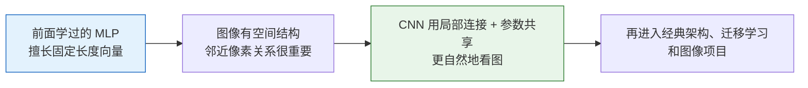
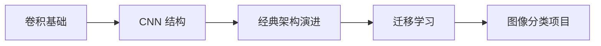

# 学前导读：CNN 这一章到底在学什么

这一章解决的是：

> **图像为什么不能直接按普通表格特征来学，而需要卷积网络。**

## 先建立一张桥接线

如果你是从前面的 MLP 过来的，这一章最值得先看清的一件事是：

- MLP 不是错
- 只是它对图像这种“有空间结构的数据”不够自然

更稳的理解方式是：

所以这一章并不是在否定全连接网络，而是在回答：

> **当数据是图片时，网络结构为什么要跟着变。**

## 这一章的主线

## 这一章更适合新人的学习顺序

1. 先搞懂卷积到底在做什么  
   不要急着背架构名，先把“局部连接、参数共享、感受野”这几个词立住。

2. 再看 CNN 的基本结构  
   先把卷积块、池化、通道数和分类头串起来。

3. 再看经典架构演进  
   这时你再看 LeNet / AlexNet / VGG / ResNet，会更像在看设计演进，而不是模型名单。

4. 然后看迁移学习  
   这会让你第一次感受到“为什么视觉里常常不从零训”。

5. 最后做图像分类项目  
   把训练、评估、错误分析真正串起来。

## 这一章最该先抓住什么

- 图片不是普通表格
- 卷积最核心的价值是保留空间结构
- CNN 的很多设计，都是在平衡表达能力、参数量和训练稳定性
- 后面的分类、检测、分割，其实都会建立在这章直觉上

## 新人最容易卡住的地方

- 只记“卷积核会滑动”，但不知道为什么要这么做
- 看到很多 shape 变化就乱
- 记住模型名字，却说不清为什么结构会演进
- 一上来就想做大模型，不先做最小图像分类闭环

## 学完这一章后，你应该能自己回答什么

- 为什么图像任务更适合卷积而不是直接展平
- 一个卷积层到底在提取什么
- CNN 里通道、池化、感受野分别在干什么
- 为什么迁移学习在视觉任务里这么常见
