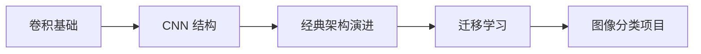

# 学前导读：CNN 这一章到底在学什么

这一章解决的是：

> **图像为什么不能直接按普通表格特征来学，而需要卷积网络。**

## 这一章的主线

```mermaid
flowchart LR
    A["卷积基础"] --> B["CNN 结构"]
    B --> C["经典架构演进"]
    C --> D["迁移学习"]
    D --> E["图像分类项目"]
```
