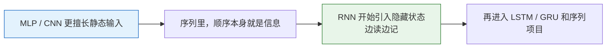
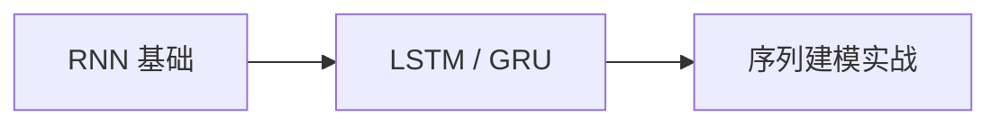

# 学前导读：RNN 与序列模型这一章到底在学什么

这一章解决的是：

> **当输入不再是固定长度表格，而是一串有先后顺序的信息时，模型该怎么学。**

## 零、先建立一张桥接线

如果你是从前面的 MLP、CNN 过来的，这一章最关键的变化不是“模型名字变了”，而是：

- 输入开始带时间顺序
- 前面的信息会影响后面的理解

更稳的理解方式是：

所以这一章真正新增的核心，是：

> **模型开始显式处理“过去的信息如何流到现在”。**

## 这一章的主线

## 这一章更适合新人的学习顺序

1. 先把“序列为什么比静态输入更难”搞懂  
   先立住顺序和上下文这件事。

2. 再看 RNN 基础  
   先把隐藏状态和时间展开看懂。

3. 然后看 LSTM / GRU  
   这时你再看门控为什么会出现，就不会只剩公式。

4. 最后做序列建模实战  
   真正把“一个序列怎么喂进模型、怎么预测”走一遍。

## 这一章最该先抓住什么

- 序列难点不在“数据更多”，而在“前后有关联”
- 隐藏状态是 RNN 最核心的引入
- LSTM / GRU 是在补普通 RNN 容易忘信息的短板
- 这一章是在为后面的注意力和 Transformer 铺路

## 新人最容易卡住的地方

- 只会背 hidden state 名字，不知道它到底在记什么
- 把时间步和 batch 维混掉
- 看不懂序列任务里输入输出为什么会有很多种形式
- 还没搞懂 RNN 的边界，就急着冲 Transformer
