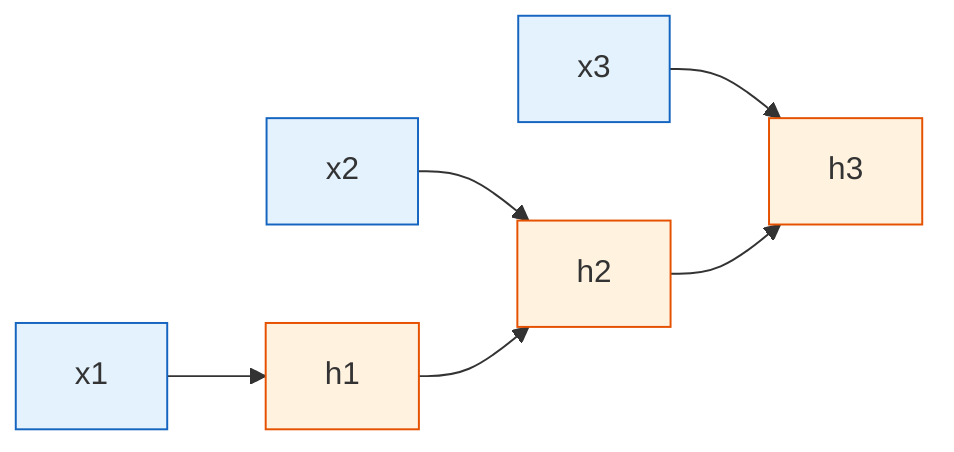

# RNN 基础

:::tip 本节定位
前面的 MLP 和 CNN 更擅长处理“静态输入”，而 RNN 要解决的是另一类问题：

> **输入不是一坨静态特征，而是一串有顺序的数据。**

比如一句话、一个时间序列、一段日志、一串用户行为。
:::

## 学习目标

- 理解为什么序列任务不能只靠普通 MLP 解决
- 直觉理解 RNN 的隐藏状态（hidden state）
- 看懂 RNN 在时间维度上的展开方式
- 手工走一遍最小 RNN 计算流程
- 掌握 PyTorch 中 `nn.RNN` 的输入输出形状
- 理解 RNN 的优势和局限，为后面的 LSTM / GRU 做准备

---

## 一、为什么序列任务更难？

### 1.1 顺序本身就是信息

看这两句话：

- “我不喜欢这门课”
- “我喜欢这门课，不难”

如果只统计词频，它们都出现了：

- 我
- 喜欢
- 这门课

但真正决定意思的，是顺序和上下文。

再看时间序列：

- 第 1 天销量低，第 2 天升高，第 3 天爆发

这里也不是一堆独立数字，而是一个变化过程。

所以序列任务的难点不是“数据更多”，而是：

> **前面的信息会影响后面的理解。**

### 1.2 MLP 为什么不擅长这个问题？

MLP 可以把固定长度向量映射成输出，但它不会天然记住：

- 第 1 个词和第 8 个词之间的关系
- 当前值和过去趋势的关系
- 之前看过什么、现在该保留什么

这就像你每看一句话，都强行“失忆一次”，自然很难理解长序列。

---

## 二、RNN 的核心想法：每读一步，都带着一点“记忆”

### 2.1 隐藏状态是什么？

RNN 的核心设计是隐藏状态 `h_t`。

你可以把它理解成：

> **模型读到当前这一步时，脑子里暂时记住的一点信息。**

每来一个新输入 `x_t`，模型都会结合：

- 当前输入 `x_t`
- 上一时刻记忆 `h_{t-1}`

算出新的记忆 `h_t`。

### 2.2 一个很好记的类比

RNN 很像你边听别人说话边记笔记：

- 当前听到的新内容 = `x_t`
- 之前已经记下来的重点 = `h_{t-1}`
- 你更新后的笔记 = `h_t`

这个“边看边更新”的过程，就是 RNN 的本质。

---

## 三、RNN 在时间上是怎样展开的？

### 3.1 同一套参数，反复处理每个时间步

RNN 不会给每个时间步都单独造一套新参数。  
它做的是：

> 用同一套参数，反复处理序列的每一个位置。



### 3.2 为什么“共享参数”很重要？

因为不管句子有 5 个词还是 50 个词，模型都能用同样方式处理。  
这正是 RNN 能处理变长序列的关键之一。

---

## 四、一个最小手工示例：一步步算隐藏状态

### 4.1 先看最简公式

最简单的 RNN 可以写成：

> `h_t = tanh(W_x * x_t + W_h * h_{t-1} + b)`

这里：

- `x_t`：当前输入
- `h_{t-1}`：上一步记忆
- `h_t`：当前新记忆

### 4.2 可运行示例

```python
import numpy as np

# 一个长度为 4 的输入序列
x_seq = [1.0, 0.5, -1.0, 2.0]

W_x = 0.8
W_h = 0.5
b = 0.1

h = 0.0  # 初始隐藏状态

for t, x_t in enumerate(x_seq, start=1):
    h = np.tanh(W_x * x_t + W_h * h + b)
    print(f"step={t}, x_t={x_t:.1f}, h_t={h:.4f}")
```

### 4.3 这段代码到底在教什么？

它不是为了模拟真实大模型，而是为了让你先看懂：

- RNN 每一步都依赖前一步
- 隐藏状态会不断被更新
- 当前输出不是只看当前输入，而是“当前输入 + 过去摘要”

这三点理解了，RNN 的核心就抓住了。

---

## 五、RNN 的输入输出到底有几种？

### 5.1 Many-to-one：整段序列输出一个结果

最典型的任务：

- 情感分类
- 垃圾邮件分类
- 行为预测

输入：

- 一串词 / 一段序列

输出：

- 一个类别

### 5.2 Many-to-many：每一步都输出

典型任务：

- 序列标注
- 词性标注
- 命名实体识别

输入：

- 一串词

输出：

- 每个词一个标签

### 5.3 Sequence-to-sequence：一段输入变成另一段输出

典型任务：

- 机器翻译
- 摘要生成

这一块后面会在 Seq2Seq 章节里细讲。

---

## 六、PyTorch 里的 RNN 到底怎么用？

### 6.1 最小可运行示例

```python
import torch

torch.manual_seed(42)

# batch=2, seq_len=5, input_size=4
x = torch.randn(2, 5, 4)

rnn = torch.nn.RNN(
    input_size=4,
    hidden_size=6,
    batch_first=True
)

out, h = rnn(x)

print("x shape   :", x.shape)
print("out shape :", out.shape)
print("h shape   :", h.shape)
```

### 6.2 这些 shape 分别是什么意思？

输入：

- `x.shape = [2, 5, 4]`
- 表示 2 个样本
- 每个样本长度是 5
- 每个时间步有 4 维特征

输出：

- `out.shape = [2, 5, 6]`
- 表示每个时间步都输出一个 6 维隐藏表示

最终隐藏状态：

- `h.shape = [1, 2, 6]`
- 第一个维度 `1` 表示层数（这里只有一层）
- 第二个维度 `2` 是 batch
- 第三个维度 `6` 是隐藏状态维度

### 6.3 `out` 和 `h` 有什么区别？

- `out`：每个时间步的输出都保留下来
- `h`：最后一个时间步的隐藏状态

在 many-to-one 分类任务里，很多时候直接拿最后的 `h` 或 `out[:, -1, :]` 去做分类。

---

## 七、一个更贴近任务的小例子：序列分类

下面我们模拟一个很小的任务：

- 输入一串数字
- 判断整体趋势更像“偏正”还是“偏负”

```python
import torch
from torch import nn

torch.manual_seed(42)

# 4 条序列，每条长度 5，每步 1 维
X = torch.tensor([
    [[1.0], [1.2], [1.3], [1.1], [1.0]],
    [[-1.0], [-1.1], [-1.3], [-0.9], [-1.2]],
    [[0.8], [0.7], [1.0], [0.9], [1.1]],
    [[-0.6], [-0.7], [-0.9], [-1.0], [-0.8]]
])

y = torch.tensor([1, 0, 1, 0])

class SimpleRNNClassifier(nn.Module):
    def __init__(self):
        super().__init__()
        self.rnn = nn.RNN(input_size=1, hidden_size=8, batch_first=True)
        self.fc = nn.Linear(8, 2)

    def forward(self, x):
        out, h = self.rnn(x)
        last_hidden = out[:, -1, :]
        return self.fc(last_hidden)

model = SimpleRNNClassifier()
loss_fn = nn.CrossEntropyLoss()
optimizer = torch.optim.Adam(model.parameters(), lr=0.05)

for epoch in range(100):
    pred = model(X)
    loss = loss_fn(pred, y)

    optimizer.zero_grad()
    loss.backward()
    optimizer.step()

    if epoch % 20 == 0:
        print(f"epoch={epoch:3d}, loss={loss.item():.4f}")

with torch.no_grad():
    result = model(X).argmax(dim=1)
    print("预测:", result.tolist())
    print("真实:", y.tolist())
```

这个例子很小，但它确实在教一件事：

> RNN 不是在单步上做分类，而是在整段序列上逐步累积信息，再做决策。

---

## 八、RNN 为什么后来被 LSTM / GRU 和 Transformer 挤下去？

### 8.1 主要问题：长距离依赖难

RNN 理论上可以记很久，但实际训练里经常会遇到：

- 梯度消失
- 梯度爆炸
- 前面信息很快被冲淡

比如一句很长的话里，开头的信息到结尾可能已经很难保住。

### 8.2 训练也不够并行

RNN 是一步一步往后算的：

- 第 5 步要等第 4 步
- 第 4 步要等第 3 步

这就让它在长序列上效率不高。

也正因此：

- LSTM / GRU 先补了一波
- Transformer 后来从根上换了思路

但 RNN 依然值得学，因为它能帮你真正理解“序列建模”的底层直觉。

---

## 九、初学者最常踩的坑

### 9.1 不知道输入 shape 应该长什么样

在 PyTorch 里，最常见的就是搞混：

- `batch_first=True`
- `batch_first=False`

如果设成 `batch_first=True`，输入通常是：

- `[batch, seq_len, input_size]`

### 9.2 分不清 `out` 和 `h`

记住：

- `out` 看每一步
- `h` 看最后总结

### 9.3 以为 RNN 天然就能记很长历史

理论上可以，实践里常常不行。  
这正是后面要学 LSTM / GRU 的原因。

---

## 小结

这一节你最该带走的不是 API，而是三个稳定直觉：

1. RNN 是为序列问题设计的，因为顺序本身就是信息
2. 隐藏状态就是模型在“边读边记”
3. RNN 的本质是用同一套参数，沿时间维度反复更新状态

理解了这三点，你后面再学 LSTM、Seq2Seq、注意力机制，都会顺很多。

---

## 练习

1. 把手工 RNN 示例里的 `W_x`、`W_h` 改掉，观察隐藏状态变化。
2. 把 PyTorch 示例里的 `hidden_size` 从 6 改到 12，看 shape 怎样变化。
3. 把分类示例里的序列换成你自己定义的数据，试着做一个简单趋势分类。
4. 想一想：为什么一句很长的话，RNN 可能会“越读越忘掉开头”？ 
