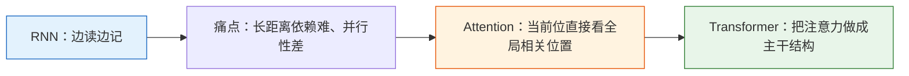
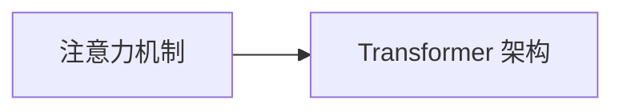

# 学前导读：Transformer 这一章到底在学什么

这一章解决的是：

> **为什么现代 NLP 和很多深度学习系统，会从 RNN 转向注意力和 Transformer。**

## 零、先建立一张桥接线

如果你是从 RNN 那一章过来的，这一章最值得先看清的一件事是：

- RNN 已经在解决“序列怎么处理”
- Transformer 要解决的是“序列很长时，怎么更高效、更全局地建关系”

更稳的理解方式是：

所以这一章真正新增的核心，不是“又一个新模型”，而是：

> **序列建模开始从“顺序传递”转向“全局关联”。**

## 这一章的主线

## 这一章更适合新人的学习顺序

1. 先把“为什么 RNN 不够”搞清楚  
   先理解长距离依赖和并行性问题。

2. 再把注意力机制看懂  
   先稳住 Q / K / V 和 self-attention 的直觉。

3. 然后看 Transformer 架构  
   这时再看 encoder / decoder / residual / layer norm 会顺很多。

## 这一章最该先抓住什么

- 注意力的本质是“当前位按相关性回头看全局”
- Q / K / V 是角色分工，不是为了把问题搞复杂
- Transformer 不是凭空出现，而是从注意力一步步长出来的
- 这一章会成为后面 NLP、大模型、多模态主线的关键起点
