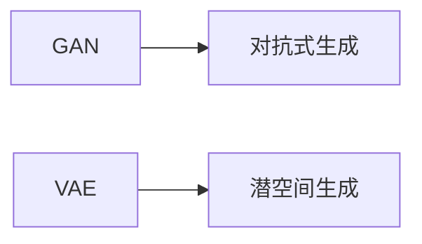

# 学前导读：生成模型这一章到底在学什么

这一章更像深度学习里的拓展视野课，它解决的是：

> **除了做分类和预测，模型怎样学会“生成”新样本。**

## 这一章的主线

```mermaid
flowchart LR
    A["GAN"] --> B["对抗式生成"]
    C["VAE"] --> D["潜空间生成"]
```

这一章不要求你一上来就掌握最前沿生成模型，而是先建立两条经典生成思路的直觉。
