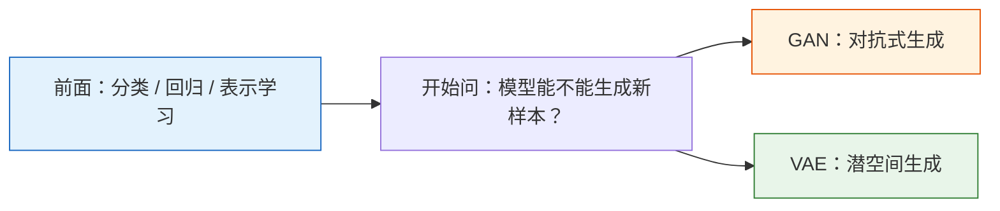
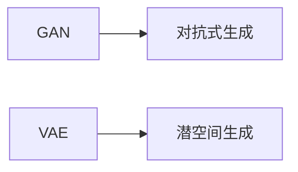

# 学前导读：生成模型这一章到底在学什么

这一章更像深度学习里的拓展视野课，它解决的是：

> **除了做分类和预测，模型怎样学会“生成”新样本。**

## 先建立一张桥接线

如果你是从前面的分类、序列和 Transformer 主线过来的，这一章最值得先看清的一件事是：

- 前面模型更常在学“怎么判断”
- 这一章开始更多在学“怎么生成”

更稳的理解方式是：

所以这一章真正新增的核心，不是“模型更酷了”，而是：

> **目标开始从“判对”转向“生成得像”。**

## 这一章的主线

这一章不要求你一上来就掌握最前沿生成模型，而是先建立两条经典生成思路的直觉。

## 这一章更适合新人的学习顺序

1. 先把“生成任务和分类任务到底差在哪”想清楚  
   先稳住目标变化这件事。

2. 再看 VAE  
   它更容易帮你建立“潜空间、采样、生成”这条结构直觉。

3. 然后再看 GAN  
   这时你更容易理解“对抗训练为什么强、为什么也更不稳”。

## 这一章最该先抓住什么

- 生成模型不是在学标签，而是在学数据分布
- VAE 和 GAN 代表了两条不同的经典生成路线
- 这一章更偏“建立视野和结构直觉”，不是马上冲最前沿实现
- 它会帮助你后面理解更现代的图像、视频、AIGC 模型
