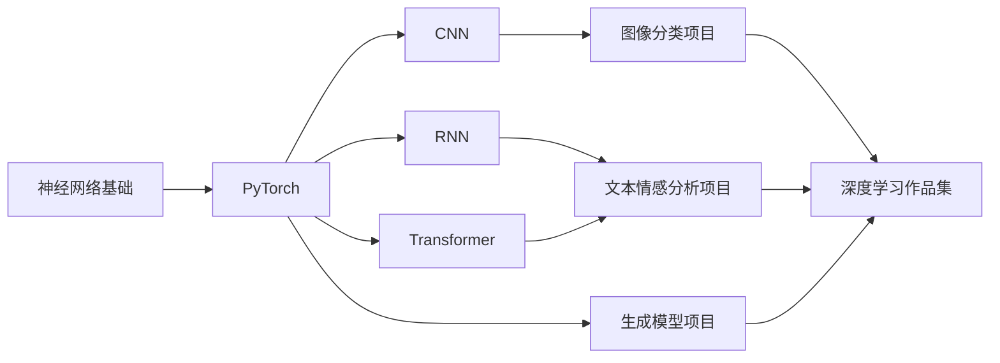
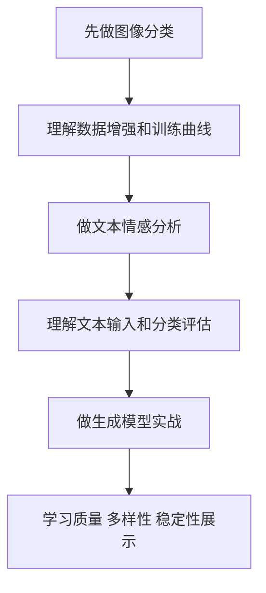
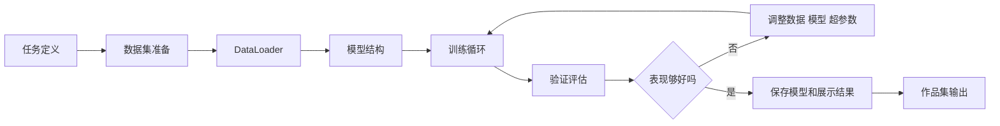

# 学前导读：项目实战这一章到底该怎么学

这一章不是继续堆概念，而是把前面学过的神经网络、PyTorch、CNN、RNN、Transformer、生成模型和训练技巧真正做成项目。

深度学习项目和传统机器学习项目最大的不同，是你会更频繁地面对数据规模、训练成本、模型收敛、过拟合、GPU 环境、超参数和结果可视化问题。因此这一章不只是让模型跑起来，更要训练你管理训练过程和解释模型表现的能力。

## 这一章在整个课程里的位置

深度学习项目章是第五阶段的出口。它要证明你能把深度学习知识用于真实任务，而不是只理解单个模型结构。

从课程主线看，这一章也是通往大模型阶段的重要桥梁。你在这里学到的训练闭环、数据划分、loss 曲线、验证集、错误分析和实验记录，会在后面理解预训练、微调和大模型评估时继续发挥作用。

## 这一章真正要解决的问题

这一章要回答五个问题：如何为深度学习任务准备数据集和数据加载器；如何设计训练循环、验证循环和保存最佳模型；如何根据 loss、accuracy、F1、样例输出和错误案例判断模型表现；如何处理过拟合、欠拟合、类别不平衡和训练不稳定；如何把项目整理成可复现 Notebook、脚本或报告。

新人最容易犯的错误，是只关心“代码有没有跑完”。深度学习项目更应该关心：训练是否收敛，验证集是否提升，错误样例有什么规律，模型失败时是数据问题、模型问题还是训练设置问题。

## 新人推荐学习顺序

建议先做图像分类，因为它最适合理解数据增强、CNN、迁移学习和训练曲线。然后做文本情感分析，把文本数据、token、embedding、序列模型和分类评估连接起来。最后做生成模型实战，关注生成结果的质量、多样性、稳定性和展示方式。

## 学这一章时要抓住的主线

这一章的主线可以概括为：深度学习项目是数据、模型、训练、验证和错误分析的循环。

看懂这条线后，你会知道深度学习项目不能只展示最终指标。训练曲线、验证曲线、混淆矩阵、错误样例和可视化结果，都是作品集里非常重要的证据。

## 三个项目分别在练什么

| 项目 | 任务类型 | 你真正要练什么 |
|---|---|---|
| 图像分类 | CNN 项目 | 从训练到评估的完整图像任务闭环 |
| 文本情感分析 | 文本分类项目 | 标签设计、baseline、错误分析和升级路线 |
| 生成模型实战 | 生成项目 | 质量、多样性、稳定性和展示框架 |

## 这一章和后面阶段的关系

深度学习项目会帮助你更好地理解大模型不是黑箱魔法。后面学预训练、微调、RAG 评估和 Agent 评估时，你会不断用到这里的训练记录、验证集、错误分析和可复现思维。

如果这一章没学稳，后面常见的问题是：看到 loss 下降却不知道是否过拟合；不知道验证集和测试集的区别；只会调用预训练模型，不会判断模型失败原因；做微调时没有 baseline 和评估方案。

## 本章小项目出口

学完这一章后，建议至少完成一个“可复现深度学习训练项目”。项目需要包含数据准备、训练/验证划分、模型结构、训练曲线、评估指标、错误案例、模型保存和结果展示。

如果做图像分类，建议展示几张预测正确和预测错误的样例；如果做文本情感分析，建议展示错误文本和可能原因；如果做生成项目，建议展示不同参数或版本下的生成结果对比。

## 过关标准

这一章结束时，你应该能独立写出一个基础 PyTorch 训练流程，能解释训练集、验证集和测试集的作用，能根据训练曲线判断过拟合或欠拟合，能保存和加载模型，能用错误分析说明模型局限。

如果你能把一个深度学习项目整理成可复现 Notebook 或脚本，并用指标、曲线和样例说明模型表现，就达到了深度学习阶段的作品集出口标准。
