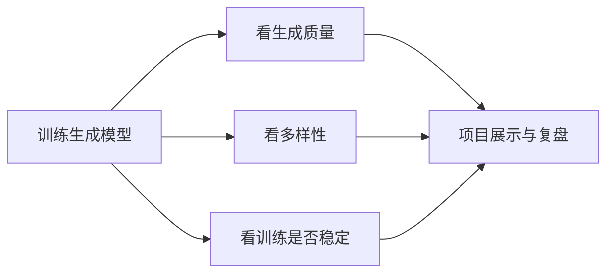
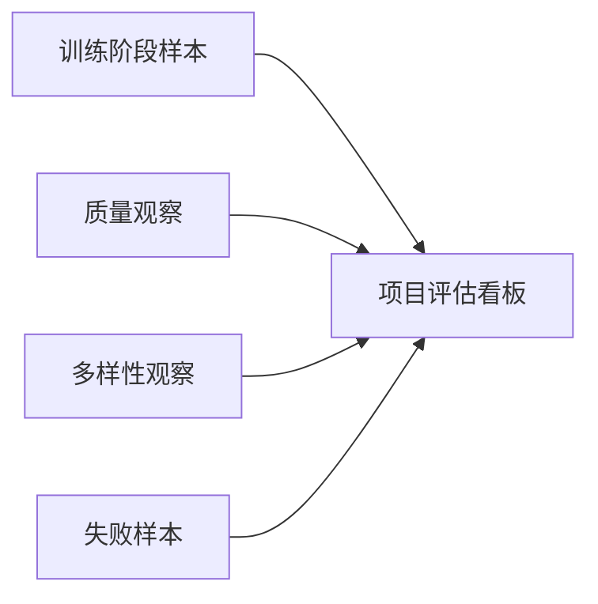

# 项目：生成模型实战【选修】

:::tip 本节定位
生成项目和分类项目最大的差别在于：

- 你没有一个特别简单清楚的“正确标签”可对

所以生成项目真正难的地方常常不是把模型跑起来，  
而是：

> **你到底怎么判断它生成得好不好。**

这一节的重点，就是把生成项目最基础的评估和展示框架讲清楚。
:::

## 学习目标

- 理解生成项目和分类项目在评估上的差别
- 学会设计一个最小生成项目的展示结构
- 理解“质量”和“多样性”为什么都重要
- 建立生成项目的基本复盘框架

---

## 先建立一张地图

生成项目最容易让新人困惑的地方是：模型明明跑起来了，但你不知道自己到底做得算不算好。



所以这一节真正要学的，是“怎么判断和展示”，不只是“怎么生成”。

## 一、生成项目最先要解决的是什么？

不是：

- 用哪种最复杂模型

而是：

- 你到底在生成什么
- 你要怎么判断生成结果值不值

### 常见项目问题形式

- 生成人脸或头像
- 生成小型手写数字
- 生成简单轮廓图

对练手来说，建议先选：

- 目标清楚
- 数据容易获取
- 结果容易肉眼观察

的题目。

---

## 二、生成项目最小骨架

### 1. 数据

- 训练样本

### 2. 模型

- GAN / VAE / 更现代生成模型

### 3. 采样与可视化

- 定期生成样本看趋势

### 4. 评估

- 样本质量
- 多样性

### 5. 展示

- 不同时期样本对比
- 失败模式总结

### 2.1 一张更适合新人的评估看板

很多新人第一次做生成项目时，  
最大的问题不是“不会训”，  
而是：

- 不知道该看什么

可以先把最小看板收成下面这 4 栏：



只要这 4 栏你能持续填出来，  
这个项目就不会再只是“生成了一些图”。

## 三、推荐推进顺序

1. 先选一个非常小、容易观察的数据集
2. 再确定你更重视质量、多样性还是稳定性
3. 然后再选模型路线
4. 最后再决定怎么展示和比较结果

---

## 四、先跑一个最小项目规划示例

```python
from dataclasses import dataclass, field


@dataclass
class GenerativeProjectPlan:
    name: str
    data_source: str
    model_family: str
    evaluation_focus: list
    risks: list = field(default_factory=list)


plan = GenerativeProjectPlan(
    name="simple_digit_generator",
    data_source="small_grayscale_digits",
    model_family="VAE",
    evaluation_focus=["visual_quality", "diversity", "training_stability"],
    risks=["mode collapse", "模糊样本", "潜空间不连续"],
)

print(plan)
```

### 4.1 为什么这一步比直接堆代码更重要？

因为生成项目如果不先说清：

- 数据
- 模型路线
- 评估重点

后面很容易只剩“我生成了一些图”，却说不清项目价值。

---

## 五、生成项目怎么做最基础的结果检查？

### 5.1 先看质量

生成结果像不像目标数据？

### 5.2 再看多样性

是不是总生成差不多的东西？

### 5.3 一个极简多样性检查例子

```python
samples = [
    "digit_like_pattern_A",
    "digit_like_pattern_A",
    "digit_like_pattern_B",
    "digit_like_pattern_C",
]

diversity = len(set(samples)) / len(samples)
print("diversity score =", diversity)
```

虽然这个例子非常简化，  
但它已经在提醒你：

- 只看“像不像”还不够
- 还要看“是不是老生成同样东西”

### 5.4 再加一个“训练阶段样本看板”示例

真实项目里，一个特别好用的展示方式是：

- 固定几个 epoch
- 每个 epoch 都保存一小组样本
- 再把它们并排展示

哪怕不用真的画图，  
先做一个结构化看板都很有帮助：

```python
checkpoints = [
    {"epoch": 1, "quality": 0.20, "diversity": 0.80, "note": "大多是噪声"},
    {"epoch": 10, "quality": 0.45, "diversity": 0.72, "note": "开始出现轮廓"},
    {"epoch": 30, "quality": 0.68, "diversity": 0.60, "note": "清晰度提高，但开始变像"},
    {"epoch": 60, "quality": 0.75, "diversity": 0.48, "note": "可能出现 mode collapse"},
]

for row in checkpoints:
    print(row)
```

这个例子最值得先记住的不是数值本身，  
而是：

- 质量和多样性往往要一起看
- 训练越往后，不一定所有指标都一起变好

---

## 六、最容易踩的坑

### 6.1 误区一：只放最好看的几张图

真正项目应该展示：

- 平均样本质量
- 失败样本

### 6.2 误区二：只看质量，不看多样性

这会掩盖 mode collapse。

### 6.3 误区三：一上来选太复杂数据集

练手项目更适合先选：

- 易观察
- 易比较

的小任务。

---

## 项目交付时最好补上的内容

- 一组不同训练阶段的样本对比
- 一组失败样本
- 一段对“质量 / 多样性 / 稳定性”取舍的说明
- 一段为什么选这个模型而不是别的模型的解释

## 一个新人可直接照抄的项目评估表

如果你不知道怎么写生成项目复盘，  
最稳的起点通常是先做这样一张表：

| 维度 | 你要回答的问题 | 最小证据 |
|---|---|---|
| 质量 | 生成结果像不像目标数据？ | 不同时期样本对比 |
| 多样性 | 是不是老生成差不多的东西？ | 一组不同采样结果 |
| 稳定性 | 训练有没有明显崩掉或塌缩？ | loss / 样本趋势说明 |
| 解释 | 为什么选这个模型路线？ | 一段路线选择理由 |

这张表特别适合初学者，  
因为它会把“我到底该展示什么”这件事先讲清楚。

## 如果继续把这个项目往上做，最值得补什么

更值得优先补的通常是：

1. 一页质量 / 多样性对照展示
2. 不同模型路线的对比页
3. 一组 mode collapse 或模糊样本的失败案例分析

这样项目会从“生成了一些结果”进一步变成“我知道该怎么评价和解释这些结果”。

## 十、一个更适合作品集的展示顺序

如果你把这个项目做成作品集页面，比较推荐按这个顺序展示：

1. 项目目标和数据范围
2. 模型路线选择
3. 不同训练阶段样本
4. 质量 / 多样性对比
5. 失败案例与原因判断
6. 下一步升级方向

这样别人看到的不是“几张图”，而是一条完整的生成项目思路。

---

## 小结

这节最重要的是建立一个生成项目判断：

> **生成模型项目最难的不只是训练，而是怎样围绕质量、多样性和稳定性建立一个可信的评估与展示框架。**

只要这个框架立住了，你做出来的项目就不再只是“生成几张图”。

## 练习

1. 想一个你愿意做的最小生成项目，并写出它的数据源和评估重点。
2. 为什么生成项目不能只展示最好看的几张结果？
3. 什么情况下你会优先怀疑 mode collapse？
4. 如果只能选一个指标优先观察，你会先看质量还是多样性？为什么？
