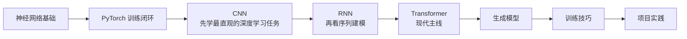

# 第五阶段：深度学习基础

| 信息 | 说明 |
|---|---|
| **预估学时** | 140～190h |
| **前置要求** | 完成前四阶段 |

掌握深度学习核心原理与 PyTorch 框架。

## 阶段导读

这一阶段的目标不是“会调一个模型”，而是把深度学习最基础的三件事真正打牢：

1. 神经网络到底怎么学
2. PyTorch 训练闭环到底怎么搭
3. 经典架构为什么这样设计

## 第四阶段是怎么自然流到这里的

如果你刚学完第四阶段，最值得先确认的一件事是：

第五阶段并不是突然换了一门课，而是在第四阶段这条主线之上继续往前走：

- 第四阶段学会了任务、baseline、评估、改进
- 第五阶段开始学习更强的表示能力和更显式的训练过程

你可以把这条过渡先读成下面这句话：

> 第四阶段更强调“怎样做一个机器学习项目”，第五阶段开始进一步回答“模型内部到底是怎么学出来的”。

如果你想先把这条桥接线看顺，建议先读：
[0.9 从经典机器学习到深度学习](./ch01-nn-basics/00-ml-to-dl-bridge.md)

## 这一阶段的教学安排是否由浅入深？

整体上是顺的，而且比第四阶段更需要按层次来学。

更适合新人的理解方式是：

也就是说：

- **前五章是主干**
- **第六章生成模型更适合作为扩展理解**
- **第七章训练技巧应该和前面章节交叉着学**
- **第八章项目要在会基础训练闭环后再做**

## 这一阶段真正新增了什么能力

从第四阶段走到第五阶段，真正新增的不是“模型更多了”，而是这三种能力：

1. 不再只依赖手工特征，而是让模型自己学表示
2. 不再只调用 `fit()`，而是开始更明确地看见训练循环
3. 不再只比较几个经典模型，而是开始理解层、梯度、参数更新和网络结构设计

### 建议学习顺序

1. 第一章：神经网络基础
2. 第二章：PyTorch 入门
3. 第三章：卷积网络
4. 第四章：循环网络
5. 第五章：Transformer
6. 第六章：生成模型
7. 第七章：训练技巧
8. 第八章：项目实践

## 更适合新人的学习节奏

如果你想学得更稳，不建议一口气按文件顺序通刷到底。更推荐这样走：

1. 先学第一章  
   把神经元、激活函数、损失、反向传播打稳。

2. 再学第二章  
   把 `tensor -> model -> loss -> backward -> step` 这条 PyTorch 训练主线真正跑顺。

3. 先做一个最小训练闭环  
   不急着上复杂网络，先能把数据送进模型、训练、验证、画曲线。

4. 然后学第三章 CNN  
   图像任务最直观，适合第一次真正建立“深度学习模型在学什么”的感觉。

5. 再学第四、第五章  
   从序列建模一路过渡到 Transformer。

6. 第七章训练技巧穿插着学  
   一旦你遇到 loss 不稳、过拟合、显存不够，这章就应该立刻回看。

7. 最后做第八章项目  
   把训练、评估、诊断和改进串成完整闭环。

## 本阶段章节地图

| 章节 | 主题 | 主要解决什么问题 |
|---|---|---|
| 第一章 | 神经网络基础 | 搞清楚神经元、激活函数、损失和反向传播 |
| 第二章 | PyTorch 入门 | 学会数据、模型、优化器和训练循环 |
| 第三章 | 卷积网络 | 理解图像任务里的局部感受野和特征提取 |
| 第四章 | 循环网络 | 理解序列信息如何被逐步传递 |
| 第五章 | Transformer | 理解注意力和现代序列建模主线 |
| 第六章 | 生成模型 | 补 GAN、VAE 等生成式思路 |
| 第七章 | 训练技巧 | 学诊断、调参、压缩与部署前准备 |
| 第八章 | 项目实践 | 把训练、评估和分析真正串起来 |

### 这一阶段最该带走什么

- 能手写一个最小训练循环
- 能看懂 loss、梯度和优化器在做什么
- 知道 CNN / RNN / Transformer 各自解决什么问题
- 知道训练不稳时先查哪一层

## 学这一阶段最容易卡住的地方

- 只会调库，不知道中间数据怎么流
- 代码能跑，但解释不清 loss 和梯度
- 只追新模型，不先把训练闭环打顺
- 不做错误分析，只看 loss 降没降

## 如果你是从第四阶段刚过来，最稳的起步方式

建议不要一上来就冲 CNN、Transformer 或生成模型。  
更稳的顺序通常是：

1. 先看神经网络基础章前两节  
   先把神经元、前向和反向真正看懂。

2. 再进 PyTorch 章  
   把 `tensor -> autograd -> module -> dataloader -> training loop` 这条线先跑顺。

3. 先做一个最小可训练例子  
   比如一个小型分类任务，让你第一次把 loss、梯度、优化器串起来。

4. 最后再去看 CNN / RNN / Transformer  
   这样你看到复杂结构时，不会只剩“模型名很新”。

## 这一阶段最值得优先补强的能力

- 能看懂每一层输入输出的 shape
- 能独立写最小训练循环
- 能从训练曲线判断问题大致出在哪
- 能区分“结构问题、数据问题、训练问题”这三类常见问题

### 学完后的出口能力

- 你应该能独立完成一个小型分类或文本任务的训练与评估
- 你应该能看懂后面视觉、NLP、大模型课程里最基本的模型训练代码
- 你应该能把“模型结构、训练、评估、排障”连成一条完整主线
