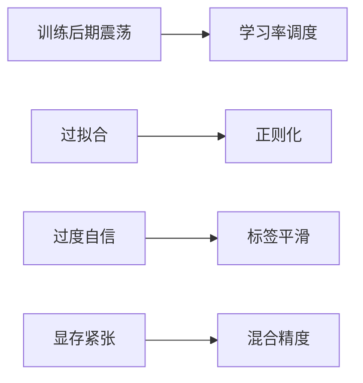

# 训练技巧

:::tip 本节定位
在图像分类里，模型架构当然重要。  
但很多时候真正拉开效果差距的，反而是一组看起来不起眼的训练细节：

- 学习率调度
- 标签平滑
- 正则化
- 混合精度

这节课的重点不是把技巧背成清单，而是理解它们分别在补哪类问题。
:::

## 学习目标

- 理解常见训练技巧分别在解决什么问题
- 学会判断哪些技巧适合当前训练问题
- 通过可运行示例建立“技巧不是魔法，而是定向补丁”的直觉
- 理解为什么训练细节对最终结果常常很敏感

---

## 零、先建立一张地图

分类训练技巧更适合按“训练症状 -> 对应补丁”来理解：



所以这节不是方法清单，而是一张排障地图。

## 一、为什么训练技巧这么重要？

因为深度学习训练很少只靠“模型结构”决定成败。  
实际效果还常受到：

- 优化路径
- 正则化强度
- 数值稳定性

这些细节影响。

你可以把训练技巧理解成：

- 给训练过程加护栏
- 给优化过程加修正

---

## 二、几个最常见技巧在补什么？

### 2.1 学习率调度

解决：

- 前期需要快学
- 后期需要稳收敛

### 2.2 标签平滑

解决：

- 模型过度自信

### 2.3 正则化

例如：

- dropout
- weight decay

解决：

- 过拟合

### 2.4 混合精度

解决：

- 显存和吞吐效率

---

## 三、一个最小技巧选择示例

```python
training_issue = [
    {"problem": "训练后期震荡", "candidate": "学习率调度"},
    {"problem": "验证集明显过拟合", "candidate": "weight_decay / dropout"},
    {"problem": "模型过度自信", "candidate": "label_smoothing"},
    {"problem": "显存紧张", "candidate": "mixed_precision"},
]

for item in training_issue:
    print(item)
```

### 3.1 这个例子想表达什么？

技巧不是乱加的。  
更稳的方式是：

- 先看症状
- 再选对应补丁

---

## 四、最常见误区

### 4.1 误区一：技巧越多越好

不一定。  
乱叠技巧很容易让训练更难解释。

### 4.2 误区二：所有项目都套一模一样配置

不同数据、不同模型、不同设备需求不同。

### 4.3 误区三：技巧能掩盖数据问题

如果数据和标签本身有问题，  
训练技巧通常救不了根因。

## 五、新人第一次做图像分类时，最稳的技巧顺序

更建议的顺序通常是：

1. 先把 baseline 训练稳
2. 再加学习率调度
3. 再看 weight decay / label smoothing
4. 最后再考虑混合精度和更多高级技巧

先把顺序理清，训练会轻松很多。

---

## 小结

这节最重要的是建立一个训练判断：

> **训练技巧的价值，不在于“让模型更神奇”，而在于针对训练过程中的具体问题做定向修正。**

## 六、这节最该带走什么

- 技巧应该针对问题，而不是越多越好
- baseline 不稳时，不要急着堆技巧
- 训练细节常常会决定最终上限，但前提是你知道自己在修什么

---

## 练习

1. 想一想：如果训练集 loss 降得很快，但验证集很差，你最先会考虑哪两种技巧？
2. 为什么说混合精度更多是在补资源问题，而不是直接补模型表达能力？
3. 用自己的话解释：标签平滑为什么能缓解过度自信？
4. 如果你只能保留一个训练技巧，你会优先保留哪类？为什么？
