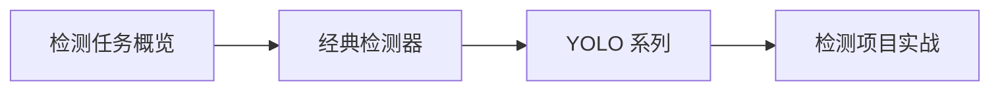

# 学前导读：目标检测这一章到底在学什么

目标检测这一章解决的是：

> **图里不仅有什么，还要知道它在哪里。**

## 零、先建立一张桥接线

如果你已经学过图像分类，这一章最值得先看清的一件事是：

- 分类只回答“这张图是什么”
- 检测开始同时回答“它在哪”

所以检测不是分类的简单升级版，而是多加了一层：

- 位置理解
- 多目标处理
- 框级评估

## 这一章的主线

学这一章时，最重要的不是先背模型名字，而是先把框、IoU、mAP 和多目标场景看懂。

## 这一章更适合新人的学习顺序

1. 先看检测任务概览  
   先把框、类别、IoU、mAP 这些最核心对象立住。

2. 再看经典检测器  
   先理解两阶段和一阶段主线是怎么长出来的。

3. 再看 YOLO  
   这时你更容易看懂为什么它会成为常见工程起点。

4. 最后做项目实战  
   把框、阈值、误检漏检分析真正串起来。

## 这一章最该先抓住什么

- 检测比分类多的核心难度是“定位”
- 多目标场景会让任务和评估都更复杂
- 这一章真正重要的是框和指标，不只是模型名
