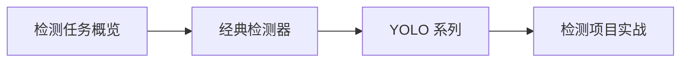

# 学前导读：目标检测这一章到底在学什么

目标检测这一章解决的是：

> **图里不仅有什么，还要知道它在哪里。**

## 这一章的主线

```mermaid
flowchart LR
    A["检测任务概览"] --> B["经典检测器"]
    B --> C["YOLO 系列"]
    C --> D["检测项目实战"]
```

学这一章时，最重要的不是先背模型名字，而是先把框、IoU、mAP 和多目标场景看懂。
