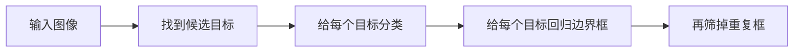

# 目标检测概述

:::tip 本节定位
图像分类只能回答：

- 这张图大概是什么

但很多真实任务需要更具体的问题：

> **图里有什么，而且它在哪里？**

这就是目标检测的核心。
:::

## 学习目标

- 理解目标检测和图像分类的差别
- 理解边界框、类别和置信度三要素
- 通过可运行示例理解 IoU 这类核心指标直觉
- 建立检测任务和后续 YOLO / 检测实战之间的连接感

---

## 先建立一张地图

如果你刚学完图像分类，可以先把这节理解成：

- 分类解决的是“整张图最主要是什么”
- 检测开始解决“图里每个目标是什么、它在哪”

所以检测不是“多一个框而已”，而是：

- 输出对象变了
- 评估对象变了
- 错误类型也变了

目标检测最适合新人的理解顺序不是“先记模型”，而是先把任务结构看清楚：



所以检测任务天然比分类复杂，因为它同时在做：

- 分类
- 定位
- 多目标筛选

## 一、目标检测到底在做什么？

检测任务通常同时输出：

- 类别
- 边界框位置
- 置信度

例如：

- 一张街景图里有两辆车、一位行人
- 每个对象都要标出位置

这比整图分类复杂很多。

### 1.1 第一次学这节最该先记什么？

最值得先记住的是：

1. 检测不是整图判断，而是多目标判断
2. 每个目标至少有三样东西：类别、位置、置信度
3. 后面很多模型差异，其实都围绕这三样东西在展开

### 1.2 为什么这一节最值得先抓住“三要素”？

因为后面几乎所有检测模型，最后都在围绕这三样东西展开：

- 类别
- 框
- 置信度

你可以先把检测输出理解成一句很朴素的话：

> “我觉得这里有个什么目标，它大概在这里，而且我有多大把握。”

---

## 二、为什么分类模型不够用？

因为同一张图里可能：

- 有多个目标
- 目标大小不同
- 目标位置不同

图像分类只给整张图一个标签，  
无法表达这些信息。

### 2.1 一个更适合新人的判断方式

以后你看到一个视觉问题时，可以先问：

- 是整张图只要一个答案？
- 还是图里每个对象都要单独找出来？

如果是后者，那它就已经超出了普通分类任务的边界。

---

## 三、先看一个最小 IoU 例子

IoU 是检测里非常核心的概念，  
因为它回答：

- 预测框和真实框到底重合得有多好

```python
def iou(box_a, box_b):
    ax1, ay1, ax2, ay2 = box_a
    bx1, by1, bx2, by2 = box_b

    inter_x1 = max(ax1, bx1)
    inter_y1 = max(ay1, by1)
    inter_x2 = min(ax2, bx2)
    inter_y2 = min(ay2, by2)

    inter_w = max(0, inter_x2 - inter_x1)
    inter_h = max(0, inter_y2 - inter_y1)
    inter_area = inter_w * inter_h

    area_a = (ax2 - ax1) * (ay2 - ay1)
    area_b = (bx2 - bx1) * (by2 - by1)
    union = area_a + area_b - inter_area

    return inter_area / union if union > 0 else 0.0


gt_box = (10, 10, 30, 30)
pred_box = (15, 15, 32, 32)

print("IoU =", round(iou(gt_box, pred_box), 4))
```

### 3.1 为什么这个指标特别重要？

因为检测不只是“有没有发现目标”，  
还要看：

- 框得准不准

### 3.1.1 IoU 最值得先记住的，不是公式，而是“重叠质量”

第一次学检测，不要先背坐标交并比公式。  
先记住：

- IoU 本质上是在看预测框和真实框重合得有多好

这会直接帮助你理解后面很多概念：

- 正负样本匹配
- NMS
- mAP

### 3.2 新人第一次学检测，最该先记哪三个概念？

第一次接触目标检测时，最值得先记住的是：

1. 边界框  
   模型不是只回答“有车”，还要回答“车在哪”。

2. IoU  
   用来衡量预测框和真实框重合得好不好。

3. 多目标场景  
   同一张图通常不止一个目标，所以会有重复框、遮挡、重叠这些问题。

### 3.3 为什么检测天然更像“系统问题”？

因为你最后要处理的往往不是一个框，  
而是一组框：

- 哪些框该保留
- 哪些框是重复
- 哪些框分数太低应该过滤

这也是为什么检测从很早开始就会有明显的后处理环节。

### 3.4 第一次做检测时，最容易低估的是什么？

通常不是分类器本身，而是：

- 框的定义口径
- 阈值选择
- 重复框处理
- 误检和漏检之间的平衡

所以检测项目会比分类更像一个完整系统，而不是单个模型输出。

---

## 四、最容易踩的坑

### 4.1 误区一：检测只是分类加个框

框本身就是很难的回归问题。

### 4.2 误区二：只看分类分数

位置误差同样关键。

### 4.3 误区三：多目标场景按单目标想

多目标会带来：

- 重叠
- 遮挡
- 重复预测

## 五、学这一节时最正确的预期

这一节最重要的不是今天就学会一个完整检测器，  
而是先真正分清：

- 分类任务只回答“是什么”
- 检测任务还要回答“在哪里”
- 后面所有 YOLO、Faster R-CNN，本质上都在解决这两个问题的组合

## 第一次做检测项目时，最该先建立哪种意识？

最值得先建立的是：

- 检测项目首先是标注项目
- 其次才是模型项目

因为如果框口径不统一，后面模型和评估都会一起乱掉。

---

## 小结

这节最重要的是建立一个检测判断：

> **目标检测是在同时解决“是什么”和“在哪里”两个问题，因此它天然比分类更复杂，也更接近真实视觉应用。**

## 这节最该带走什么

- 检测不是分类加一个框这么简单
- IoU 是理解检测质量的第一把钥匙
- 真正的难点来自多目标、遮挡和定位误差

如果再压成一句话，那就是：

> **目标检测是在把“看见东西”升级成“看见每个东西，并把它们逐个定位出来”。**

---

## 练习

1. 自己换两组框坐标，看看 IoU 怎么变。
2. 为什么说检测比分类更贴近真实视觉任务？
3. 如果一个检测框分类对了但位置偏很多，这次预测能算好吗？为什么？
4. 想一想：多目标场景为什么会比单目标场景难很多？
