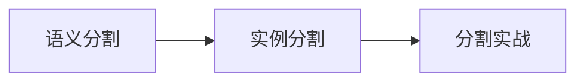

# 学前导读：图像分割这一章到底在学什么

这一章解决的是：

> **不只是给框，而是给出更精细的区域理解。**

## 这一章的主线

```mermaid
flowchart LR
    A["语义分割"] --> B["实例分割"]
    B --> C["分割实战"]
```

这章最适合帮助新人分清：

- 整图分类
- 框级检测
- 像素级分割

这三类视觉任务到底差在哪。
