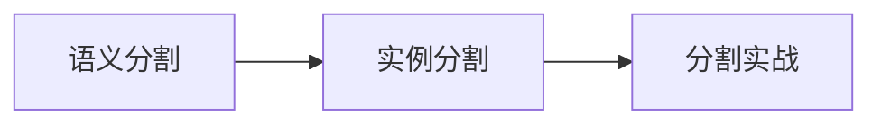

# 学前导读：图像分割这一章到底在学什么

这一章解决的是：

> **不只是给框，而是给出更精细的区域理解。**

## 零、先建立一张桥接线

如果你已经学过分类和检测，这一章最值得先看清的一件事是：

- 分类给整图一个标签
- 检测给目标一个框
- 分割开始给像素级区域答案

所以分割真正新增的核心，不是“更复杂的模型”，而是：

- 输出粒度更细
- 评估更细
- 边界理解更重要

## 这一章的主线

这章最适合帮助新人分清：

- 整图分类
- 框级检测
- 像素级分割

这三类视觉任务到底差在哪。

## 这一章更适合新人的学习顺序

1. 先看语义分割  
   先把“每个像素都要判类”这件事看懂。

2. 再看实例分割  
   这时你更容易理解“同类不同个体为什么还要分开”。

3. 最后做分割实战  
   把 mask、损失、IoU 和错例分析串起来。

## 这一章最该先抓住什么

- 分割比检测更细，是像素级输出
- mask 是这一章最重要的对象
- 这一章会让你第一次真正进入“区域理解”层面
