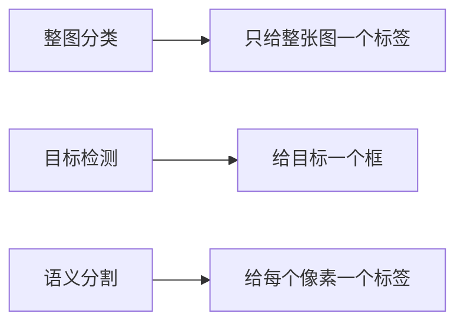

# 语义分割

:::tip 本节定位
分类回答的是：

- 这张图是什么

检测回答的是：

- 图里有什么、它在哪

语义分割再进一步回答：

> **图里的每个像素属于什么类别。**

这让视觉理解进入更细粒度层面。
:::

## 学习目标

- 理解语义分割和分类/检测的区别
- 理解分割 mask 为什么更细粒度
- 通过可运行示例理解像素级标签和 IoU
- 建立语义分割的基本任务直觉

---

## 先建立一张地图

如果你刚学完分类和检测，可以先把这节理解成：

- 分类只给整图一个答案
- 检测给每个目标一个框
- 分割开始给每个像素一个类别

所以这一节真正新增的核心是：

- 输出粒度变得最细
- 评估也更细
- 模型是否“看懂边界”开始非常重要

语义分割最适合新人的理解顺序是：



这节最重要的不是先记网络名，而是先知道：

- 分割为什么比检测更细
- mask 为什么是核心表示

### 一个更适合新人的总类比

如果把分类、检测、分割放在一起看，可以这样理解：

- 分类像在回答：“这张照片主要拍了什么？”
- 检测像在回答：“画面里有哪些对象，它们大概在哪？”
- 分割像在回答：“把整张图像拿来涂色，每个像素都要决定属于谁。”

这样一来，分割为什么更难就会一下子清楚很多：

- 它不是只给一个答案
- 也不是只画几个框
- 它要对整张图的每一块区域都负责

## 一、语义分割到底在做什么？

它的目标是：

- 给图像中每个像素分一个类别

例如：

- 天空
- 路面
- 人
- 车

### 1.1 第一次学这节最该先记什么？

最值得先记住的是：

1. 分类只给整图标签
2. 检测给框
3. 分割给区域

而且这个“区域”不是粗略提示，而是每个像素都有类别归属。

### 为什么它比检测更细？

因为检测只给框，  
分割会更精确地给出区域边界。

### 1.2 为什么这节最值得先抓住“像素级”这件事？

因为从这一节开始，视觉任务不再只是：

- 找对象
- 给框

而是开始回答：

- 这一片区域到底属于什么
- 这个边界到底画得准不准

所以语义分割可以先简单理解成：

> **把整张图变成一张“每个像素都有语义标签”的地图。**

---

## 二、先跑一个最小分割 mask 示例

```python
pred_mask = [
    [0, 0, 1],
    [0, 1, 1],
    [0, 0, 1],
]

gt_mask = [
    [0, 0, 1],
    [0, 1, 1],
    [0, 1, 1],
]


def iou_for_class(pred, gt, target_class):
    inter = 0
    union = 0
    for pred_row, gt_row in zip(pred, gt):
        for p, g in zip(pred_row, gt_row):
            if p == target_class and g == target_class:
                inter += 1
            if p == target_class or g == target_class:
                union += 1
    return inter / union if union else 0.0


print("IoU for class 1:", round(iou_for_class(pred_mask, gt_mask, 1), 4))
```

### 2.1 这个例子最关键的直觉是什么？

分割评估不是看“整图对不对”，  
而是看：

- 区域重叠得好不好

### 2.1.1 为什么分割里的 IoU 会比分类指标更有存在感？

因为在分割任务里：

- 预测类别对了还不够
- 区域要大致重合才算真的分对

这也是为什么你会经常看到：

- per-class IoU
- mIoU

而不是只看一个总体准确率。

这就是为什么 IoU 在分割里也非常重要。

### 2.2 新人第一次学分割，最该先记哪三件事？

1. mask 是像素级标签图
2. 分割评估比分类更关注区域重叠
3. 小类别和边界区域往往最难

### 2.3 为什么分割项目里特别容易出现“看起来差不多，但指标差很多”？

因为只要边界区域错一点，或者小类别漏一片，  
IoU 就可能掉得很明显。

这也是为什么分割任务特别适合训练新人建立一个意识：

> **视觉结果不是“看着像就行”，区域边界本身就是结果的一部分。**

### 2.4 第一次学分割时，最容易低估什么？

最容易低估的是：

- 边界
- 小类别
- 类别不平衡

因为这些地方常常在可视化里只占一点点，  
但对 IoU 和真实效果影响会很大。

### 2.5 再看一个最小“类别不平衡”示例

```python
mask = [
    [0, 0, 0, 0],
    [0, 1, 1, 0],
    [0, 0, 0, 0],
    [0, 0, 0, 0],
]


def class_counts(mask):
    counts = {}
    for row in mask:
        for value in row:
            counts[value] = counts.get(value, 0) + 1
    return counts


print(class_counts(mask))
```

这个例子虽然很小，但能一下子帮新人看懂一个现实问题：

- 背景像素经常特别多
- 真正重要的小类别却只占很少一部分

所以分割项目里，如果你只盯总体像素准确率，很容易被“背景全都判对了”这件事误导。

---

## 三、最容易踩的坑

### 3.1 边界不准

分割模型很容易在物体边缘出错。

### 3.2 类别极度不平衡

背景往往太多，  
小目标类别很容易被忽略。

### 3.3 只看总体像素准确率

像素准确率高，不代表小类别真的分得好。

### 3.4 只看彩色可视化，不做失败分桶

很多新人第一次做分割时，会贴几张好看的 mask 图就结束。  
但真正能推动项目进步的，通常是把失败样本分成：

- 边界错
- 小类别漏掉
- 类别混淆
- 标注本身有争议

只有这样，你才知道下一步该改：

- 数据
- 损失函数
- 采样策略
- 还是模型结构

## 四、学这一节时最正确的预期

这一节最重要的不是今天就学会复杂分割模型，  
而是先真正看清：

- 分割比检测更细粒度
- 分割结果通常更依赖区域级指标
- 小类别和边界误差会极大影响真实效果

## 第一次做语义分割项目时，最稳的顺序

更建议这样做：

1. 先把类别定义收窄
2. 再统一 mask 标注标准
3. 先做一个最小 baseline
4. 再看 per-class IoU 和失败样本

这样会比一开始就追复杂网络更容易把项目做清楚。

---

## 如果把它做成项目，最值得展示什么

- 原图
- 预测 mask
- GT mask
- per-class IoU
- 失败样本里的边界对比

这样会比只贴一张“彩色 mask 图”更像真正项目。

---

## 小结

这节最重要的是建立一个判断：

> **语义分割是在做像素级分类，因此它比分类和检测都更细粒度，也更依赖区域级评估。**

## 这节最该带走什么

- 分割的核心对象是 mask，不是整图标签也不是框
- IoU 在分割里不是配角，而是核心评估视角
- 边界和类别不平衡是分割任务的常见难点

如果再压成一句话，那就是：

> **语义分割是在做像素级语义地图，因此它真正关心的不只是“有没有识别到”，还要看“区域边界有没有画对”。**

## 练习

1. 自己改一组 `pred_mask`，观察 IoU 会怎么变。
2. 为什么像素准确率高，不一定说明分割模型真的好？
3. 语义分割和目标检测最大的差别是什么？
4. 如果类别非常不平衡，你最担心什么问题？
