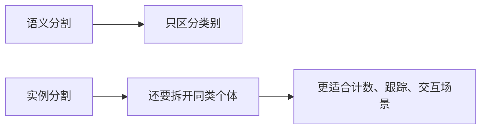

# 实例分割

:::tip 本节定位
语义分割已经能回答：

- 哪些像素属于“人”

但如果图里有三个人，它还不够。  
实例分割更进一步：

> **不仅知道像素属于哪个类别，还要知道它属于哪一个具体实例。**
:::

## 学习目标

- 理解实例分割和语义分割的差别
- 理解“类别”与“实例”为什么是两个层次
- 通过可运行示例建立实例 mask 直觉
- 理解实例分割为什么更接近真实视觉场景

---

## 零、先建立一张地图

实例分割最适合新人的理解顺序不是“又多了一个分割任务”，而是先看清：



所以这节真正想解决的是：

- 为什么“类别对了”还不够
- 为什么“同类个体拆开”会显著增加任务难度

## 一、实例分割比语义分割多了什么？

语义分割：

- 只区分类别

实例分割：

- 类别 + 个体区分

也就是说，图里两个“person”不该混成一个整体。

### 1.1 一个新人最该先分清的三件事

第一次学实例分割时，最值得先记住的是：

1. 语义分割回答“这是什么类别”
2. 实例分割还要回答“这是第几个个体”
3. 所以后者天然更接近真实多目标场景

---

## 二、先看一个最小实例 mask 示例

```python
instance_map = [
    [0, 1, 1, 0],
    [0, 1, 1, 2],
    [0, 0, 0, 2],
]


def pixels_of_instance(instance_map, target_id):
    pixels = []
    for r, row in enumerate(instance_map):
        for c, value in enumerate(row):
            if value == target_id:
                pixels.append((r, c))
    return pixels


print("instance 1:", pixels_of_instance(instance_map, 1))
print("instance 2:", pixels_of_instance(instance_map, 2))
```

### 2.1 这个例子最关键的地方是什么？

它说明实例分割不只是输出类别编号，  
还会区分：

- 第 1 个实例
- 第 2 个实例

这在计数、跟踪和交互场景里非常重要。

### 2.2 为什么实例分割会特别适合安防和自动驾驶？

因为这些场景里，系统往往不只关心：

- 画面里有没有人

更关心：

- 到底有几个人
- 哪几个目标彼此挨得很近
- 后续能不能继续跟踪这些个体

也就是说，实例分割天然更像“面向后续决策的视觉表示”。

---

## 三、最容易踩的坑

### 3.1 相邻同类实例容易粘在一起

这是实例分割特别常见的错误。

### 3.2 小实例更难

个体越小、越拥挤，越难分清。

### 3.3 评估比语义分割更复杂

因为现在不仅要看 mask 质量，  
还要看实例是否正确拆开。

## 四、第一次学这节时最正确的预期

这一节最重要的不是今天就学会复杂实例分割网络，  
而是先真正看清：

- 为什么语义分割和实例分割不是一个东西
- 为什么相邻同类目标会成为真正难点
- 为什么这个任务一旦做好，会对计数、交互和跟踪特别有价值

---

## 小结

这节最重要的是建立一个判断：

> **实例分割比语义分割多解决了一层“同类目标之间怎么区分”的问题，因此更接近真实多目标视觉场景。**

## 五、这节最该带走什么

- 实例分割是在语义分割之上再补“个体拆分”
- 难点往往不在类别，而在相邻同类目标的边界
- 如果后续任务需要计数、跟踪或交互，实例分割往往特别有价值

---

## 练习

1. 自己构造一个更大的 `instance_map`，再标出 3 个实例。
2. 为什么实例分割比语义分割更难？
3. 如果两个相邻目标总被粘成一个实例，你会首先怀疑什么？
4. 想一想：实例分割在自动驾驶或安防里为什么特别有价值？
