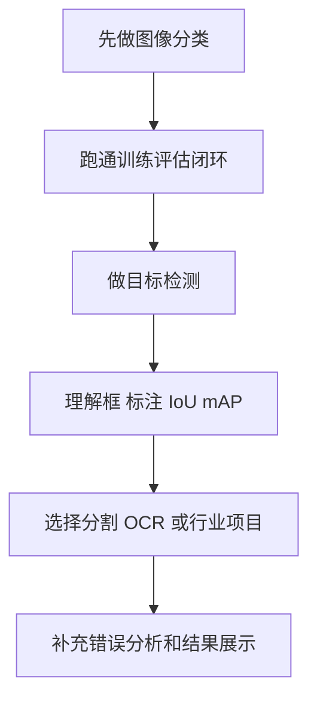

# 学前导读：综合项目这一章到底该怎么学

这一章不是继续堆模型，而是把前面学过的视觉任务真正装进一个应用场景。

计算机视觉项目的核心不是“我用了哪个模型”，而是：输入图像是什么，标注标准是什么，模型输出是什么，评价指标是什么，错误案例在哪里，结果如何展示给真实使用者。

## 这一章在整个课程里的位置

第九阶段前面已经学过视觉基础、图像分类、目标检测、图像分割和高级视觉方向。综合项目是这一阶段的出口，要把这些任务放进真实场景中，例如安防检测、工业质检、医学影像、文档 OCR 或商品识别。

从课程主线看，视觉项目也会为后面的多模态和 AIGC 打基础。因为多模态系统里的图像理解能力，仍然离不开分类、检测、分割、OCR、错误分析和数据质量意识。

## 这一章真正要解决的问题

这一章要回答五个问题：如何把场景需求转成视觉任务；如何收集和标注图像数据；如何选择分类、检测或分割方案；如何用 accuracy、F1、mAP、IoU、Dice 等指标评估；如何展示模型成功案例、失败案例和业务风险。

新人最容易犯的错误，是只追模型架构，不看数据和标注。视觉项目里，数据质量、类别定义、标注一致性、光照角度、遮挡情况和样本分布，往往比换一个模型更影响最终效果。

## 新人推荐学习顺序

建议先做图像分类项目，因为它最容易跑通数据准备、训练、评估和结果展示。然后做目标检测项目，练习框标注、IoU、mAP 和误报漏报分析。最后根据兴趣选择图像分割、OCR、工业质检或医学影像项目，进一步理解像素级输出和高风险场景的评估要求。

## 学这一章时要抓住的主线

这一章的主线可以概括为：视觉项目是“数据标注 + 模型训练 + 指标评估 + 失败案例展示”的闭环。

看懂这条线后，你会知道视觉项目展示不能只放一张预测图。你还应该展示数据样例、标注规则、指标、混淆矩阵或检测可视化、失败案例和改进方向。

## 两个项目分别在练什么

| 项目 | 你真正要练什么 |
|---|---|
| 安防检测 | 把检测模型放进告警场景里思考误报和漏报 |
| 医学影像 | 把分割 / 分类结果放进高风险场景里思考评估和责任边界 |

## 这一章和后面阶段的关系

视觉项目会直接连接多模态阶段。图文问答、截图理解、文档解析和 AIGC 创作都需要你理解图像输入、视觉输出、结果可视化和失败边界。

如果这一章没学稳，后面常见的问题是：多模态模型看起来会识图，但你不知道它错在哪里；AIGC 图像结果没有审核标准；视觉项目只展示成功样例，不知道误报漏报意味着什么。

## 本章小项目出口

学完这一章后，建议完成一个“可展示视觉项目”。最小版本可以是图像分类，包含数据集说明、训练/验证划分、模型、指标、预测样例和错误分析。进阶版本可以做安全帽检测、车辆检测、缺陷检测、医学分割或 OCR，并展示标注样例和模型可视化结果。

作品集版本建议补充项目背景、任务定义、数据来源、标注规范、评价指标、成功/失败案例、部署设想和风险说明。

## 过关标准

这一章结束时，你应该能把视觉场景拆成分类、检测或分割任务，能准备数据和标注规范，能选择合适指标，能展示模型结果和失败案例，能说明误报、漏报或分割错误对业务的影响。

如果你能把一个视觉项目整理成可复现 Notebook 或脚本，并用图像样例说明模型表现和局限，就达到了计算机视觉方向的作品集出口标准。
