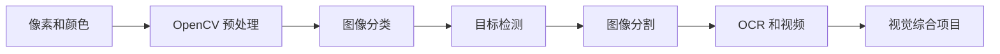
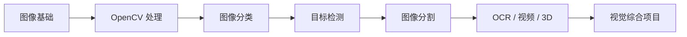

# 10 计算机视觉（方向选修）

这一阶段解决的是“怎样让模型理解图像”。它是方向选修：如果你的主线目标是 LLM 应用和 Agent，可以后补；如果你想做视觉、多模态、工业检测、OCR 或医学影像，就建议系统学习。

## 故事化导入：教模型看见世界

人类看到一张图片，会自然识别物体、位置、边界和动作；模型看到的却只是像素矩阵。计算机视觉要做的事，就是让模型从像素中逐步学会“这是什么”“在哪里”“边界到哪里”。从分类到检测再到分割，每一步都让模型看得更细。

## 学习闯关地图

## 互动练习：同一张图问三个层级的问题

拿一张包含多个物体的图片，先问“这张图主要是什么类别”，再问“每个物体在哪里”，最后问“每个物体的边界在哪里”。这三个问题分别对应分类、检测和分割。你会发现视觉任务的难度不是突然增加，而是输出越来越精细。

## 项目彩蛋

本阶段的彩蛋作品可以是一个“视觉检测小工具”：上传图片后，系统完成预处理、识别目标、标出位置，并输出置信度和结果说明。它可以继续升级成 OCR 文档助手、工业缺陷检测或多模态问答项目。

## 阶段定位

| 信息 | 说明 |
|---|---|
| 适合对象 | 已完成深度学习基础，希望进入视觉或多模态方向的学习者 |
| 预估学时 | 120～180 小时 |
| 前置要求 | 完成深度学习与 Transformer 基础 |
| 阶段产出 | 图像分类、目标检测、图像分割或视觉综合项目 |

## 新手最小通关路线

新手先理解图像像素、颜色空间、OpenCV 预处理、分类、检测和分割的区别，不需要一开始追最新模型。只要能训练或调用一个图像分类模型，并说清楚检测和分割比分类多输出了什么，就算完成最小通关。

## 进阶深入路线

有经验的学习者可以深入数据标注、增强策略、YOLO、分割模型、mAP、部署场景和失败案例分析。进一步尝试把视觉模型接入一个小应用，输出带标注框、置信度和错误样例说明的结果。

## 视觉任务如何由浅入深

计算机视觉不是一个单一任务。它通常按输出粒度逐步变复杂：先判断整张图是什么，再找出目标在哪里，再判断每个像素属于什么区域。

## 本阶段学习路径

第一章学习 CV 基础与 OpenCV，理解图像像素、颜色空间、滤波、边缘、形态学和基础图像处理。

第二章学习图像分类进阶，包括数据增强、现代分类架构和训练技巧。

第三章学习目标检测，理解候选框、类别、置信度、IoU、mAP 和 YOLO 系列。

第四章学习图像分割，理解语义分割、实例分割和像素级输出。

第五章学习进阶专题，包括人脸检测、视频分析、OCR 和 3D 视觉。

第六章完成综合项目，把数据、模型、指标和应用场景连起来。

## 学完后你应该能做到

- 能解释分类、检测、分割三类视觉任务的区别
- 能用 OpenCV 完成基础图像处理
- 能训练或微调一个图像分类模型
- 能理解目标检测和分割任务的输入输出及评价指标
- 能为一个视觉项目准备数据、训练模型并分析结果

## 常见误区

不要只追最新视觉模型。视觉项目真正困难的地方往往是数据采集、标注质量、类别不平衡、指标选择和部署场景。

也不要把 OpenCV 和深度学习割裂。OpenCV 适合传统图像处理和工程预处理，深度学习适合复杂识别任务，两者经常会一起出现。

## 阶段项目

基础版是完成一个图像分类项目，包含数据准备、训练和基础评估。标准版需要加入数据增强、错误样例分析和可视化预测结果。挑战版可以做目标检测或分割项目，加入标注格式、mAP/IoU 指标、推理展示和场景化应用说明。

如果你想看更细的学习节奏，可以阅读 [学习指南：计算机视觉怎么学最不容易学乱](./study-guide.md)。