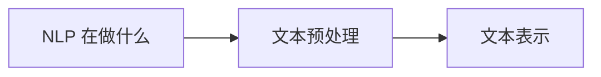

# 学前导读：文本基础这一章到底在学什么

这一章不是在学“几个文本处理工具”，而是在帮你建立 NLP 的输入直觉。

## 零、先建立一张桥接线

如果你是从第五阶段序列和 Transformer 主线过来的，这一章最值得先看清的一件事是：

- 前面你已经知道模型可以处理序列
- 这一章开始回答“文本这种序列在进入模型前，到底应该怎样整理和表示”

所以这一章不是偏离模型主线，而是在补：

> **NLP 最基本的输入直觉。**

## 这一章的主线

如果这一章没学稳，后面词向量、分类、BERT 都会容易变成只剩术语。

## 这一章更适合新人的学习顺序

1. 先看 NLP 到底在解决哪些任务  
   先立住文本任务地图。

2. 再看预处理  
   先知道原始文本进入模型前通常要做哪些整理。

3. 最后看文本表示  
   这时你更容易理解“为什么表示不是一件小事，而是后面所有任务的入口”。

## 这一章最该先抓住什么

- 文本不是天然可计算对象
- 预处理不是机械清洗，而是在帮任务建立更稳定输入
- 文本表示会直接决定后面 embedding、分类和预训练主线能不能看顺
