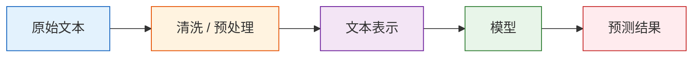

# NLP 概述

## 学习目标

完成本节后，你将能够：

- 说清楚 NLP 在解决什么问题
- 理解 NLP 的典型处理流程
- 知道文本为什么比表格更难处理
- 跑通一个最小的文本处理示例

---

## 一、NLP 在做什么？

NLP 是 Natural Language Processing，自然语言处理。

说得直白一点：

> **NLP 就是让计算机处理人类语言。**

这些语言可以是：

- 文章
- 评论
- 邮件
- 对话
- 搜索词
- 合同
- 医疗记录

它能做的任务非常多，比如：

| 任务 | 例子 |
|---|---|
| 文本分类 | 判断评论是好评还是差评 |
| 信息抽取 | 从简历里抽取姓名、学校、技能 |
| 问答系统 | 根据文档回答问题 |
| 机器翻译 | 中文翻英文 |
| 文本摘要 | 长文自动提炼重点 |
| 对话系统 | 聊天机器人、客服机器人 |

---

## 二、为什么文本处理比表格数据难？

表格数据里，一列通常有明确含义：

- 年龄
- 收入
- 城市

但文本不一样。  
文本像一整段“人类随手写下来的复杂信息”，里面有：

- 语义
- 语气
- 歧义
- 上下文
- 省略
- 错别字

比如下面这句话：

> “这个手机不便宜，但拍照是真的能打。”

如果只看“便宜”这两个字，可能误判成正向；  
但结合上下文，整句话其实更偏正向评价。

这说明：

> **文本的意义不只由单个词决定，还受到上下文影响。**

---

## 三、NLP 的典型流程

你可以先把 NLP 看成一条流水线：



### 每一步分别做什么？

| 步骤 | 作用 |
|---|---|
| 清洗 / 预处理 | 去掉噪声，统一格式 |
| 文本表示 | 把文字变成数字 |
| 模型 | 学习文字和任务目标的关系 |
| 预测结果 | 类别、分数、答案、摘要等 |

后面几节其实就是沿着这条线展开。

---

## 四、几个你必须先熟悉的词

### 1. 语料（Corpus）

就是一批文本数据。

### 2. 词元（Token）

把文本切成一个个处理单位后，每个单位就可以叫 token。  
它可能是：

- 一个词
- 一个子词
- 一个字
- 一个符号

### 3. 词表（Vocabulary）

就是“模型认识的 token 集合”。

### 4. 文本表示

计算机不能直接吃文字，所以要先把文字变成数值向量。

---

## 五、一个最小例子：做规则版意图识别

这个例子不需要机器学习，只用规则就能帮你建立 NLP 直觉。

```python
import re

texts = [
    "帮我查一下今天北京天气",
    "请帮我订一张去上海的机票",
    "计算一下 25 乘以 4 是多少",
    "明天深圳会下雨吗"
]

def classify_intent(text):
    text = re.sub(r"\s+", "", text)

    if "天气" in text or "下雨" in text:
        return "weather_query"
    if "机票" in text or "订票" in text:
        return "ticket_booking"
    if "计算" in text or "乘以" in text:
        return "calculation"
    return "unknown"

for t in texts:
    print(t, "->", classify_intent(t))
```

这个例子虽然简单，但已经体现了 NLP 的核心思想：

1. 输入是文本
2. 我们要从文本里识别模式
3. 最终输出一个结构化结果

---

## 六、NLP 发展方式的三条主线

### 1. 规则系统

早期 NLP 很依赖人工规则。

优点：

- 可解释
- 小任务上手快

缺点：

- 难维护
- 泛化差

### 2. 传统机器学习

把文本转成特征，再用分类器学习。

比如：

- BoW
- TF-IDF
- 逻辑回归
- SVM

### 3. 深度学习和大模型

让模型自己学习表示和上下文关系。

比如：

- RNN / LSTM
- Transformer
- BERT
- GPT / LLM

所以你后面学的内容，其实是在回答一个问题：

> 我们怎样让计算机越来越准确地“理解文本”？

---

## 七、NLP 为什么和大模型关系这么紧？

因为大语言模型本质上就是“超大规模的文本模型”。

如果你不了解：

- token
- 文本表示
- 上下文
- 语义相似度
- 语言建模

那后面学 LLM、RAG、Agent 时就容易只停留在“会调 API”的层面。

所以第七阶段不是绕远路，而是在给后面铺路。

---

## 八、初学者常见误区

### 1. 以为 NLP 就等于聊天机器人

聊天只是 NLP 的一个应用场景，不是全部。

### 2. 以为分词、清洗都是细枝末节

很多任务里，预处理质量会直接影响效果上限。

### 3. 以为只有深度学习才算 NLP

不是。  
规则系统和传统机器学习在很多中小型任务里依然有价值。

---

## 小结

这节课你最该记住的是：

> **NLP 的本质，是把自然语言变成可计算、可推理、可建模的对象。**

接下来我们会一步步回答两个问题：

1. 文本怎么清洗？
2. 文本怎么变成数字？

---

## 练习

1. 给 `classify_intent()` 再加一个“音乐播放”意图类别。
2. 自己写 5 句文本，测试分类规则有没有误判。
3. 想一想：如果用户说“今天天气不错，顺便帮我算下 12+8”，这个规则系统会有什么问题？
