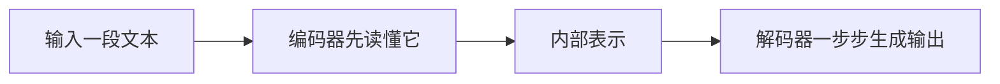

# Seq2Seq 模型

:::tip 本节定位
前面的分类和序列标注任务，输出通常还是“标签”。  
而从这一章开始，我们进入另一类问题：

> **输入是一段文本，输出也是一段文本。**

例如：

- 翻译
- 摘要
- 改写
- 问答生成

这类任务最经典的起点，就是 encoder-decoder 结构。
:::

## 学习目标

- 理解 Seq2Seq 和分类类任务的根本差别
- 理解 encoder 和 decoder 各自负责什么
- 通过可运行示例建立“编码再生成”的直觉
- 理解 Seq2Seq 为什么成为很多生成任务的基础结构

---

## 零、先建立一张地图

Seq2Seq 这节最适合新人的理解顺序不是“先看模型细节”，而是先看清任务形态变了什么：



所以这节真正想解决的是：

- 为什么“文本到文本”任务和分类任务根本不是一类问题
- 为什么要把系统拆成 encoder 和 decoder 两部分

## 一、Seq2Seq 在解决什么问题？

### 1.1 它不是“给整句打标签”

它更像：

- 输入一串 token
- 输出另一串 token

例如：

- “我爱学习” -> “I love studying”

### 1.2 为什么普通分类器不适合做这类任务？

因为分类器输出通常是固定集合里的一个标签。  
而 Seq2Seq 任务的输出：

- 长度不固定
- 内容不固定
- 生成过程有顺序依赖

### 1.3 一个类比

分类像给作文打一个分数。  
Seq2Seq 更像把中文作文重新写成英文作文。

---

## 二、编码器和解码器分别在做什么？

### 2.1 编码器

它负责：

- 读入输入序列
- 把输入压成内部表示

### 2.2 解码器

它负责：

- 基于编码结果
- 一步一步生成输出序列

### 2.3 为什么要分成两部分？

因为这类任务天然是：

- 先理解输入
- 再构造输出

这和单纯分类不一样。

---

## 三、先跑一个“编码后生成”的最小示例

```python
translation_memory = {
    "我": "I",
    "爱": "love",
    "学习": "study",
}


def encode(source_tokens):
    return {"source_tokens": source_tokens, "length": len(source_tokens)}


def decode(encoded):
    output = []
    for token in encoded["source_tokens"]:
        output.append(translation_memory.get(token, "<unk>"))
    return output


source = ["我", "爱", "学习"]
encoded = encode(source)
target = decode(encoded)

print("encoded:", encoded)
print("decoded:", target)
```

### 3.1 这个例子最重要的启发是什么？

它说明 Seq2Seq 的核心流程是：

1. 输入不直接变成最终答案
2. 中间先过一层编码表示
3. 再由解码器生成输出

### 3.2 新人第一次学 Seq2Seq，最该先记什么？

最值得先记住的是：

1. encoder 更像“先把输入读懂”
2. decoder 更像“根据理解结果一步步写输出”
3. 输出不是固定标签，而是一个有顺序的生成过程

---

## 四、Seq2Seq 最常见的难点是什么？

### 4.1 输入压缩过于粗糙

早期 encoder-decoder 的一个典型问题是：

- 整个输入被压成单个固定长度向量

输入一长，信息容易丢失。

### 4.2 输出是逐步生成的

这意味着：

- 前一步错了
- 后面也容易跟着错

### 4.3 这也是为什么后面会引入注意力机制

注意力的核心目的之一，就是让解码器在生成时不必只依赖一个固定向量，  
而是可以动态查看输入不同位置。

### 4.4 这节和后面注意力机制的关系是什么？

这节最该先立住的是：

- Seq2Seq 的“编码 -> 解码”主线

而下一节注意力要解决的，正是这里的核心瓶颈：

- 固定长度表示太容易丢信息

---

## 五、Seq2Seq 适合哪些任务？

### 5.1 翻译

典型输入输出映射任务。

### 5.2 摘要

输入长文，输出短文。

### 5.3 改写与问答生成

输入与输出不是同一份文本，但有明确对应关系。

---

## 六、最容易踩的坑

### 6.1 误区一：Seq2Seq 就只是“翻译模型”

翻译只是最经典例子。  
它本质上适用于更广的“文本到文本”任务。

### 6.2 误区二：有编码器和解码器就已经足够

如果没有注意力和更强表示，长输入问题会很明显。

### 6.3 误区三：生成任务只要会输出就行

Seq2Seq 任务真正难的是：

- 对输入忠实
- 生成合理
- 保持结构

## 七、这节最该带走什么

- Seq2Seq 是“输入序列 -> 输出序列”的基础结构
- encoder / decoder 是为了解决“先理解，再生成”
- 注意力机制的出现，正是为了补 Seq2Seq 最核心的信息瓶颈

---

## 小结

这节最重要的是把 Seq2Seq 理解成：

> **一类先编码输入、再逐步生成输出的结构，它是翻译、摘要和很多文本生成任务的基础范式。**

只要这个结构主线清楚，后面学注意力和 T5 时就会很自然。

---

## 练习

1. 把示例里的词典扩成 5~10 个词，再试几个句子。
2. 为什么说 Seq2Seq 的输出不是固定长度、也不是固定标签集？
3. 想一想：如果输入非常长，为什么“只压成一个向量”会吃力？
4. 用自己的话解释：encoder 和 decoder 各自负责什么？
