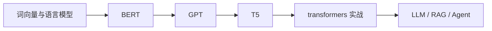
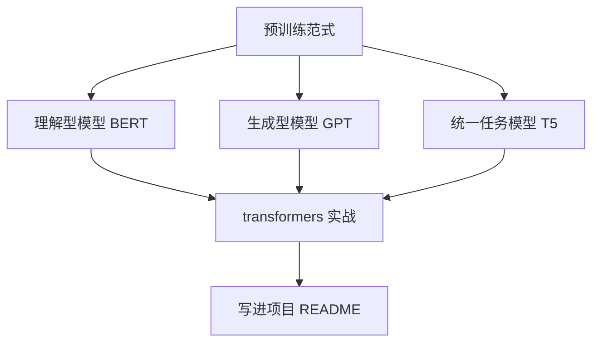

# 学前导读：预训练模型这一章到底在学什么

## 本章定位

这一章是传统 NLP 通向大模型应用的桥。前面你学过文本表示、文本分类、序列标注和 Seq2Seq，这些内容通常围绕单个任务训练模型；这一章开始进入“先预训练一个通用底座，再迁移到不同任务”的现代 NLP 范式。

学这一章的目标不是背 BERT、GPT、T5 的名字，而是理解三种问题：模型怎样从大规模文本中获得语言能力，为什么不同预训练目标会带来不同能力倾向，以及 transformers 工具库怎样把这些模型接入真实项目。

## 这一章在整门课里的位置

这章既是第 11 站自然语言处理的收束，也是第 7～9 站大模型、RAG 和 Agent 的前置桥梁。你后面调用大模型 API、做文本检索、做微调或构建 RAG 时，都会反复遇到 tokenizer、embedding、上下文长度、生成方式和模型加载这些概念。

## BERT、GPT、T5 分别代表什么思路

| 模型家族 | 核心思路 | 更适合理解什么 |
|---|---|---|
| BERT | 通过掩码预测学习双向语义表示 | 分类、匹配、抽取、检索 embedding 的基础直觉 |
| GPT | 通过自回归预测下一个 token 学习生成能力 | 聊天、续写、工具调用、Prompt 和生成式应用 |
| T5 | 把各种 NLP 任务统一成 text-to-text | 任务统一、指令化、多任务迁移 |

不要把这三类模型看成互相替代的版本号。它们更像三种训练和使用范式：BERT 偏理解，GPT 偏生成，T5 强调把任务都改写成文本到文本。现代大模型会吸收这些思想，但学习它们能帮你理解后面的技术为什么这样设计。

## 本章学习顺序

第一步先理解预训练范式：为什么一个模型先在大规模文本上学习，再在具体任务上迁移，比每个任务从零训练更有效。第二步看 BERT，重点理解 mask、双向上下文、CLS 表示和下游任务微调。第三步看 GPT，重点理解自回归生成、上下文窗口和 Prompt。第四步看 T5，理解把翻译、摘要、问答、分类都统一成 text-to-text 的思想。最后用 transformers 跑一个最小例子，把 tokenizer、model、pipeline、输入输出连起来。

## 和大模型课程的连接

这一章会帮你提前理解大模型应用里的很多“工程常识”。例如，tokenizer 决定文本怎样被模型读取；上下文长度决定一次能放多少资料；embedding 可以用于检索和聚类；生成模型需要控制温度、长度和停止条件；模型加载和推理成本会影响部署方案。

当你进入 RAG 时，BERT/embedding 的理解会帮助你看懂向量检索；进入 Prompt 和 Agent 时，GPT 的自回归生成会帮助你理解为什么模型会一步步生成计划和工具参数；进入微调时，预训练和下游任务迁移的关系会变得非常重要。

## 本章小项目出口

建议完成一个“预训练模型对比小实验”。基础版可以用 transformers pipeline 分别跑文本分类、摘要或生成示例，并记录输入输出。标准版可以比较 BERT 类模型和 GPT 类模型在同一文本任务上的适用边界。挑战版可以把一个课程段落做成 embedding 检索小例子，作为后面 RAG 的前置准备。

README 至少写清楚：使用了哪个模型，输入是什么，输出是什么，模型更适合理解还是生成，运行时遇到什么依赖或下载问题，以及这个实验会怎样连接到后面的 RAG 或 LLM 应用。

## 常见误区

不要以为“预训练模型”只等于“更大的模型”。真正重要的是训练目标、输入输出形式和迁移方式。也不要一开始就追最新模型名，先把 BERT、GPT、T5 的基本范式弄清楚，后面看到 RoBERTa、DeBERTa、LLaMA、Qwen、DeepSeek 等模型时，才能知道它们大致是在解决哪类问题。

## 过关标准

学完这一章后，你应该能说清楚：BERT、GPT、T5 的训练思路有什么不同，为什么 transformers 工具库能统一调用很多模型，什么任务适合理解型模型，什么任务适合生成型模型，以及这些概念如何连接到后面的 RAG、Prompt、微调和 Agent。