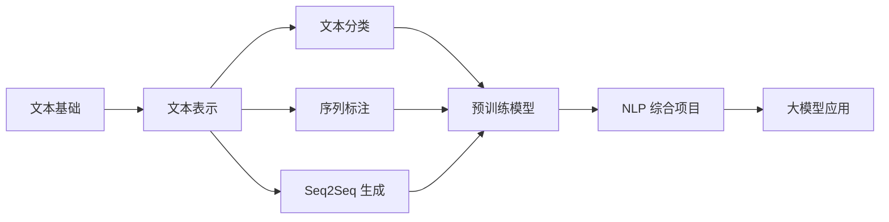
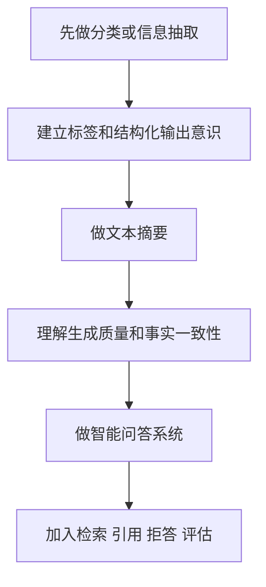
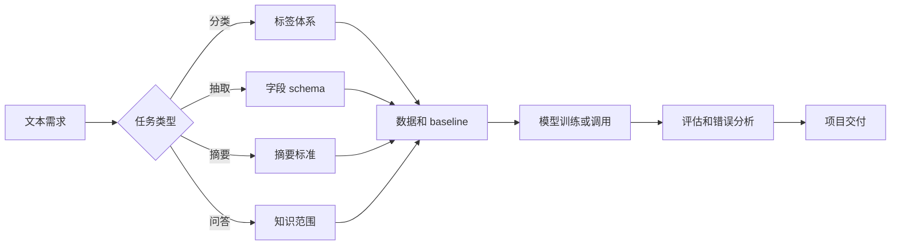

# 学前导读：综合项目这一章到底该怎么学

这一章不是继续堆模型，而是把前面学过的文本表示、分类、序列标注、Seq2Seq、预训练模型和评估真正装进一个项目闭环。

NLP 项目的核心不是“用了哪个模型”，而是：文本从哪里来，标签或目标如何定义，任务边界是否清楚，模型输出是否可评估，错误样例能不能解释，最终结果能不能服务真实场景。

## 这一章在整个课程里的位置

11 自然语言处理（方向选修）前面已经学过文本基础、词向量、文本分类、序列标注、Seq2Seq 和预训练模型。综合项目是这一学习站的出口，要把这些能力放进问答、摘要、信息抽取或文本分类等实际任务里。

从课程主线看，NLP 项目也是大模型阶段的前置训练。因为大模型应用里的 Prompt、RAG、结构化输出和 Agent 任务理解，都建立在文本处理、任务边界和评估意识之上。

## 这一章真正要解决的问题

这一章要回答五个问题：如何把文本需求定义成分类、抽取、问答或摘要任务；如何准备文本数据、标签和评估集；如何建立 baseline；如何评估生成质量、抽取准确性或分类效果；如何处理模型幻觉、边界不清、标签歧义和结构化输出不稳定。

新人最容易犯的错误，是把所有文本任务都看成“让模型生成一段话”。实际上，分类输出类别，序列标注输出每个 token 或片段的标签，抽取输出结构化字段，摘要输出压缩后的文本，问答还要处理知识边界和拒答。

## 新人推荐学习顺序

建议先做信息抽取或文本分类项目，因为它们更容易建立清晰标签和评估指标。然后做文本摘要，理解生成任务的压缩质量、事实一致性和可读性。最后做智能问答系统，把检索、上下文、拒答、引用和评估连接起来。

## 学这一章时要抓住的主线

这一章的主线可以概括为：NLP 项目要先分清任务边界，再决定数据、模型和评估方式。

看懂这条线后，你会知道为什么 NLP 项目最怕任务定义模糊。如果标签不清、字段不清、知识范围不清，模型再强也很难稳定产出。

## 三个项目分别在练什么

| 项目 | 你真正要练什么 |
|---|---|
| 智能问答系统 | 知识边界、检索、拒答和评估 |
| 文本摘要系统 | 生成结果的压缩质量、事实一致性和可解释性 |
| 信息抽取系统 | 从文本里稳定抽取结构化字段 |

## 这一章和后面阶段的关系

NLP 综合项目会直接连接大模型阶段。Prompt 工程里的结构化输出，RAG 里的文档切分和检索，Agent 里的任务理解和观察总结，本质上都需要 NLP 项目的任务边界、文本处理和评估能力。

如果这一章没学稳，后面常见的问题是：RAG 项目没有无答案处理；结构化输出字段混乱；摘要看起来流畅但事实不一致；信息抽取没有 schema；问答系统不能区分不知道和不该回答。

## 本章小项目出口

学完这一章后，建议至少完成一个“可评估 NLP 项目”。最小版本可以是信息抽取：从简历、合同、课程文档或评论中抽取固定字段，并用准确率、召回率或人工检查评估。进阶版本可以做问答或摘要，并加入引用、拒答、事实一致性检查和错误案例分析。

作品集版本建议补充数据来源、任务定义、标签或 schema、baseline、评估样例、失败案例和下一步改进。

## 过关标准

这一章结束时，你应该能区分文本分类、序列标注、信息抽取、摘要和问答任务，能为其中一个任务准备数据和评估方式，能建立 baseline，能用错误案例说明模型局限，能把输出整理成结构化项目报告。

如果你能做出一个带任务定义、数据样例、评估指标、失败案例和改进方向的 NLP 项目，就达到了自然语言处理方向的作品集出口标准。
