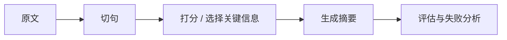

# 项目：文本摘要系统

:::tip 本节定位
摘要项目很适合作为作品集，因为它逼着你回答几个非常真实的问题：

- 什么叫关键信息
- 怎样压缩长文本
- 怎样判断摘要是否真的好

这一节不会只停在“会抽几句”，而会把一个作品级项目最该展示的部分讲清楚。
:::

## 学习目标

- 学会定义一个摘要项目的最小闭环
- 学会把抽取式 baseline 做成可解释系统
- 学会设计最小评估和失败分析
- 学会把这个题材包装成一个完整的 NLP 项目

---

## 先建立一张地图

文本摘要项目最适合新人的理解顺序不是“先追更强模型”，而是先看清项目闭环：



所以这节真正想解决的是：

- 什么叫“保住主线”
- 摘要项目到底怎样评估和展示

## 一、项目题目怎么收窄？

一个适合练手的题目可以是：

> **给课程长文介绍生成 2 句摘要。**

这类题目好在：

- 领域清晰
- 文本长度适中
- 摘要目标比较直观

### 1.1 第一次做摘要项目，题目怎么选更稳？

更稳的起点通常有三个特点：

- 原文结构比较清楚
- 主线信息比较集中
- 读者比较容易判断“有没有漏重点”

所以像：

- 课程介绍
- 新闻简报
- 会议纪要

这类文本通常都很适合作为练手题目。

---

## 二、作品级摘要项目最小闭环

1. 选文本集合
2. 切句
3. 句子打分
4. 选 top-k 句子
5. 做人工评估
6. 总结失败模式

## 三、推荐推进顺序

对新人来说，更稳的顺序通常是：

1. 先做抽取式 baseline
2. 再补最小人工评估
3. 再做失败案例分析
4. 最后再考虑生成式摘要对比

这样你会更容易知道摘要系统到底提升了什么。

---

## 四、先做一个更完整的抽取式摘要系统

```python
import re

article = """
人工智能课程的学习路径通常分为基础阶段和进阶阶段。
基础阶段包括 Python 编程、数据分析和机器学习。
当学习者掌握了这些内容之后，才能更稳地进入深度学习和大模型应用开发。
很多人一开始就想直接学大模型，但往往因为基础不牢而很快卡住。
如果学习目标是做 AI 应用工程，理解数据处理、模型训练和系统部署都很重要。
""".strip()


def split_sentences(text):
    parts = re.split(r"[。！？\\n]+", text)
    return [p.strip() for p in parts if p.strip()]


def sentence_score(sentence, all_sentences):
    # 极简词频打分：句子中的高频词越多，分数越高
    tokens = "".join(all_sentences)
    return sum(tokens.count(ch) for ch in sentence if ch.strip())


def summarize(text, top_k=2):
    sentences = split_sentences(text)
    scored = [
        (sentence_score(sent, sentences), idx, sent)
        for idx, sent in enumerate(sentences)
    ]
    top = sorted(sorted(scored, reverse=True)[:top_k], key=lambda x: x[1])
    return "。".join(item[2] for item in top) + "。", scored


summary, scored = summarize(article, top_k=2)
print("summary:", summary)
print("scores:", scored)
```

### 4.1 这个示例为什么更像项目？

因为它不只给你结果，  
还保留了：

- 切句结果
- 打分结果

这让你能做：

- 解释
- 调试
- 失败分析

### 4.2 为什么摘要项目特别值得展示中间分数？

因为摘要好不好本来就带主观性。  
中间打分过程能帮助别人理解：

- 你是怎样做选择的

---

## 五、一个最小人工评估表该长什么样？

```python
eval_cases = [
    {
        "text": article,
        "gold_focus": ["基础阶段", "深度学习和大模型", "系统部署"],
    }
]

for case in eval_cases:
    pred_summary, _ = summarize(case["text"], top_k=2)
    covered = [item for item in case["gold_focus"] if item in pred_summary]
    print({
        "summary": pred_summary,
        "covered_focus": covered,
        "coverage_ratio": round(len(covered) / len(case["gold_focus"]), 4),
    })
```

### 5.1 这个评估为什么简单但有用？

因为它逼你回答：

- 摘要到底保没保住主线

这比只看“读起来顺不顺”更具体。

---

## 六、摘要项目最值得展示的失败案例

例如：

- 选句重复
- 漏掉关键信息
- 句子顺序不自然

### 为什么这些很值得展示？

因为它们恰好体现了抽取式摘要的典型局限。

### 6.1 一个很适合新人的失败分析框架

你可以先按这三类去分：

1. 漏掉主线信息
2. 句子重复或冗余
3. 句子本身对，但组合起来不自然

这样比只说“这个摘要不太好”更容易推进下一步改进。

---

## 七、怎么把这个项目再推成作品级？

### 7.1 加一个生成式摘要对比

### 7.2 增加更多文本类型

例如：

- 新闻
- 课程介绍
- 会议纪要

### 7.3 做一页 before / after 展示

例如：

- 原文
- baseline 摘要
- 调优后摘要
- 失败分析

---

## 小结

这节最重要的是建立一个作品级判断：

> **摘要项目的关键，不只是能抽几句，而是你能否把“切句、打分、生成、评估和失败分析”讲成一个可解释的闭环。**

只要这个闭环清楚，文本摘要项目就会非常像一个成熟的 NLP 作品。

## 项目交付时最好补上的内容

- 原文 / 摘要对照
- 中间句子得分表
- 一组失败摘要案例
- 一段你对“什么叫关键信息”的定义说明

## 如果继续往上做，这个项目最值得补什么

更值得优先补的通常是：

1. 更稳的句子打分特征
2. 更好的人工评估标准
3. 抽取式和生成式摘要的对比页

这样你的项目就会从“能跑”进一步变成“能比较、能解释、能展示”。

---

## 练习

1. 把 `top_k` 改成 1 和 3，观察摘要内容怎么变化。
2. 为什么摘要项目特别值得展示“中间打分结果”？
3. 想一想：抽取式摘要最容易出现哪类失败？
4. 如果你要把这个项目放进作品集，你会优先展示哪 4 部分？
