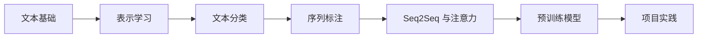

# 第七阶段：自然语言处理

| 信息 | 说明 |
|---|---|
| **预估学时** | 120～180 小时 |
| **前置要求** | 完成第五阶段 |

## 阶段概述

系统掌握 NLP 核心技术与预训练语言模型

:::warning 大模型/Agent方向
本阶段为条件必修。如果跳过，请完成第八A阶段的 NLP 核心速成。
:::

## 阶段导读

这一阶段最好按“文本从表示到任务”的顺序来学：

1. 先补 NLP 地图、预处理和表示
2. 再学 embedding 和语言模型基础
3. 再学分类、序列标注、Seq2Seq
4. 最后再看预训练模型和项目

## 这一阶段的教学安排是否由浅入深？

整体上是顺的，而且这条线对新人尤其重要。

更适合新人的理解主线是：

也就是说：

- **前两章在解决“文本怎么变成模型能吃的表示”**
- **中间三章在解决“文本任务分别怎么建模”**
- **第六章在解释现代 NLP 为什么会走向预训练**
- **第七章负责把整条链真正做成项目**

### 建议学习顺序

1. 第一章：文本基础
2. 第二章：表示学习
3. 第三章：文本分类
4. 第四章：序列标注
5. 第五章：序列到序列
6. 第六章：预训练模型
7. 第七章：项目实践

## 更适合新人的学习节奏

如果你是第一次系统学 NLP，更稳的节奏通常是：

1. 先学第一章  
   先把分词、表示、预处理这些最基础的入口搞清楚。

2. 再学第二章  
   先真正理解词向量、上下文化表示和语言模型直觉。

3. 然后学第三章  
   文本分类是第一次做 NLP 项目最容易建立闭环的任务。

4. 再学第四章  
   这时再去看序列标注，会更容易理解“词级标签”和“句级标签”的差别。

5. 再学第五章  
   先把编码器-解码器和注意力讲顺，再去进入更现代结构。

6. 最后学第六章和第七章  
   把预训练模型和项目实践真正串起来。

## 本阶段章节地图

| 章节 | 主题 | 主要解决什么问题 |
|---|---|---|
| 第一章 | 文本基础 | 建立 NLP 任务地图、预处理和文本表示基础 |
| 第二章 | 表示学习 | 理解词向量、上下文化表示和语言模型直觉 |
| 第三章 | 文本分类 | 学情感分析、主题分类等经典任务 |
| 第四章 | 序列标注 | 学 NER、BIO 标注和标签约束 |
| 第五章 | 序列到序列 | 学编码器-解码器、注意力和生成任务基础 |
| 第六章 | 预训练模型 | 学 BERT、GPT、T5 和现代 NLP 主线 |
| 第七章 | 项目实践 | 用问答、摘要、信息抽取把主线串起来 |

### 学这一阶段最该带走什么

- 知道文本为什么必须先表示成数字
- 知道分类、抽取、生成三类任务的差别
- 知道预训练为什么会改变整个 NLP 主线

## 学这一阶段最容易卡住的地方

- 把 token、embedding、语言模型这些概念混在一起
- 只记模型名字，不先理解任务
- 一看到 Transformer 就跳过前面的传统主线

## 这一阶段最值得优先补强的能力

- 能说清“词、句子、文档”分别怎么表示
- 能分清分类、抽取、生成三类任务
- 能把传统 NLP 和预训练模型主线连起来
- 能通过错例和样本分析理解模型为什么会答错

### 学完后的出口能力

- 能完成一个最小文本分类或信息抽取项目
- 能看懂 BERT / GPT / T5 在任务视角上的差异
- 能更顺地进入第八 A 阶段的大模型原理主线
