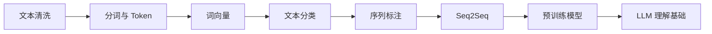
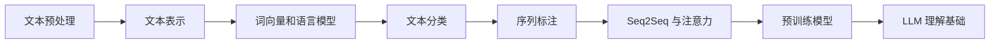

# 11 自然语言处理（方向选修）

这一阶段解决的是“怎样让模型处理文本”。在大模型时代，很多 NLP 基础已经被 LLM 封装起来，但如果你想更深入理解大模型、文本任务、信息抽取、搜索和问答系统，NLP 仍然非常重要。

## 故事化导入：教模型读懂人类语言的弯弯绕

文本不像表格那样整齐，也不像图片那样固定成像素。一个词会因为上下文改变含义，一句话可能包含情绪、实体、关系和意图。NLP 的任务就是把这些看似松散的文字，转换成模型可以计算、比较、分类和生成的表示。

## 学习闯关地图

## 互动练习：同一句话拆出三层信息

选一句用户评论，先判断它的情绪，再找出里面的人名、产品名或地点，最后思考它真正想表达的意图。情绪分类、命名实体识别和意图识别分别对应 NLP 中不同任务。这样练习能帮助你把“读文本”拆成可建模的问题。

## 项目彩蛋

本阶段的彩蛋作品可以是一个“评论理解助手”：输入一批评论后，系统自动判断情绪、提取关键词、归纳主题，并给出典型样本。它既能连接传统 NLP，也能自然升级到 LLM 文本分析和 RAG 文档理解。

## 阶段定位

| 信息 | 说明 |
|---|---|
| 适合对象 | 已完成深度学习基础，希望深入文本任务、大模型原理或 NLP 方向的学习者 |
| 预估学时 | 120～180 小时 |
| 前置要求 | 完成深度学习与 Transformer 基础 |
| 阶段产出 | 文本分类、问答系统、文本摘要或信息抽取项目 |

## 新手最小通关路线

新手先理解文本清洗、分词、Token、词向量、文本分类和预训练模型这些主线概念，不需要一开始掌握所有传统 NLP 模型。只要能完成一个文本分类或关键词抽取项目，并解释文本如何变成模型输入，就算完成最小通关。

## 进阶深入路线

有经验的学习者可以深入上下文表示、序列标注、Seq2Seq、BERT、GPT、T5 和 Transformers 工具链。进一步尝试把传统方法、深度学习方法和 LLM 方法放在同一个文本任务上比较。

## NLP 和大模型是什么关系

NLP 是大模型的重要来源之一。Token、Embedding、语言模型、Seq2Seq、Attention、预训练模型，这些概念都在大模型里继续存在。学习 NLP 不是为了停留在旧方法，而是为了看懂大模型之前的技术积累。

## 新人先做什么，进阶再做什么

新人第一次学这一阶段时，先抓住文本任务的主线：分词、表示、分类、抽取、生成和评估。不要一开始陷入模型名字，先理解输入文本怎样变成可计算的特征。

有经验的学习者可以把重点放在任务边界和评估上：标签体系是否清楚，抽取结果如何判定正确，生成任务如何评估，传统 NLP 和大模型方案怎样取舍。

## 本阶段学习路径

第一章学习文本处理基础，包括 NLP 地图、文本预处理和文本表示。

第二章学习词嵌入与语言模型，理解词向量、上下文表示和语言模型的基本思想。

第三章学习文本分类，这是很多业务文本任务的入门项目。

第四章学习序列标注，包括命名实体识别和 BiLSTM-CRF 等方法。

第五章学习 Seq2Seq 与注意力，理解机器翻译和生成任务的重要历史路线。

第六章学习预训练语言模型，包括 BERT、GPT、T5 和 Transformers 库。

第七章完成 NLP 综合项目。

## 学完后你应该能做到

- 能解释文本如何变成模型能处理的表示
- 能理解词向量、上下文表示和语言模型的区别
- 能完成文本分类、序列标注或摘要类项目
- 能说清楚 BERT、GPT、T5 等预训练模型的大致差异
- 能更顺畅地理解大模型里的 tokenizer、embedding 和上下文建模

## 常见误区

不要认为有了 LLM 就完全不需要 NLP。LLM 让很多任务更容易了，但文本清洗、任务定义、标注格式、评估指标、信息抽取和语义检索仍然离不开 NLP 思维。

也不要一开始陷入传统方法细节。第一遍学习应重点抓“文本如何表示、任务如何建模、预训练如何改变范式”。

## NLP 错误剧场：文本任务先查标签和边界

如果分类模型总混淆相近类别，先检查标签定义是否重叠；如果抽取结果漏信息，检查标注规则和文本切分；如果生成结果流畅但不可靠，必须加入事实检查、引用或人工审核。

## 阶段项目

基础版是完成文本分类项目，包含文本清洗、特征表示、训练和评估。标准版需要加入信息抽取、摘要或问答任务，并比较不同模型或提示方式的效果。挑战版可以做一个评论理解助手或领域文档抽取系统，输出情绪、实体、主题和典型样本分析。

如果你想看更细的学习节奏，可以阅读 [学习指南：自然语言处理怎么学最不容易学乱](./study-guide.md)。