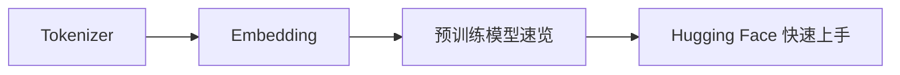

# 学前导读：NLP 核心速成这一章到底在学什么

这一章不是要把完整 NLP 再学一遍，而是给后面大模型主线补最小必需的文本基础。

## 这一章的主线

```mermaid
flowchart LR
    A["Tokenizer"] --> B["Embedding"]
    B --> C["预训练模型速览"]
    C --> D["Hugging Face 快速上手"]
```

这一章学稳后，你再看大模型训练和调用，心里会更有抓手。
