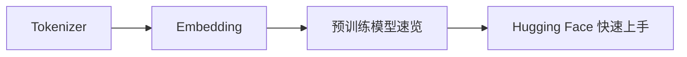

# 学前导读：NLP 核心速成这一章到底在学什么

这一章不是要把完整 NLP 再学一遍，而是给后面大模型主线补最小必需的文本基础。

## 零、先建立一张桥接线

如果你是从第七阶段 NLP 主线过来的，这一章最值得先看清的一件事是：

- 它不是在重复第七阶段
- 而是在给第八 A 阶段后面的 LLM 原理、预训练和调用，补一套最小共同底座

所以这一章真正的定位是：

> **在进入大模型原理前，先把 tokenizer、embedding、预训练模型这些最低限度的文本抓手重新压实。**

## 这一章的主线

这一章学稳后，你再看大模型训练和调用，心里会更有抓手。

## 这一章更适合新人的学习顺序

1. 先看 tokenizer  
   先把“文本怎么切成模型能吃的单位”看清楚。

2. 再看 embedding  
   先把“词或 token 怎么变成向量”接起来。

3. 再看预训练模型速览  
   这时你更容易理解不同模型为什么共享某些底层结构。

4. 最后看 Hugging Face  
   再把前面这些对象真正落到库调用上。

## 这一章最该先抓住什么

- 这一章不是重学 NLP，而是在给大模型主线补最小可用文本底座
- tokenizer 和 embedding 会成为后面所有 LLM 调用和训练的入口对象
- 预训练模型速览是后面进入 LLM 概览与 Transformer 深入的前置抓手
