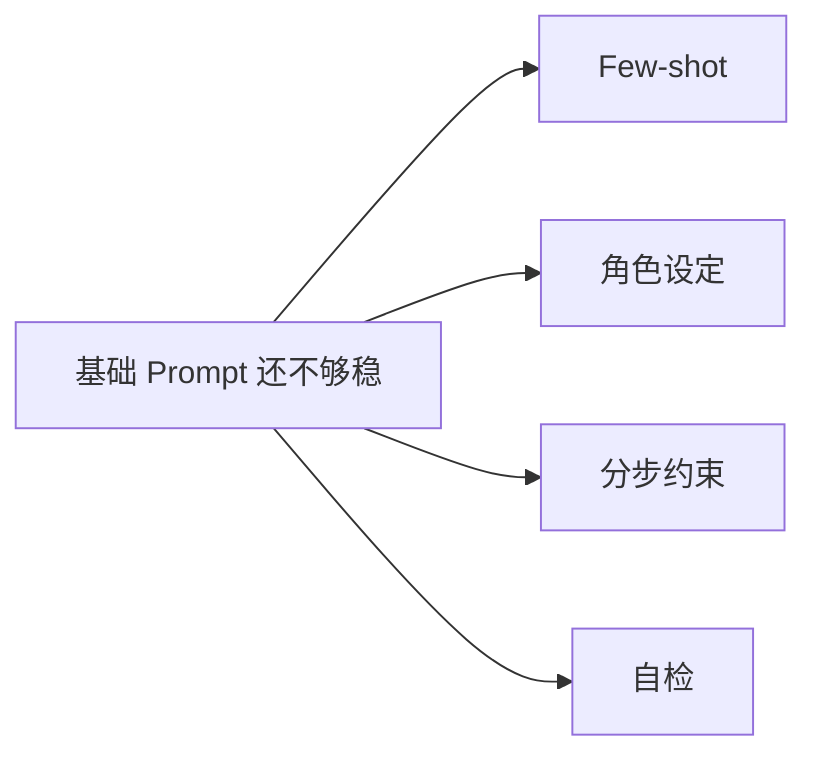

# 高级 Prompt 技巧

:::tip 本节定位
当你已经知道 Prompt 基础后，接下来更自然的问题就是：

> **还有哪些方式能让模型更稳、更接近我想要的结果？**

这就是“高级 Prompt 技巧”的位置。  
但注意，这里的“高级”不等于“更花哨”，而是：

> **更适合问题。**
:::

## 学习目标

- 理解 few-shot、角色设定、分步约束这些技巧分别在解决什么问题
- 学会判断什么时候值得加技巧，什么时候反而会把 Prompt 写乱
- 建立 Prompt 调优要靠实验而不是靠感觉的意识
- 看懂几类常见高级技巧的真实作用边界

---

## 零、先建立一张地图

高级 Prompt 技巧最适合新人的理解方式不是“看到什么招都往上堆”，而是先看清：



这节真正想解决的是：

- 哪些技巧分别在补哪类问题
- 什么时候该加，什么时候反而会让 Prompt 变乱

## 一、为什么会需要“高级” Prompt？

因为有些任务仅靠一句简单指令不够稳。

例如：

- 标签边界模糊
- 输出格式要求严格
- 任务有多阶段逻辑
- 模型容易漏条件

这时就需要更细的引导。

但最重要的原则仍然是：

> **不是技巧越多越好，而是越匹配任务越好。**

---

## 二、Few-shot：为什么“给例子”这么有用？

### 2.1 它最适合哪些问题？

当任务很难只靠一句定义讲清楚时，few-shot 特别有价值。

例如：

- `fact` vs `opinion`
- 信息抽取字段样式
- 某种固定回复风格

### 2.2 一个最小 few-shot 示例

```python
few_shot_examples = [
    {"input": "北京是中国的首都。", "output": "fact"},
    {"input": "这门课非常有趣。", "output": "opinion"}
]

for ex in few_shot_examples:
    print(ex)
```

### 2.3 它真正的作用是什么？

不是“多写几行字”，而是：

> **把抽象规则变成可以模仿的示范。**

这在很多边界模糊任务里比单纯定义更稳。

---

## 三、角色设定什么时候有帮助？

很多 Prompt 会写：

- 你是一个资深老师
- 你是一个法律助手
- 你是一个代码 reviewer

### 3.1 它什么时候真的能带来收益？

当你希望模型：

- 采用某种风格
- 进入某种工作模式
- 维持某种角色边界

时，角色设定会很有帮助。

### 3.2 但角色设定不是魔法

如果任务本身不清楚，只写一句：

- 你是世界顶级专家

通常不会自动让结果变稳。

所以一个很重要的判断是：

> 角色设定是辅助层，不是替代任务定义层。 

---

## 四、分步约束为什么经常更稳？

### 4.1 因为很多任务天然有多阶段

例如：

1. 先找事实
2. 再做判断
3. 最后结构化输出

如果你把这几步全揉成一句话，模型更容易乱。

### 4.2 一个示意

```text
请按以下步骤完成任务：
1. 先找出文本里的关键事实
2. 再判断其情感倾向
3. 最后输出 JSON
```

这种写法的核心价值在于：

> 把任务内部结构显式写出来。 

---

## 五、自检（self-check）为什么会出现？

### 5.1 什么时候它特别有意义？

当你最担心模型：

- 漏掉条件
- 格式出错
- 输出和约束不一致

时，可以让它在输出前再做一层自检。

### 5.2 一个最小示意

```text
在输出最终答案前，请检查：
1. 是否遗漏了关键信息
2. 是否满足输出格式要求
3. 是否包含了原文中不存在的事实
```

### 5.3 这类技巧的边界

它可能有帮助，但不是万能药。  
它更适合：

- 格式敏感
- 漏信息敏感

的场景。

---

## 六、为什么高级技巧不能乱叠？

因为每多加一层技巧，也在增加：

- Prompt 长度
- 复杂度
- 调试难度

所以更成熟的做法通常不是：

- 什么都加

而是：

- 先明确问题，再加最需要的那一层

这是一个非常重要的 Prompt 工程习惯。

---

## 七、一个更稳的 Prompt 调优顺序

比起“看到一个技巧就往上堆”，更推荐：

1. 先把任务目标写清楚
2. 再把输出格式写清楚
3. 如果还不稳，再补示例
4. 如果还是不稳，再加分步约束或自检

这样你更容易判断：

- 哪一层改动真的带来了收益

## 八、第一次做 Prompt 调优时最稳的策略

建议你每次只新增一层技巧，例如：

1. 先改输出格式
2. 再补 1~2 个 few-shot
3. 再考虑加分步约束

不要一次把角色、示例、自检、格式全叠上去，否则很难知道到底哪一层在起作用。

---

## 八、最常见的误区

### 8.1 觉得 Prompt 越长越高级

长但乱的 Prompt 往往更糟。

### 8.2 什么技巧都叠进去

这会让你很难知道究竟哪一层在起作用。

### 8.3 只凭感觉调，不做小实验

## 九、核心提醒

- 高级 Prompt 不是“更花”，而是“更贴问题”
- few-shot、角色设定、分步约束和自检各有边界
- 最稳的调优方式仍然是逐层实验，而不是一次乱叠

Prompt 调优本质上也应该是实验过程。

---

## 小结

这一节最重要的不是背几个技巧名字，而是理解：

> **高级 Prompt 技巧真正有价值的地方，在于它们能帮助你把任务定义、示范、约束和校验做得更稳定。**

而不是让 Prompt “看起来更高级”。

---

## 练习

1. 为一个情感分类任务写出一个包含 few-shot 的 Prompt。
2. 想一想：角色设定和任务目标哪一个更基础？为什么？
3. 用自己的话解释：为什么“分步约束”常常比一句模糊大指令更稳？
4. 为什么说高级 Prompt 技巧真正重要的不是复杂，而是适配？
