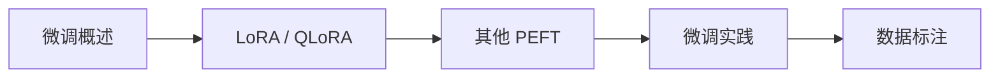

# 学前导读：微调这一章到底在学什么

这一章解决的是：

> **当 Prompt 不够时，怎样真正改模型行为。**

## 这一章的主线

```mermaid
flowchart LR
    A["微调概述"] --> B["LoRA / QLoRA"]
    B --> C["其他 PEFT"]
    C --> D["微调实践"]
    D --> E["数据标注"]
```
