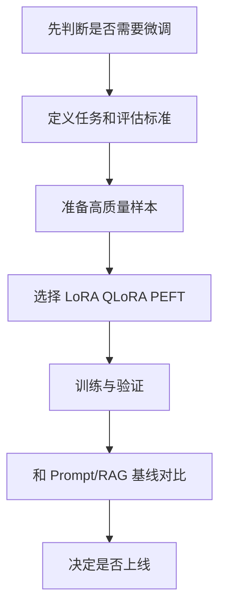
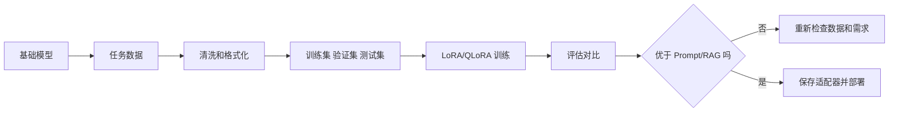

# 学前导读：微调这一章到底在学什么

这一章解决的是：当 Prompt 已经不足以稳定改变模型行为时，怎样通过训练让模型更适合某类任务、格式或领域。

微调不是“让模型什么都变强”的魔法按钮。它更适合解决风格、格式、领域表达、固定任务模式和特定行为习惯的问题。很多知识更新类问题，其实更适合 RAG；很多一次性任务，其实更适合 Prompt；只有当你有稳定任务、足够样本和明确评估标准时，微调才值得认真考虑。

## 这一章在整个课程里的位置

你已经学过大模型概览、预训练和 Prompt 工程。预训练解释模型通用能力从哪里来，Prompt 解释如何在不改参数的情况下调用能力。微调则进入另一条路线：在已有模型基础上，用任务数据继续训练，让模型行为更贴近你的目标。

## 这一章真正要解决的问题

这一章要回答五个问题：什么情况下应该微调，什么情况下不该微调；微调数据应该怎样收集、清洗、标注和切分；LoRA、QLoRA 和其他 PEFT 方法为什么能降低训练成本；微调训练大致包含哪些步骤；怎样通过评估判断微调是真的有效，而不是只在训练样例上看起来更好。

新人最容易误解的是：模型答错领域知识，就立刻想微调。事实上，如果问题是“资料太新、知识太私有、需要可引用来源”，RAG 往往更合适；如果问题是“输出格式、语气、任务套路长期不稳定”，微调才更可能发挥价值。

## 新人推荐学习顺序

建议先看微调概述，建立“为什么微调”和“什么时候不微调”的边界。然后学 LoRA/QLoRA，因为它们是当前入门微调最常见、成本较低的路径。接着了解其他 PEFT 方法，知道全量微调之外还有多种参数高效方案。最后看微调实践和数据标注，把数据准备、训练配置、验证集、评估样例和上线风险串起来。

## 学这一章时要抓住的主线

这一章的主线可以概括为：微调不是从零造模型，而是在已有模型上用高质量样本塑造行为。

看懂这条线后，你会知道微调项目最贵的部分不一定是 GPU，而是数据和评估。没有好数据，微调会把错误学得更稳定；没有评估，你无法判断模型是泛化了，还是只是记住了样本。

## 这一章和后面章节的关系

微调会和 RAG、Prompt、对齐以及模型部署一起构成大模型应用的技术选择框架。Prompt 解决调用方式，RAG 解决外部知识，微调解决稳定行为，对齐解决人类偏好和安全边界，部署解决成本、延迟和可用性。

如果这一章没学稳，后面常见的问题是：把微调当成万能方案；没有验证集就判断效果；训练数据混乱导致模型格式更不稳定；用微调解决本该由 RAG 解决的私有知识更新问题；只看训练 loss，不看真实任务表现。

## 本章小项目出口

学完这一章后，建议做一个小型指令微调实验。选择一个明确任务，例如“把课程章节摘要改写成固定 JSON 结构”或“把用户问题分类为学习路径、概念解释、项目建议、环境问题”。准备几十到几百条样本，先做 Prompt baseline，再用 LoRA/QLoRA 做小规模微调，最后比较格式稳定性、准确率或人工评分。

这个项目的重点是完整闭环：定义任务、准备数据、训练、评估、对比 baseline 和记录失败案例，而不是追求训练出一个很大的模型。

## 过关标准

这一章结束时，你应该能判断一个问题是否适合微调，能解释 LoRA、QLoRA 和 PEFT 的基本作用，能说清楚微调数据为什么比训练脚本更关键，能设计一个最小微调评估方案。

如果你能把 Prompt、RAG 和微调放在同一张决策图里，并说明不同场景下该优先选哪条路线，就说明你已经建立了比较成熟的大模型工程判断。
