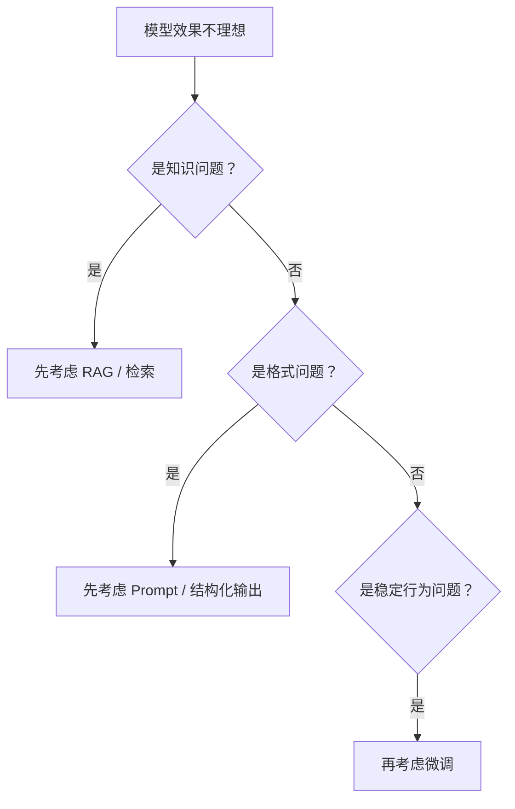

# 微调概述

:::tip 本节定位
很多人一提模型定制，第一反应就是：

- 去微调它

但真实工程里，更重要的问题其实是：

> **现在这个问题，到底值不值得通过微调来解决？**

这一节的核心，不是把“微调”神化成万能按钮，而是把判断逻辑讲清楚。
:::

## 学习目标

- 理解微调真正适合解决哪类问题
- 理解为什么不是所有任务都应该先微调
- 分清全量微调和参数高效微调（PEFT）的基本思路
- 建立更实用的微调决策直觉

---

## 零、先建立一张地图

微调概述这节最适合新人的理解顺序不是“先去训练”，而是先看清决策树：



这节真正想解决的是：

- 到底什么时候才该微调
- 微调解决的是哪类问题，不解决哪类问题

## 一、微调到底在解决什么问题？

可以先把它粗略理解成：

> **让基础模型在某个更具体的任务、风格或领域上表现得更稳定。**

例如：

- 更会某种固定输出格式
- 更适应某类业务回复风格
- 更懂某个垂直领域的任务形式

这说明微调更像是在做：

- 能力塑形

而不只是：

- 知识补充

---

## 二、为什么不是所有问题都该先微调？

很多问题其实更适合先考虑：

- Prompt
- RAG
- 工具调用

### 2.1 如果问题是“知识不够新”

更自然的第一选择往往是：

- 检索

### 2.2 如果问题是“输出格式不稳”

更自然的第一选择往往是：

- Prompt 优化
- 结构化输出

### 2.3 什么时候微调才更值得优先考虑？

当你发现问题更像：

- 模型行为长期不稳
- 风格要求固定
- 某类任务反复出现且模式稳定

这时微调就更有价值。

一句话先记：

> **先分清这是知识问题、格式问题，还是行为问题。**

---

## 三、全量微调和参数高效微调的差别

### 3.1 全量微调

直觉上就是：

- 模型大部分参数都允许更新

优点：

- 灵活

缺点：

- 显存高
- 成本高
- 更难训

### 3.2 参数高效微调（PEFT）

直觉上就是：

- 不去大改整个模型
- 只训练少量增量参数

优点：

- 更省资源
- 更容易复用

这也是为什么现在实际项目里 PEFT 越来越常见。

---

## 四、一个最小参数规模示意

```python
params = {
    "full_finetune": 100_000_000,
    "peft": 5_000_000
}

for name, count in params.items():
    print(name, "trainable_params =", count)
```

### 4.2 这段代码在提醒什么？

它不是在告诉你某个精确数字，而是在提醒：

> 微调方法差别的第一层现实问题，往往是“到底要改多少参数”。 

这直接决定：

- 显存
- 训练速度
- 存储成本

---

## 五、什么时候微调真的很有价值？

### 5.1 当你想让模型形成稳定行为

例如：

- 特定回复风格
- 特定任务格式
- 特定领域习惯

### 5.2 当你有稳定、可持续的数据

如果你的任务数据：

- 量足够
- 质量够好
- 模式比较稳定

那微调通常更有意义。

### 5.3 什么时候不值得？

如果需求经常变化，或者知识频繁更新，  
那很多时候微调并不是第一选择。

---

## 六、微调最容易被高估的地方

### 6.1 误区一：以为微调能解决所有问题

不会。  
很多问题更适合用：

- 检索
- 工作流
- Prompt

### 6.2 误区二：以为微调后模型就会“背住知识库”

微调更适合塑造行为，不总适合承载快速更新的知识。

### 6.3 误区三：只要训了就一定更强

如果数据差，微调反而可能把模型训坏。

---

## 七、一个很实用的判断问题

在决定要不要微调之前，可以先问：

1. 这是知识问题，还是行为问题？
2. 这个任务形态会不会长期稳定存在？
3. 我有没有干净、稳定的数据？
4. 我是否真的有资源承担训练和维护？

如果这些问题答得清楚，微调决策通常就会稳很多。

## 八、第一次做项目时最稳的顺序

如果你想真的落地一个任务，建议先这样走：

1. 先用 Prompt 做 baseline
2. 再用检索或工作流做第二层 baseline
3. 只有在行为仍然长期不稳时，再考虑微调

这样你最后才更容易说明：

- 微调到底解决了什么
- 它值不值得

---

## 八、小结

这一节最重要的不是把微调理解成一个默认动作，而是理解：

> **微调更适合解决“模型行为和任务适配”问题，而不是所有问题。**

一旦这个判断建立起来，后面再学 LoRA、QLoRA 和工程实践时，你就不会盲目上手。

## 九、这节最该带走什么

- 微调不是默认动作，而是一种代价更高的适配手段
- 先分清知识问题、格式问题、行为问题
- 只有当任务长期稳定、数据可靠、收益明确时，微调才更值得优先考虑

---

## 练习

1. 想一个你的真实项目，判断它的问题更像知识问题还是行为问题。
2. 用自己的话解释：为什么不是所有任务都应该优先微调？
3. 如果需求经常变，为什么微调未必是第一选择？
4. 为什么说“数据质量”往往比“方法名”更影响微调结果？
