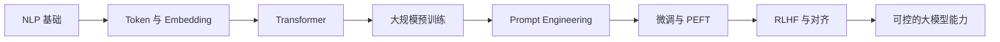

# 06 大模型原理、Prompt 与微调

这一阶段解决的是“大模型能力从哪里来，怎样被控制和适配”。你不只是学习几个模型名字，而是理解 Token、Embedding、Transformer、预训练、Prompt、微调和对齐之间的关系。

## 阶段定位

| 信息 | 说明 |
|---|---|
| 适合对象 | 已完成深度学习与 Transformer 基础，希望进入 LLM 应用、RAG 或 Agent 的学习者 |
| 预估学时 | 90～120 小时 |
| 前置要求 | 完成第五阶段；如果 NLP 基础较弱，可配合第七阶段或本阶段 NLP 速成内容 |
| 阶段产出 | Prompt 实验、结构化输出任务、领域微调或微调方案设计 |

## 大模型在 AI 历史中的位置

大模型不是凭空出现的，它继承了深度学习、NLP、Transformer 和预训练范式。真正的变化在于：模型规模、数据规模和指令对齐让语言模型从“完成单个 NLP 任务”变成“通过语言接口完成大量任务”。

## 本阶段学习路径

第一章先补 NLP 核心速成，包括 tokenizer、embedding、预训练模型和 HuggingFace 快速体验。

第二章学习大语言模型概览，理解 LLM 发展历史、核心概念和行业格局。

第三章深入 Transformer，重点理解架构、变体、高效注意力和规模化计算。

第四章学习预训练技术，包括数据、训练方法和工程问题。

第五章学习 Prompt Engineering，让你知道如何通过输入组织模型行为。

第六章学习微调，重点理解 LoRA、QLoRA、PEFT 和数据标注。

第七章学习 RLHF 与对齐，理解为什么模型能力强还不等于可靠、可控、安全。

## 学完后你应该能做到

- 能解释 Token、Embedding、Attention 和上下文窗口的基本含义
- 能说清楚预训练、指令微调、Prompt 和微调之间的区别
- 能设计基本 Prompt，并要求模型输出结构化结果
- 能判断一个任务更适合 Prompt、RAG 还是微调
- 能理解 LoRA/QLoRA 的用途和适用边界
- 能为后续 LLM 应用、RAG 和 Agent 系统建立模型行为直觉

## 常见误区

不要把大模型理解成“更大的搜索引擎”或“带知识的数据库”。大模型本质上仍然是基于上下文生成 token 的模型，它可能生成错误内容，也可能因为提示、上下文或任务定义不清而表现不稳定。

也不要一上来就追求微调。很多应用问题优先应该用 Prompt、结构化输出、RAG 或系统设计解决，微调通常不是第一步。

## 阶段项目

推荐完成一个 Prompt 实验项目：围绕同一任务，对比普通提示、角色提示、分步骤提示、结构化输出和少样本提示的效果。进阶项目可以设计一个小型领域微调方案，说明数据来源、标注格式、训练方式、评估指标和风险。

如果你想看更细的学习节奏，可以阅读 [学习指南：大模型原理怎么学最不容易学乱](./study-guide.md)。