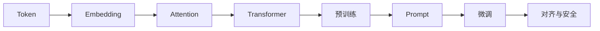
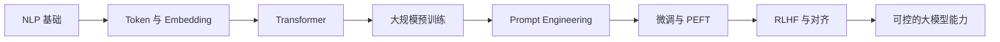

# 7 大模型原理、Prompt 与微调

这一阶段解决的是“大模型能力从哪里来，怎样被控制和适配”。你不只是学习几个模型名字，而是理解 Token、Embedding、Transformer、预训练、Prompt、微调和对齐之间的关系。

## 故事化导入：拆开聊天机器人的魔法盒

大模型看起来像魔法：输入一句话，它就能写代码、总结文档、扮演角色、规划任务。但这一阶段要做的是把魔法盒拆开：文本先被切成 Token，Token 变成向量，Transformer 在上下文里计算关系，预训练让模型获得语言能力，Prompt 和微调再把能力引导到具体任务上。

## 学习闯关地图

## 互动练习：像做实验一样写 Prompt

不要只问“这个 Prompt 好不好”，而是每次只改一个变量：是否加角色、是否给示例、是否要求分步骤、是否限制输出格式、是否提供评分标准。把不同版本的输入和输出保存下来，你会慢慢形成自己的 Prompt 实验手册。

## 项目彩蛋

本阶段的彩蛋作品是一份“Prompt 实验图谱”：选择同一个任务，设计至少五种提示方式，比较输出质量、稳定性、格式可控性和成本。后面做 RAG、Agent、结构化输出和工具调用时，这份图谱会成为你的提示工程起点。

## 阶段定位

| 信息 | 说明 |
|---|---|
| 适合对象 | 已完成深度学习与 Transformer 基础，希望进入 LLM 应用、RAG 或 Agent 的学习者 |
| 预估学时 | 90～120 小时 |
| 前置要求 | 完成 6 深度学习与 Transformer 基础；如果 NLP 基础较弱，可配合 11 自然语言处理（方向选修）或本阶段 NLP 速成内容 |
| 阶段产出 | Prompt 实验、结构化输出任务、领域微调或微调方案设计 |

## 新手最小通关路线

新手先理解 Token、Embedding、Attention、Transformer、预训练、Prompt、微调和对齐之间的关系，不需要一开始训练自己的大模型。只要能设计稳定 Prompt、让模型输出结构化结果，并判断任务适合 Prompt、RAG 还是微调，就算完成最小通关。

## 进阶深入路线

有经验的学习者可以深入 Transformer 变体、预训练数据、LoRA/QLoRA、指令微调、RLHF 和模型评估。进一步尝试为一个领域任务设计微调方案，明确数据格式、训练成本、评估指标和风险边界。

## 大模型在 AI 历史中的位置

大模型不是凭空出现的，它继承了深度学习、NLP、Transformer 和预训练范式。真正的变化在于：模型规模、数据规模和指令对齐让语言模型从“完成单个 NLP 任务”变成“通过语言接口完成大量任务”。

## 新人先做什么，进阶再做什么

新人第一次学这一阶段时，先把大模型看成“会根据上下文完成任务的接口”。先练稳定 Prompt、结构化输出和简单评估，再理解预训练、微调和对齐背后的原因。

有经验的学习者可以把重点放在方案选择上：什么时候 Prompt 足够，什么时候需要 RAG，什么时候才考虑微调，如何设计评估集验证效果。你的目标不是追模型名，而是能为真实问题选择合适的大模型方案。

## 本阶段学习路径

第一章先补 NLP 核心速成，包括 tokenizer、embedding、预训练模型和 HuggingFace 快速体验。

第二章学习大语言模型概览，理解 LLM 发展历史、核心概念和行业格局。

第三章深入 Transformer，重点理解架构、变体、高效注意力和规模化计算。

第四章学习预训练技术，包括数据、训练方法和工程问题。

第五章学习 Prompt Engineering，让你知道如何通过输入组织模型行为。

第六章学习微调，重点理解 LoRA、QLoRA、PEFT 和数据标注。

第七章学习 RLHF 与对齐，理解为什么模型能力强还不等于可靠、可控、安全。

## 学完后你应该能做到

- 能解释 Token、Embedding、Attention 和上下文窗口的基本含义
- 能说清楚预训练、指令微调、Prompt 和微调之间的区别
- 能设计基本 Prompt，并要求模型输出结构化结果
- 能判断一个任务更适合 Prompt、RAG 还是微调
- 能理解 LoRA/QLoRA 的用途和适用边界
- 能为后续 LLM 应用、RAG 和 Agent 系统建立模型行为直觉

## 常见误区

不要把大模型理解成“更大的搜索引擎”或“带知识的数据库”。大模型本质上仍然是基于上下文生成 token 的模型，它可能生成错误内容，也可能因为提示、上下文或任务定义不清而表现不稳定。

也不要一上来就追求微调。很多应用问题优先应该用 Prompt、结构化输出、RAG 或系统设计解决，微调通常不是第一步。

## 大模型错误剧场：回答不稳定时先定位什么

如果模型输出跑偏，先检查任务说明是否清楚、输出格式是否给例子、上下文是否包含冲突信息；如果结构化输出经常失败，先减少字段、增加示例并做解析校验；如果效果仍不稳定，要用固定问题集比较 Prompt、RAG 或微调方案，而不是凭单次体验判断。

## 第一遍怎么读：必读、项目查阅和选修深入

| 阅读标签 | 建议章节 | 学习目标 |
|---|---|---|
| 必读 | NLP 速成、LLM 核心概念、Prompt 基础、结构化输出 | 先理解模型输入输出、上下文和任务表达 |
| 项目查阅 | Prompt 实践、微调概览、数据标注、阶段项目 | 做 Prompt 对比或领域适配项目时重点查看 |
| 选修深入 | Transformer 深入、预训练工程、LoRA/QLoRA、RLHF 和对齐 | 想走模型理解、微调或评估方向时再深入 |

第一遍不要把所有 Transformer 和预训练细节都当成必背内容。更重要的是能判断一个任务该用 Prompt、RAG、微调还是 Agent。

## 阶段复盘卡：从模型原理到任务适配

学完这个阶段后，可以用下面这张表检查自己是否真正理解了“大模型怎么来、怎么用、怎么适配”。

| 复盘问题 | 你应该能回答什么 |
|---|---|
| Token 与 Embedding | 文本为什么要先切成 token，再变成向量？ |
| Transformer | 注意力机制为什么能处理上下文关系？ |
| 预训练 | 模型能力主要从数据和训练目标中学到了什么？ |
| Prompt | 哪些问题可以先通过更清楚的任务说明解决？ |
| 微调 | 哪些问题属于长期行为适配，而不是知识更新？ |
| 对齐 | 为什么“模型会回答”不等于“模型可靠、安全、符合意图”？ |

这一阶段真正的出口，不是能背出很多模型名字，而是能判断：一个任务到底该用 Prompt、结构化输出、RAG、微调，还是后面的 Agent 系统来解决。

## 阶段项目

基础版是完成一个 Prompt 对比实验，记录普通提示、角色提示、分步骤提示和结构化输出的效果差异。标准版需要围绕同一任务建立 Prompt 实验图谱，比较稳定性、格式控制、成本和错误类型。挑战版可以设计一个领域微调方案或最小微调实验，说明数据来源、标注规范、训练方式、评估方法和安全风险。

如果你想看更细的学习节奏，可以阅读 [学习指南：大模型原理怎么学最不容易学乱](./study-guide.md)。

## 本阶段趣味任务卡

| 玩法 | 本阶段任务 |
|---|---|
| 剧情任务 | 让助手稳定表达：设计 Prompt、约束结构化输出，并用固定输入检查漂移。 |
| Boss 战 | **JSON 漂移怪** |
| 可解锁徽章 | Prompt 调教师、Schema 守护者 |
| 新手轻松版 | 只完成一个最小输入到输出闭环，先留下运行截图或命令输出 |
| 作品集证据 | Prompt 版本表和 schema 校验结果 |

如果你觉得本阶段内容很多，先把这张任务卡当作最低目标。能完成新手轻松版，就可以继续往后学；以后准备作品集时，再回来升级标准版和挑战版。

## 阶段交付物

| 交付物 | 最小版 | 作品集版 |
|---|---|---|
| Prompt 对比实验 | 比较普通提示、角色提示和分步骤提示 | 有固定输入、输出对比、版本记录和失败样本 |
| 结构化输出样例 | 能让模型输出 JSON 或表格 | 有 schema、解析校验、错误重试和回归样本 |
| 任务适配判断 | 能说明何时用 Prompt、RAG 或微调 | 有决策表、成本估算和适用边界说明 |
| 微调方案 | 写出数据来源和标注思路 | 包含训练方式、评估集、安全风险和替代方案 |
| README/报告 | 展示实验输入输出 | 说明 Prompt 版本、指标、失败类型和下一步 |

## 和 AI 学习助手贯穿项目的关系

本阶段可以对应 AI 学习助手 v0.7：接入 LLM API，生成学习计划、复盘卡、Prompt 模板和结构化摘要。 如果你正在按贯穿项目路线学习，建议本阶段结束时至少提交一次版本记录：本阶段新增了什么能力、如何运行、示例输入输出是什么、遇到了什么问题、下一步准备怎么改。

## 阶段通关标准

| 通关层级 | 你需要做到什么 |
|---|---|
| 最低通关 | 能解释 Transformer、预训练、Prompt、微调和对齐的边界。 |
| 推荐通关 | 完成本阶段至少一个可运行小项目，并在 README 中记录运行方式、示例输入输出和遇到的问题。 |
| 作品集通关 | 把本阶段产出接入“AI 学习助手”贯穿项目，留下截图、日志、评估样例和下一步计划。 |

学完本阶段后，不需要把所有细节都背下来。更重要的是能说清楚：本阶段解决什么问题，它和上一阶段的关系是什么，以及它会怎样支撑后续学习。下一阶段会把大模型接入 RAG 和应用系统。
