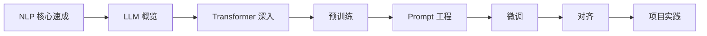

# 第八A阶段：大模型原理与微调

| 信息 | 说明 |
|---|---|
| **预估学时** | 90～120 小时 |
| **前置要求** | 完成第五阶段，强烈建议完成第七阶段 |

## 阶段概述

深入理解大语言模型原理，掌握 Prompt 工程、微调与对齐技术

## 阶段导读

这一阶段不要只把它看成“大模型名词汇总”。  
更稳妥的学习主线是：

1. 先补 NLP crash course
2. 再看 LLM 概览与 Transformer 深入
3. 再看预训练、Prompt、微调、对齐
4. 最后做项目页

## 这一阶段的教学安排是否由浅入深？

整体上是顺的，而且对第一次系统理解大模型的人来说，这种从 NLP 基础一路走到微调和对齐的路径是合理的。

更适合新人的理解主线是：

也就是说：

- **前四章在回答模型能力从哪里来**
- **第五到第七章在回答能力怎样被控制、适配和约束**
- **第八章负责把这些能力真正放进一个具体项目**

### 建议学习顺序

1. 第一章：NLP 核心速成
2. 第二章：LLM 概览
3. 第三章：Transformer 深入
4. 第四章：预训练
5. 第五章：Prompt 工程
6. 第六章：微调
7. 第七章：对齐
8. 第八章：项目实践

## 更适合新人的学习节奏

如果你是第一次系统学大模型，更稳的节奏通常是：

1. 先把第一章完整学完  
   先把 tokenizer、embedding、预训练模型这些“最小文本底座”补齐。

2. 再学第二、三章  
   先把 LLM 发展脉络和 Transformer 核心结构真正接起来。

3. 再学第四章  
   先知道模型为什么会具备通用能力，再看后面的 Prompt 和微调才不容易飘。

4. 然后学第五章  
   先理解“不改模型时怎样把输出变好”。

5. 再学第六、第七章  
   这时你会更容易区分微调、对齐和 Prompt 的边界。

6. 最后做第八章项目  
   把数据、训练方式、评估和业务目标串起来。

## 本阶段章节地图

| 章节 | 主题 | 主要解决什么问题 |
|---|---|---|
| 第一章 | NLP 核心速成 | 给后面大模型主线补齐最小文本基础 |
| 第二章 | LLM 概览 | 建立大模型发展脉络和基本名词地图 |
| 第三章 | Transformer 深入 | 理解 block、注意力、规模化与变体 |
| 第四章 | 预训练 | 理解数据、目标函数和训练工程 |
| 第五章 | Prompt 工程 | 理解不改模型时如何提升输出质量 |
| 第六章 | 微调 | 理解 SFT、LoRA、QLoRA 和数据准备 |
| 第七章 | 对齐 | 理解 RLHF、DPO 和行为控制主线 |
| 第八章 | 项目实践 | 把原理、数据、微调与评估串起来 |

### 学这一阶段最容易卡住的地方

- 只记模型名，不记训练范式
- 把 Prompt、RAG、微调混成一个东西
- 低估数据和评估在微调里的作用

## 学这一阶段时建议带着的问题

- 这个能力是预训练带来的，还是指令微调带来的
- 这个问题更适合 Prompt、微调还是 RAG
- 模型行为变化究竟来自数据、参数还是推理时约束

## 这一阶段最值得优先补强的能力

- 能把“模型结构、训练范式、任务适配方式”讲成一条线
- 能分清 Prompt、微调、RAG、对齐各自解决什么问题
- 能从项目目标反推：到底该改数据、改参数，还是改推理流程

### 学完后的出口能力

- 能说清 GPT / BERT / T5 / LoRA / RLHF 的区别
- 能判断什么时候该 Prompt、什么时候该微调
- 能做一个最小领域微调或对齐项目规划
