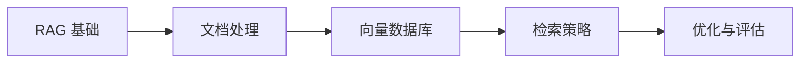

# 学前导读：RAG 这一章到底在学什么

这一章解决的是：

> **当模型知识不够新、不够全时，怎样先把外部知识接进来。**

## 先建立一张桥接线

如果你是从第八 A 阶段过来的，这一章最值得先看清的一件事是：

- 前面你已经知道模型能力和微调从哪里来
- 这一章开始回答：如果问题不是“能力不够”，而是“知识不够新 / 不够全”，那应该怎么办

所以 RAG 主线真正重要的不是“多接一个向量库”，而是：

> **在不改模型参数的前提下，把外部知识稳定地接进回答链路。**

## 这一章的主线

## 这一章更适合新人的学习顺序

1. 先看 RAG 基础  
   先把“先查资料，再回答”这条主线立住。

2. 再看文档处理和切块  
   先知道知识为什么不能原样直接塞给模型。

3. 再看向量库和检索策略  
   这时你更容易理解召回、重排、过滤为什么会影响生成质量。

4. 最后看优化与评估  
   真正建立“RAG 不是搭起来就完了”的工程直觉。

## 这一章最该先抓住什么

- RAG 的核心不是“模型更强”，而是“知识链路更可控”
- 检索质量会直接决定生成质量
- 这一章是后面知识库、助手和企业问答系统的关键地基
