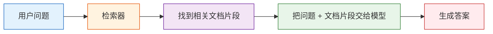

# RAG 基础

## 学习目标

完成本节后，你将能够：

- 理解为什么光靠大模型参数记忆不够
- 说清楚 RAG 的标准工作流程
- 跑通一个最小可运行的检索增强示例
- 理解 RAG 适合什么场景、不适合什么场景

---

## 一、为什么需要 RAG？

你可以把大模型想成一个“读过很多书的人”。  
但即使读过很多书，也会遇到三个问题：

1. 某些信息太新，训练时还没出现
2. 某些信息太专，模型记得不牢
3. 某些回答必须严格基于你自己的私有文档

这时候就需要 RAG：

> **先查资料，再回答。**

类比一下：

- 纯模型回答：闭卷考试
- RAG 回答：开卷考试

---

## 二、RAG 的标准流程



拆开看就是：

1. 文档先被切成小块
2. 用户提问时，从知识库里检索相关块
3. 把这些块作为上下文交给模型
4. 模型基于上下文生成答案

---

## 三、一个最小可运行的迷你 RAG

为了保证代码直接能跑，下面不用向量数据库，先用最简单的关键词重叠来模拟“检索”。

```python
import re
from collections import Counter

documents = [
    {
        "id": 1,
        "title": "退款政策",
        "content": "课程购买后 7 天内，如果学习进度低于 20%，可以申请退款。"
    },
    {
        "id": 2,
        "title": "证书说明",
        "content": "完成所有必修项目并通过结课测试后，可以获得课程结业证书。"
    },
    {
        "id": 3,
        "title": "学习方式",
        "content": "课程支持按阶段学习，建议先完成 Python、数据分析和机器学习基础。"
    }
]

def tokenize(text):
    return re.findall(r"[\\w\\u4e00-\\u9fff]+", text.lower())

def overlap_score(query, doc_text):
    query_tokens = tokenize(query)
    doc_tokens = tokenize(doc_text)
    query_count = Counter(query_tokens)
    doc_count = Counter(doc_tokens)
    return sum(min(query_count[t], doc_count[t]) for t in query_count)

def retrieve(query, documents, top_k=2):
    scored = []
    for doc in documents:
        score = overlap_score(query, doc["content"] + " " + doc["title"])
        scored.append((score, doc))
    scored.sort(key=lambda x: x[0], reverse=True)
    return [doc for score, doc in scored[:top_k] if score > 0]

def answer_with_rag(query):
    hits = retrieve(query, documents, top_k=2)
    if not hits:
        return "知识库里没有找到足够相关的信息。"

    context = "\\n".join([f"- {doc['title']}：{doc['content']}" for doc in hits])
    return f"根据知识库检索结果：\\n{context}\\n\\n回答：优先参考上面的条款。"

query = "课程多久内可以退款？"
print(answer_with_rag(query))
```

这个例子虽然简化了，但已经完整体现了 RAG 的结构。

---

## 四、RAG 真正提升的是什么？

RAG 主要提升的是三件事：

### 1. 时效性

资料可以随时更新，不必重新训练大模型。

### 2. 可控性

回答基于你指定的知识库，不是完全靠模型自由发挥。

### 3. 可追溯性

你可以把“参考了哪些文档片段”展示给用户看。

这在企业场景里尤其重要。

---

## 五、RAG 不等于“问什么都不会幻觉”

这是一个特别常见的误解。

RAG 虽然能降低幻觉，但不能彻底消灭。  
它还是可能在这些地方出问题：

- 检索错了
- 检索不全
- 文档切块不好
- 模型拿到证据后仍然总结错

所以 RAG 不是银弹，它是一种“让答案更有根据”的工程方法。

---

## 六、RAG 最适合哪些场景？

### 很适合

- 企业知识库问答
- 政策 / 制度 / FAQ 查询
- 基于产品文档的客服系统
- 基于代码库 / 文档库的检索问答

### 不太适合

- 纯开放创作类任务
- 根本没有知识库的场景
- 需要精确数值计算但文档本身又不稳定的场景

---

## 七、RAG 和微调是什么关系？

很多新人会把它们混在一起。

### RAG

- 不改模型参数
- 靠“外部资料注入上下文”

### 微调

- 修改模型参数
- 让模型长期学会某种风格或能力

类比一下：

- RAG：考试时带资料
- 微调：考前长期训练

两者不是互斥的，很多系统会一起用。

---

## 八、一个更像“产品”的小例子

你可以把上面的迷你 RAG 稍微包装成“课程助手”：

```python
questions = [
    "结业证书怎么拿？",
    "学习顺序怎么安排？",
    "我能退款吗？"
]

for q in questions:
    print("=" * 50)
    print("用户问题:", q)
    print(answer_with_rag(q))
```

这就是很多 AI 问答产品的最小原型。

---

## 九、初学者常见误区

### 1. 以为 RAG 的核心是“调用一下向量库”

不是。  
RAG 的核心是：**让正确资料在正确时机进入模型上下文。**

### 2. 以为检索和生成可以完全分开看

不行。  
检索质量会直接决定生成质量。

### 3. 以为文档原样塞进去就行

实际效果很大程度取决于切块、清洗、元数据和召回策略。

---

## 小结

这节课最关键的一句话是：

> **RAG 的本质，是让模型回答问题前先去查资料。**

它不是替代模型，而是给模型补上“外部记忆”和“可更新知识”。

下一节我们就继续看：  
这些资料到底该怎么清洗、切块和向量化。

---

## 练习

1. 给 `documents` 再加两条文档，试着查询新的问题。
2. 修改 `retrieve()` 的 `top_k`，观察回答上下文会怎么变化。
3. 思考：如果文档里写的是“14 天可退款”，而模型回答成“7 天”，可能是哪一步出了问题？
