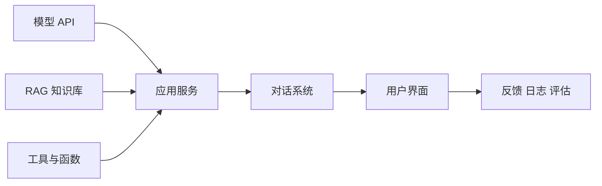
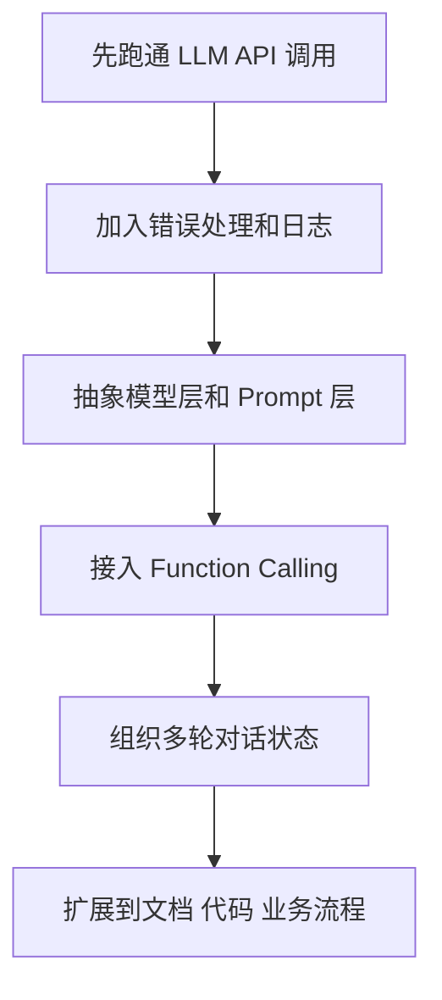
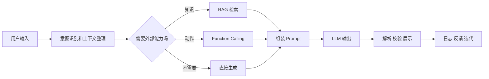

# 学前导读：应用开发这一章到底在学什么

这一章解决的是：模型能力怎样被组织成真实可用的产品功能。

到这里，你已经知道 RAG 如何接入知识，模型部署如何提供稳定调用方式。应用开发这一章要进一步回答：这些能力怎样被封装成用户能使用、开发者能维护、系统能持续运行的功能。

## 这一章在整个课程里的位置

第八 B 阶段的主线是把大模型从“能回答”推进到“能做成应用”。RAG 负责知识链路，部署负责模型服务，应用开发负责把模型、知识、工具、界面和业务流程组织起来。

这一步的关键变化是：你不再只写一次模型调用，而是要设计一个完整交互过程。用户输入从哪里来，系统怎样理解意图，是否需要调用工具，如何保存多轮上下文，输出如何被前端或后端继续使用，这些都是应用层要处理的问题。

## 这一章真正要解决的问题

这一章要回答五个问题：如何可靠调用 LLM API，并处理超时、重试、成本和错误；为什么应用复杂后需要框架或抽象层；Function Calling 如何把模型输出连接成系统动作；多轮对话怎样维护上下文和状态；文档解析、模板生成、代码助手等复杂场景怎样被拆成可维护模块。

新人最容易误解的是：LLM 应用开发就是“前端输入框加一个模型接口”。真实产品里，模型只是其中一层。你还需要处理输入校验、上下文管理、权限、日志、异常、结构化输出、用户反馈和效果评估。

## 新人推荐学习顺序

建议先看 API 调用实践，把最小调用链路、参数、错误处理和成本意识建立起来。然后看框架抽象，理解为什么当功能变复杂时，需要把 prompt、模型、工具、检索、记忆和输出解析拆成组件。接着学 Function Calling，因为这是从“生成文本”走向“触发动作”的关键。最后学对话系统和复杂应用场景，把多轮状态、文档处理和模板生成连接起来。

## 学这一章时要抓住的主线

这一章的主线可以概括为：把一次模型调用，升级成一个可维护的应用闭环。

这条线能帮助你判断应用开发的重点在哪里。不是每个场景都需要复杂框架，但每个可用产品都需要明确输入、处理、输出和反馈闭环。

## 这一章和后面章节的关系

应用开发是 RAG 和 Agent 之间的桥。RAG 让系统会查资料，Function Calling 让系统能触发动作，多轮对话让系统能持续交互，这些能力组合起来后，就会自然进入 Agent 的目标、计划、工具、记忆和执行闭环。

如果这一章没学稳，后面常见的问题是：Agent 还没做，应用层已经混乱；工具调用结果没有校验；对话状态越堆越乱；模型输出格式不稳定导致后端解析失败；只关注 Demo 成功，不知道异常路径如何处理。

## 本章小项目出口

学完这一章后，建议做一个“课程问答与学习规划助手”。它可以接收用户问题，判断是概念解释、路线建议、项目建议还是资料检索；必要时调用知识库检索；最后输出结构化建议，并记录用户反馈。

这个项目可以很小，但要体现应用闭环：API 调用、Prompt 组织、可选工具调用、多轮上下文、结构化输出、日志记录和简单错误处理。

## 过关标准

这一章结束时，你应该能独立封装一个 LLM API 调用模块，能解释 Function Calling 如何连接模型和工具，能设计一个基本多轮对话状态结构，能把 RAG、Prompt 和工具调用组织成一个小型应用。

如果你能把模型调用失败、输出格式错误、检索为空和工具报错这些异常路径都考虑进去，说明你已经开始具备大模型应用工程化思维。
