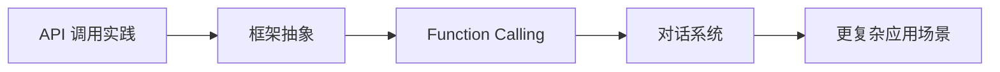

# 学前导读：应用开发这一章到底在学什么

这一章解决的是：

> **模型能力怎样被组织成真实可用的功能。**

## 这一章的主线

```mermaid
flowchart LR
    A["API 调用实践"] --> B["框架抽象"]
    B --> C["Function Calling"]
    C --> D["对话系统"]
    D --> E["更复杂应用场景"]
```
