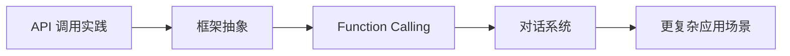

# 学前导读：应用开发这一章到底在学什么

这一章解决的是：

> **模型能力怎样被组织成真实可用的功能。**

## 零、先建立一张桥接线

如果你刚学完 RAG 和部署，这一章最值得先看清的一件事是：

- 前面你已经知道知识怎么接进来、模型怎么调用出去
- 这一章开始回答：这些能力怎样被组织成“用户真的能用”的产品功能

所以应用开发这一章真正重要的不是“多加一个框架”，而是：

> **把知识、模型调用和交互流程，组织成稳定的产品闭环。**

## 这一章的主线

## 这一章更适合新人的学习顺序

1. 先看 API 调用实践  
   先把最小调用链路和错误处理立住。

2. 再看框架抽象  
   先知道为什么一旦能力变复杂，代码会自然长出抽象层。

3. 再看 Function Calling 和对话系统  
   这时你更容易理解“模型输出”如何接成“系统动作”和“多轮状态”。

## 这一章最该先抓住什么

- 应用层关心的不只是生成文本，而是完整交互功能
- 框架只是手段，真正主线是功能组织
- 这一章会把前面的知识层、模型层真正接到产品层
