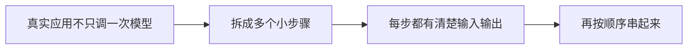

# LangChain 基础

:::tip 本节定位
很多人第一次看 LangChain，会觉得它只是“把模型调一下”。  
但它真正想解决的问题其实更具体：

> **当你的应用不再只是一次模型调用，而是多步组件组合时，怎样把它组织得更清楚？**

这就是 LangChain 的价值入口。
:::

## 学习目标

- 理解 LangChain 这种链式抽象为什么会自然出现
- 看懂 Prompt、模型、解析器、检索器在链中的位置
- 用一个最小例子理解“上一步输出喂给下一步”的核心味道
- 理解它为什么很适合做原型和线性工作流

---

## 零、先建立一张地图

LangChain 这节最适合新人的理解顺序不是“先学框架 API”，而是先看清：



所以这节真正想解决的是：

- 为什么链式抽象会自然出现
- 它到底是在替你整理什么

## 一、为什么需要“链”这种抽象？

### 1.1 因为真实应用通常不只调一次模型

比如你想做一个小问答系统，可能就已经有这些步骤：

1. 清理用户 query
2. 检索文档
3. 拼 prompt
4. 调模型
5. 格式化输出

如果你全手写在一个函数里，虽然也能跑，但很快会变得：

- 不清楚
- 不可复用
- 不好调试

### 1.2 链式抽象到底在做什么？

它在说：

> **把每一步都做成一个职责明确的小组件，然后按顺序串起来。**

这就是 LangChain 最核心的味道。

---

## 二、一个最小链式示例

```python
class SimpleChain:
    def __init__(self, steps):
        self.steps = steps

    def run(self, value):
        for step in self.steps:
            value = step(value)
        return value

def normalize_query(text):
    return text.strip().lower()

def retrieve_docs(query):
    if "退款" in query:
        return {"query": query, "docs": ["课程购买后 7 天内可退款。"]}
    return {"query": query, "docs": []}

def format_answer(payload):
    if payload["docs"]:
        return f"根据资料：{payload['docs'][0]}"
    return "没有找到相关资料。"

chain = SimpleChain([
    normalize_query,
    retrieve_docs,
    format_answer
])

print(chain.run("  退款政策是什么？ "))
```

### 2.2 这段代码在教什么？

它已经在教你 LangChain 最核心的一件事：

> 每一步只关心自己的输入输出，整个系统通过串联完成任务。 

这就是链式应用最核心的价值。

---

## 三、Prompt 在链里扮演什么角色？

### 3.1 Prompt 不是“附属文案”，而是一个组件

在很多链路里，Prompt 本身就是中间的一步：

- 输入 query
- 生成更清晰的提示模板

### 3.2 一个简单示意

```python
def build_prompt(payload):
    docs = payload["docs"]
    query = payload["query"]
    return f"请根据以下资料回答问题：资料={docs}，问题={query}"

payload = {"query": "退款政策是什么", "docs": ["课程购买后 7 天内可退款。"]}
print(build_prompt(payload))
```

这个例子在提醒你：

> Prompt 也可以被看作链里的一个中间变换节点。 

---

## 四、再加上一个“模型”步骤

为了保证示例能离线运行，我们继续用 mock model。

```python
def mock_llm(prompt):
    return f"模型输出：{prompt}"

chain = SimpleChain([
    normalize_query,
    retrieve_docs,
    build_prompt,
    mock_llm
])

print(chain.run("退款政策是什么？"))
```

### 4.2 这一步最关键的收获

你会开始看到：

- 检索器
- prompt builder
- model

其实都是链上的不同节点。

这也是为什么 LangChain 会给人一种“组件拼装框架”的感觉。

---

## 五、输出解析器为什么也重要？

很多人只关注输入 prompt 和模型输出，忽略了：

> 模型输出后，系统还常常要继续做结构化处理。 

例如：

- 只取一部分字段
- 转成 JSON
- 映射到前端展示格式

### 一个最小示例

```python
def output_parser(text):
    return {
        "answer": text.replace("模型输出：", ""),
        "ok": True
    }

chain = SimpleChain([
    normalize_query,
    retrieve_docs,
    build_prompt,
    mock_llm,
    output_parser
])

print(chain.run("退款政策是什么？"))
```

这一步会让你更清楚地意识到：

> LangChain 的真正价值，常常在“把不同组件的边界拆清楚”。 

---

## 六、为什么它特别适合做原型？

因为很多早期 LLM 应用都很像：

- 一条比较线性的流程
- 几个组件依次执行

例如：

- 清理 query
- 检索
- 拼 prompt
- 调模型
- 解析结果

这正是链式抽象最舒服的场景。

---

## 七、什么时候它会开始吃力？

如果你的流程开始变成：

- 如果检索失败就改写 query 再查一次
- 如果答案不够稳就让 reviewer 再检查
- 某些请求要走工具，某些请求不要

这种情况下，“一条直链”就会越来越勉强。

也就是说：

> 当系统开始有明显状态分支和回路时，链式抽象就可能不够了。 

这也是为什么后面会需要 LangGraph 这种更图式的框架。

---

## 八、一个很重要的工程提醒

很多人学 LangChain 时最容易犯的错是：

- 一开始就背一堆类名和接口

但更稳的方式通常是：

1. 先理解链式抽象在解决什么问题
2. 再去看具体 API

不然很容易变成：

- 会写框架代码
- 但不知道为什么要这么组织

## 九、新人第一次用 LangChain 时最稳的方式

更稳的顺序通常是：

1. 先只做一条线性链路
2. 先把每个节点输入输出打印清楚
3. 再去加检索、解析器和更复杂组件
4. 最后才考虑更复杂的图式工作流

---

## 十、小结

这一节最重要的不是记住某个具体类，而是理解：

> **LangChain 的核心价值，在于把“prompt、检索、模型、解析”这些高频组件组织成更清晰的线性工作流。**

只要这个链式思维建立起来，后面你看真实框架接口时就会顺很多。

## 这节最该带走什么

- LangChain 不是在替代模型，而是在整理多步应用
- 先理解链，再学框架，会比直接记 API 更稳
- 它特别适合原型和线性工作流，但也不是所有复杂系统的终点

---

## 练习

1. 给这个 `SimpleChain` 再加一步，把 query 改写得更适合检索。
2. 用自己的话解释：为什么 Prompt 也可以被看作链里的一个组件？
3. 想一想：当流程开始有复杂分支时，为什么链式抽象会吃力？
4. 用自己的话说明：LangChain 最适合解决什么形状的问题？
