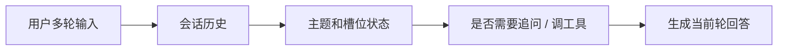

# 对话系统与多轮管理

:::tip 本节定位
很多人一做聊天应用，第一反应是：

- 维护一个 `history`
- 把历史一起塞给模型

这能做出最基础 demo，但离一个真正可用的对话系统还有很远。

这一节的重点，就是把“多轮对话”这件事拆清楚。
:::

## 学习目标

- 理解单轮问答和多轮对话系统的核心区别
- 理解会话状态、上下文窗口、澄清问题这些基本概念
- 看懂一个最小多轮对话管理器
- 明白为什么对话系统的关键不只是记历史，而是管状态

---

## 零、先建立一张地图

多轮对话这节最适合新人的理解顺序不是“把历史都塞进去”，而是先看清：



所以这节真正想解决的是：

- 多轮系统为什么比单轮问答难
- “有历史”为什么不等于“有状态”

## 一、为什么多轮对话比单轮问答难得多？

### 1.1 单轮问答更像“一问一答”

例如：

- 用户问一句
- 系统回一句

这类系统即使没有长期状态，也能工作。

### 1.2 多轮对话真正难在哪？

因为后续轮次经常会省略信息：

1. “退款政策是什么？”
2. “那我已经学了 30% 还能退吗？”

第二句里的“那我”其实默认继承了第一轮主题。  
如果系统不记得前文，就会理解不完整。

所以多轮对话真正难的地方不是“消息变多了”，而是：

> **上下文依赖和状态延续。**

---

## 二、一个对话系统通常至少要管什么？

最少通常要管：

- 会话历史
- 当前主题
- 用户澄清信息
- 是否需要追问

也就是说，对话系统不仅要“生成回答”，还要管理：

> **这段对话现在处于什么状态。**

---

## 三、一个最小对话管理器示例

```python
def new_session():
    return {
        "history": [],
        "topic": None
    }

def add_turn(session, role, content):
    session["history"].append({"role": role, "content": content})

session = new_session()
add_turn(session, "user", "退款政策是什么？")
add_turn(session, "assistant", "你是想看时间范围，还是资格条件？")

print(session)
```

### 3.2 这段代码虽然很小，但它已经在教什么？

它在教你：

- 对话系统天然就有状态
- 状态至少包括历史和当前主题

这就是从“单次调用模型”走向“对话系统”的第一步。

---

## 四、对话系统不是只会回答，还要会追问

### 4.1 为什么追问能力很关键？

因为用户输入很多时候是不完整的。

例如：

- “帮我查天气”

这时系统如果直接瞎猜城市，体验通常会变差。  
更合理的做法是：

> **先补齐缺失信息。**

### 4.2 一个最小追问示例

```python
def dialog_step(session, user_message):
    add_turn(session, "user", user_message)

    if "天气" in user_message and "北京" not in user_message and "上海" not in user_message:
        reply = "你想查哪个城市的天气？"
        add_turn(session, "assistant", reply)
        return reply

    reply = f"系统正在处理：{user_message}"
    add_turn(session, "assistant", reply)
    return reply

session = new_session()
print(dialog_step(session, "帮我查天气"))
print(session["history"])
```

这已经体现出一个很关键的能力：

> 对话系统不只是答，还要能管理信息缺口。 

---

## 五、为什么“只把全部历史塞给模型”不够？

### 5.1 历史太长会带来什么？

- token 成本上升
- 响应变慢
- 无关信息越来越多

### 5.2 所以真实系统通常会做选择

例如：

- 只保留最近 N 轮
- 当前主题单独存状态
- 更早历史做摘要

也就是说，多轮管理不只是“有历史”，而是：

> **怎样保留有用历史。**

---

## 六、一个更完整一点的多轮示例

```python
def dialog_reply(session, user_message):
    add_turn(session, "user", user_message)

    if "退款" in user_message:
        session["topic"] = "refund"
        reply = "退款政策是：购买后 7 天内且学习进度低于 20% 可退款。你是想看时间，还是想判断自己是否符合资格？"

    elif "30%" in user_message and session["topic"] == "refund":
        reply = "如果你的学习进度是 30%，通常不符合退款条件。"

    else:
        reply = "我可以继续帮助你处理当前主题。"

    add_turn(session, "assistant", reply)
    return reply

session = new_session()
print(dialog_reply(session, "退款政策是什么？"))
print(dialog_reply(session, "那如果我已经学了 30% 呢？"))
print(session)
```

### 6.2 这个例子真正比普通问答多了什么？

它多出来的关键不是模型更强，而是：

- 主题跟踪
- 上下文继承

也就是说：

> 对话系统的核心，常常首先是状态设计。 

---

## 七、对话系统常见的几类状态

### 7.1 topic state

当前到底在聊什么。

### 7.2 slot state

哪些关键信息已经知道，哪些还缺。

例如天气系统里：

- 城市已知 / 未知
- 日期已知 / 未知

### 7.3 tool state

哪些工具已经调过，哪些结果已经拿到。

这在 Agent 化对话里特别重要。

## 八、新人第一次做对话系统时最稳的顺序

更稳的顺序通常是：

1. 先做单轮问答
2. 再补主题状态
3. 再补追问逻辑
4. 最后再补工具状态和更复杂记忆

如果一开始就想把所有状态都做满，通常会很乱。

---

## 九、为什么多轮对话特别容易“跑偏”？

因为它很容易受这些影响：

- 上一轮主题残留
- 历史太长
- 用户表达不完整
- 状态没有显式记录

所以你会发现：

> 做对话系统时，“状态管理”往往比“回复多漂亮”更重要。 

---

## 十、初学者最常踩的坑

### 10.1 只维护 history，不维护结构化状态

系统会越来越难控。

### 10.2 一问不清就瞎猜

很多时候追问比乱答好。

### 10.3 历史无限堆长

成本和噪声都会上升。

---

## 小结

这一节最重要的不是做出一个“会聊天”的函数，而是理解：

> **对话系统的核心，在于管理多轮状态，而不只是生成多轮文本。**

只要这个区别真正建立起来，后面你再学智能助手、Agent 对话和记忆系统时，就会顺很多。

## 这节最该带走什么

- 对话系统的本质首先是状态管理
- 历史、主题、槽位和工具状态都可能是关键
- 先把简单状态做好，再逐步扩展，比一开始做“大记忆系统”更稳

---

## 练习

1. 给本节示例再加一个“证书”主题状态。
2. 为天气查询任务设计一个 `slot state`，比如城市和日期。
3. 想一想：为什么“追问”往往是比“乱猜”更好的对话策略？
4. 用自己的话解释：为什么说多轮对话的核心是状态管理，而不是历史拼接？
