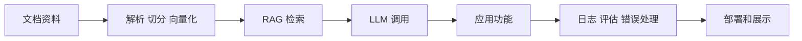
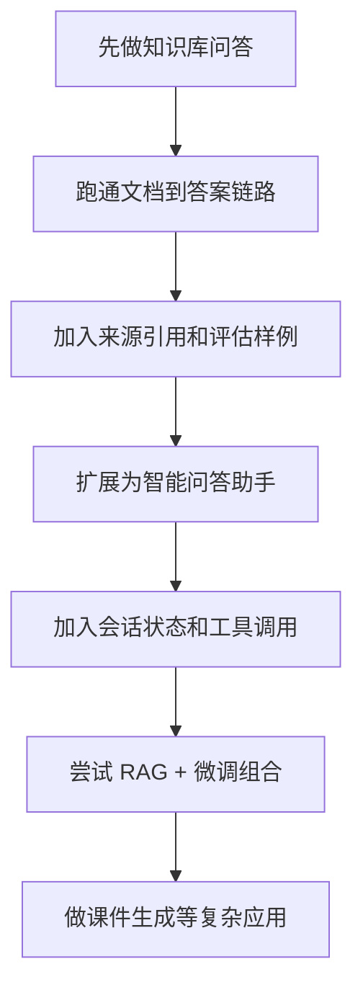
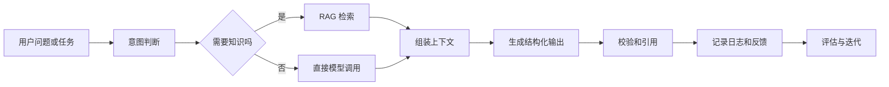

# 学前导读：综合项目这一章到底该怎么学

这一章不是继续堆组件，而是把前面学过的知识层、模型层、应用层和工程层真正做成系统。

第八 B 阶段的项目和第八 A 阶段不一样。第八 A 更关注模型能力、Prompt、微调和方案选择；第八 B 更关注一个 LLM 应用怎样接入资料、调用模型、组织功能、处理错误、记录日志，并形成可以演示和迭代的产品原型。

## 这一章在整个课程里的位置

你已经学过 RAG、模型部署、应用开发和工程化。综合项目是这一阶段的出口，要证明你不只是能写一个模型调用，而是能把文档、检索、对话、工具、结构化输出、引用、评估和部署说明组织起来。

## 这一章真正要解决的问题

这一章要回答五个问题：如何把资料变成可检索知识库；如何让模型基于来源回答而不是凭空发挥；如何把 RAG、Function Calling、多轮对话和结构化输出组织成应用功能；如何处理检索为空、模型超时、格式错误和无答案问题；如何用日志、引用和评估样例证明系统可靠。

新人最容易犯的错误，是把项目理解为“接一个向量数据库就完成了”。真正的 LLM 应用项目要能解释每一层：资料从哪里来，怎样切分，怎样检索，怎样进入 prompt，模型怎样输出，系统怎样校验，用户怎样看到来源，开发者怎样评估效果。

## 新人推荐学习顺序

建议先做企业知识库问答或课程知识库问答，因为它最能训练 RAG 主链路。然后做智能问答助手，把检索、会话状态和工具调用接成产品功能。接着做 RAG + 微调综合系统，理解知识增强和行为适配怎样组合。最后可以做知识库驱动的课件生成助手，把文档解析、例题抽取、结构化输出和模板化生成放进一个更完整的应用场景。

## 学这一章时要抓住的主线

这一章的主线可以概括为：LLM 应用项目不是一次生成，而是知识、模型、功能和工程的闭环。

看懂这条线后，你会知道项目展示不能只放最终答案。你还应该展示检索片段、来源引用、失败处理、日志样例、评估问题和下一步改进。

## 几个项目分别在练什么

| 项目 | 你真正要练什么 |
|---|---|
| 企业知识库问答 | 检索、权限、引用和可追溯回答 |
| RAG + 微调综合系统 | 知识增强和行为适配如何组合 |
| 智能问答助手 | 检索、会话状态、工具调用如何串成产品链 |
| 知识库驱动的课件生成助手 | 文档解析、例题抽取、结构化输出和模板化文档生成 |

## 这一章和后面阶段的关系

这一章是 AI Agent 阶段的前置出口。一个稳定的 LLM 应用已经包含知识、模型、工具、状态和工程化雏形；Agent 会在此基础上继续加入目标驱动、多步规划、工具观察、记忆和安全评估。

如果这一章没学稳，后面常见的问题是：Agent 还没开始做，RAG 和应用层已经不稳定；工具调用没有校验；无答案问题不会处理；系统没有日志和评估；Demo 看起来能回答，但无法解释答案从哪里来。

## 本章小项目出口

学完这一章后，建议至少完成一个“带来源引用的知识库助手”。项目需要包含文档导入、切分、向量化、检索、上下文拼接、模型回答、来源展示、无答案处理和简单评估集。

进阶版本可以加入多轮对话、用户反馈、Function Calling、文档解析和模板化导出。作品集版本建议补充架构图、关键代码说明、评估样例、失败案例和部署说明。

## 过关标准

这一章结束时，你应该能独立完成一个 RAG 或 LLM 应用项目，能解释资料从文档到答案的完整路径，能处理检索为空、模型输出格式错误和无来源回答等常见失败，能用日志和评估样例说明系统效果。

如果你能做出一个带来源引用、基础日志、错误处理、评估样例和部署说明的知识库助手，就达到了 LLM 应用开发阶段的作品集出口标准。
