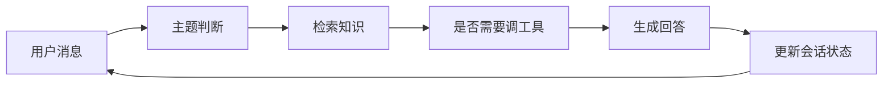

# 项目：智能问答助手

:::tip 本节定位
这一节和“企业知识库问答”很像，但目标更进一步。  
企业知识库更偏“查资料并回答”，而智能问答助手更像一个真正和用户协作的系统：

- 能多轮对话
- 能记住上下文
- 能在必要时调用工具

所以这节更接近一个**产品雏形项目**，而不是单轮问答 demo。
:::

## 学习目标

- 理解一个智能问答助手和普通问答函数的差别
- 学会把检索、状态、工具调用放进同一条流程
- 学会定义这个项目最关键的评估维度
- 学会把它做成一个更像产品的作品集项目

---

## 一、一个智能问答助手到底比普通问答多了什么？

### 1.1 不只是“你问一句，我答一句”

真正的助手感通常来自：

1. 它记得上一轮
2. 它会在需要时追问
3. 它知道什么时候该查知识库，什么时候该查工具

### 1.2 一个清楚的练手题目

例如：

> **做一个课程平台助手，能回答退款、证书和学习进度类问题。**

这个题目非常适合，因为它天然包含：

- 知识库
- 用户状态
- 多轮上下文

---

## 二、作品级项目的最小闭环长什么样？

1. 维护会话历史
2. 识别当前主题
3. 检索相关知识
4. 必要时调工具查用户状态
5. 输出带上下文意识的回答

只要这 5 步做清楚，项目就已经很有产品感。

### 2.1 一张更像真实产品的闭环图



这张图很重要，因为它会提醒你：

- 助手不是只回答一次
- 而是在一轮轮对话里不断更新状态和行动

## 三、推荐推进顺序

对新人来说，更稳的顺序通常是：

1. 先做单轮知识问答
2. 再补会话状态
3. 再补工具调用
4. 最后再做多轮评估和失败案例展示

这样你才能明确知道“助手感”到底是从哪一层加出来的。

### 3.1 一个更适合新人的总类比

你可以把智能问答助手理解成：

- 一个会查资料、会追问、也会查系统状态的客服

它和 FAQ 页最大的不同不在于：

- 回答更长

而在于：

- 会根据上下文继续协作

---

## 四、先跑一个更完整的最小助手

下面这个示例会做：

1. 维护 session
2. 检索知识库
3. 在退款问题里调用用户进度工具
4. 根据上下文生成最终回答

```python
kb = [
    {"key": "退款", "text": "退款政策：购买后 7 天内且学习进度低于 20% 可退款。"},
    {"key": "证书", "text": "证书政策：完成所有项目并通过测试后可获得证书。"},
]


def retrieve(query):
    if "退款" in query:
        return kb[0], 0.92
    if "证书" in query:
        return kb[1], 0.88
    return None, 0.0


def get_user_progress(user_id):
    progress_db = {
        1: 0.15,
        2: 0.30,
    }
    return progress_db.get(user_id, None)


def new_session():
    return {
        "history": [],
        "topic": None,
        "user_id": None,
        "last_retrieved_doc": None,
    }


def assistant_reply(session, user_message, user_id=None):
    if user_id is not None:
        session["user_id"] = user_id

    session["history"].append({"role": "user", "content": user_message})

    if "退款" in user_message:
        session["topic"] = "退款"
        doc, score = retrieve("退款")
        session["last_retrieved_doc"] = doc
        answer = f"{doc['text']} 如果你告诉我学习进度，我可以继续帮你判断是否符合资格。"

    elif "证书" in user_message:
        session["topic"] = "证书"
        doc, score = retrieve("证书")
        session["last_retrieved_doc"] = doc
        answer = doc["text"]

    elif "还能退吗" in user_message and session["topic"] == "退款" and session["user_id"] is not None:
        progress = get_user_progress(session["user_id"])
        if progress is None:
            answer = "当前查不到你的学习进度信息，请确认账号状态。"
        else:
            answer = (
                f"系统查到你的学习进度约为 {int(progress * 100)}%。"
                + (" 当前仍可退款。" if progress < 0.2 else " 当前不满足退款条件。")
            )
    else:
        answer = "我目前可以帮助你处理退款、证书和学习进度类问题。"

    session["history"].append({"role": "assistant", "content": answer})
    return answer


session = new_session()
print(assistant_reply(session, "退款政策是什么？", user_id=2))
print(assistant_reply(session, "那我还能退吗？"))
print(session)
```

### 4.1 这个例子最关键的价值是什么？

它不是只在做“问答”，而是在体现：

- 会话状态
- 检索与工具的分工
- 多轮上下文如何推动回答

这已经比单轮 FAQ 匹配更像真正的助手产品。

### 4.2 为什么 `session` 比答案本身更值得看？

因为 `session` 才是让系统持续协作的关键。  
没有状态，你几乎做不出助手感。

### 4.3 再看一个最小“状态快照”示例

```python
snapshot = {
    "topic": session["topic"],
    "user_id": session["user_id"],
    "last_retrieved_doc": session["last_retrieved_doc"],
}

print(snapshot)
```

这个示例很适合初学者，因为它会帮助你先看到：

- 助手系统真正需要维护的不是“原话全部文本”
- 而是几项关键状态

---

## 五、这个项目最该怎么评估？

### 5.1 单轮正确率不够

你至少还要看：

- 多轮上下文是否保持一致
- 工具调用是否合理
- 系统会不会在缺信息时瞎猜

### 5.2 一个最小评估用例表

```python
eval_cases = [
    {
        "turns": ["退款政策是什么？", "那我还能退吗？"],
        "user_id": 1,
        "expected_keywords": ["15%", "可退款"],
    },
    {
        "turns": ["证书怎么拿？"],
        "user_id": None,
        "expected_keywords": ["结课测试", "证书"],
    },
]

for case in eval_cases:
    session = new_session()
    last_answer = ""
    for turn in case["turns"]:
        last_answer = assistant_reply(session, turn, case["user_id"])
    print({
        "turns": case["turns"],
        "last_answer": last_answer,
        "expected_hit": all(keyword in last_answer for keyword in case["expected_keywords"]),
    })
```

### 5.3 为什么多轮评估特别重要？

因为这类项目的亮点根本就不在单轮。  
它最容易出错的地方恰恰是：

- 第二轮开始忘记上下文

### 5.4 一个很适合初学者先记的评估表

| 维度 | 更像在看什么 |
|---|---|
| 单轮回答对不对 | 知识回答能力 |
| 多轮上下文有没有接住 | 状态管理能力 |
| 工具调用合不合理 | 系统决策能力 |
| 缺信息时会不会追问 | 助手协作能力 |

这个表很适合新人，因为它会帮助你把“助手感”拆成几个具体可检查的部分。

---

## 六、怎么把这个项目做成作品级页面？

### 6.1 展示一条完整对话 trace

例如：

1. 用户问题
2. 检索命中文档
3. 是否调用工具
4. 最终回答

### 6.2 特别值得展示的失败案例

例如：

- 用户没给足信息时，系统是否会乱猜
- 工具查不到状态时，系统是否会诚实停住

### 6.3 一个很加分的点

把：

- 知识回答
- 用户状态回答

这两条链画成流程图展示出来。

---

## 七、最容易踩的坑

### 7.1 只做单轮问答

这样很难体现“助手感”。

### 7.2 没有工具边界

所有问题都靠模型猜，会越来越不稳。

### 7.3 不做上下文一致性检查

很多项目的问题恰恰出在第二轮和第三轮。

## 如果把它做成作品集，最值得强调什么

最值得强调的通常不是：

- “它能聊天”

而是：

1. 一条完整多轮对话 trace
2. 其中哪一轮触发了检索
3. 哪一轮触发了工具调用
4. session 状态是怎么变化的
5. 系统什么时候选择追问或停住

这样别人会更容易感觉到：

- 你做的是一个持续协作系统
- 不只是多轮聊天 demo

---

## 项目交付时最好补上的内容

- 一张系统流程图
- 一段完整多轮对话 trace
- 一组工具调用成功 / 失败案例
- 一组“系统知道该追问 / 该停住”的例子
- 一段你对后续扩展路径的说明

---

## 小结

这节最重要的是建立一个产品级判断：

> **智能问答助手真正像项目的地方，不是答得像人，而是能否把检索、状态和工具调用组织成一条持续协作的多轮流程。**

只要这条流程讲清楚，它就会非常像一款可继续扩展的真实 AI 产品。

## 练习

1. 给示例再加一个 `学习顺序` 主题，让助手能处理三类问题。
2. 想一想：为什么智能助手比 FAQ 更需要状态管理？
3. 如果工具查不到用户状态，系统最稳妥的回应应该是什么？
4. 如果你把这个项目做成作品集，最值得展示哪一段对话？
