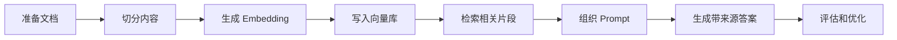
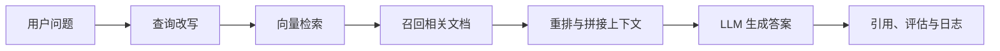
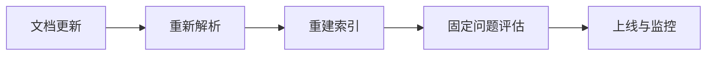
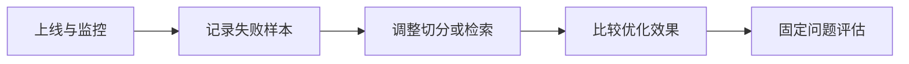

# 8 LLM 应用开发与 RAG

这一阶段解决的是“怎样把大模型接入真实系统”。你会从模型调用走向文档处理、知识库、RAG、工具调用、对话系统、部署、日志和工程化。

## 故事化导入：给大模型接上你的资料库

如果只和通用大模型聊天，它知道的是训练时学到的公开知识；如果你希望它回答公司文档、课程资料、产品手册或个人笔记，就需要把外部资料接进来。RAG 像是给模型配了一名资料员：先帮它找资料，再让它基于资料作答，最后留下引用和日志，方便检查答案从哪里来。

## 学习闯关地图



## 互动练习：从一个“回答不好”的问题开始优化

做 RAG 时，故意找一个系统回答不好的问题，然后追踪原因：是原文档没有答案，切分把关键信息切散了，检索没召回，Prompt 没要求引用，还是模型没有遵守上下文。每定位一次问题，你都在学习真实 LLM 应用工程的调试方法。

## 项目彩蛋

本阶段的彩蛋作品可以是“课程资料问答助手”或“个人知识库助手”。如果你把前面阶段的笔记、项目 README 和报错记录都放进去，它就会变成一个陪你继续学习的私人助教，也能自然过渡到下一阶段的 Agent。

## 阶段定位

| 信息 | 说明 |
|---|---|
| 适合对象 | 已理解大模型基础，希望开发 LLM 应用、知识库或企业 AI 工具的学习者 |
| 预估学时 | 90～120 小时 |
| 前置要求 | 完成大模型原理、Prompt 与微调阶段 |
| 阶段产出 | RAG 知识库、智能问答助手、课程资料助手或企业知识库 Demo |

## 新手最小通关路线

新手先手写一个最小 RAG：准备文档、切分文本、生成向量、检索片段、组织 Prompt、生成带来源的答案。只要能定位 RAG 效果差是文档、切分、检索、提示还是模型问题，就算完成最小通关。

## 进阶深入路线

有经验的学习者可以深入重排、多路召回、查询改写、评估集构造、日志监控、权限控制和部署。进一步尝试把 RAG 封装成 API 或小型应用，并加入反馈收集和成本统计。

## 新人先做什么，进阶再做什么

新人第一次学这一阶段时，先不要急着上复杂框架。更稳的顺序是先用几十行代码跑通“文档 → 切分 → 向量 → 检索 → 回答 → 引用”的最小闭环，再逐步替换成更可靠的组件。你要先能看见每一步发生了什么，才知道后面为什么需要向量数据库、重排、日志和评估。

有经验的学习者可以把重点放在工程质量上：检索失败时怎样降级，引用怎样保证可信，日志怎样支持复盘，评估集怎样构造，接口怎样部署，成本怎样记录。你的目标不是做一个“能回答”的 Demo，而是做一个别人愿意长期使用、出错时能定位原因的知识库系统。

## 为什么需要 RAG 和应用工程

大模型本身不能天然访问你的私有文档，也不能保证知识总是最新。RAG 把外部知识检索结果放进模型上下文，让模型基于资料回答问题。应用工程则负责把模型能力接入产品：处理用户输入、调用模型、组织状态、记录日志、控制成本和评估效果。



## 现代 RAG 精讲：从能回答到可维护

2025～2026 年的 RAG 已经不只是“向量数据库 + Prompt”。真实知识库会遇到关键词漏召回、片段排序不准、文档更新过期、答案引用不可信、成本和延迟不可控等问题，所以这一阶段要把 RAG 当成长期运行的工程系统来学。

| 技术方向 | 解决的问题 | 学习重点 |
|---|---|---|
| Hybrid Search | 纯向量检索容易漏掉精确关键词、编号、术语和人名 | 结合关键词检索与向量检索，再合并排序 |
| Reranking | 初次召回数量多但排序不稳定 | 用重排模型或规则把最相关片段放到前面 |
| Query Rewrite | 用户问题太短、太口语或上下文缺失 | 把问题改写成更适合检索的查询 |
| Multi-query Retrieval | 单一查询覆盖不全 | 从多个角度生成查询，提升召回率 |
| GraphRAG | 答案依赖跨文档实体和关系 | 抽取实体关系，围绕图结构组织上下文 |
| Agentic RAG | 一次检索不够，需要边查边判断 | 让系统决定是否继续检索、换查询或停止 |
| Multimodal RAG | 知识来源包含 PDF、截图、表格和图片 | 把文档解析、视觉理解和文本检索结合起来 |

学习这些技术时，不要把它们当成必须全部堆上的组件。每个技术都应该回答一个失败问题：为什么普通 RAG 不够？它改善的是召回、排序、上下文组织、引用可信度，还是运维更新？

## RAGOps 精讲：知识库上线后怎么持续变好

RAGOps 关注的是 RAG 系统上线后的质量维护。一个合格的 RAG 项目至少要能看到：文档来源、切分方式、索引版本、召回片段、重排分数、回答引用、无答案处理、用户反馈、Token 成本、响应耗时和失败日志。





最小 RAGOps 不需要一开始就很复杂，但必须有固定评估集。比如准备 20～50 个课程问题，标注期望命中的文档、理想答案和不能编造的边界。每次修改 Prompt、切分策略、Embedding 模型或重排方式，都用同一组问题比较效果，而不是凭感觉判断。

## 本阶段学习路径

第一章学习 RAG。你会理解文档解析、切分、Embedding、向量数据库、检索策略、RAG 优化和评估。

第二章学习 LLM 本地部署与统一接口。你会理解本地模型、推理服务和统一 API 的意义。

第三章学习大模型应用开发，包括 LLM API、LangChain 基础、Function Calling、对话系统、文档解析、AI 辅助编码和模板文档生成。

第四章学习工程化实践，包括异步编程、API 设计、日志监控和 Docker 部署。

第五章进入综合项目，把知识库、模型调用、应用接口和工程化组合起来。

## 学完后你应该能做到

- 能设计一个基础 RAG 流程
- 能完成文档解析、切分、Embedding 和向量检索
- 能判断 RAG 效果差时，是文档、切分、检索、提示还是模型问题
- 能调用 LLM API 并封装成应用接口
- 能使用 Function Calling 或工具调用组织简单任务
- 能为 LLM 应用加入日志、错误处理和基础部署说明

## 常见误区

不要以为“接入向量数据库”就等于完成 RAG。真正影响效果的是文档质量、切分策略、检索召回、重排、提示组织、引用可信度和评估方式。

也不要一开始就依赖复杂框架。框架能提升效率，但前提是你理解底层流程。建议先手写最小 RAG，再学习 LangChain、LlamaIndex 等框架。

## RAG 错误剧场：回答不好通常卡在哪一步

如果 RAG 回答不准，先不要急着换模型。先查原文档里有没有答案，再看切分是否把关键信息切散，检索结果是否召回相关片段，Prompt 是否要求基于来源回答，最后才判断模型是否没有遵守上下文。

## 第一遍怎么读：必读、项目查阅和选修深入

| 阅读标签 | 建议章节 | 学习目标 |
|---|---|---|
| 必读 | RAG 基础、文档处理、检索策略、RAG 评估、LLM API 实践 | 跑通知识库问答的最小闭环 |
| 项目查阅 | 向量数据库、RAG 优化、Function Calling、日志监控、API 设计 | 做课程问答助手或企业知识库时重点查看 |
| 选修深入 | Advanced RAG、本地模型部署、LangChain、Docker 部署、模板文档生成 | 需要优化性能、部署或扩展应用形态时再深入 |

第一遍建议先手写最小 RAG，再接框架。只要你能打印 query、top-k 片段、来源和答案，就已经抓住这一阶段的主线。

## RAG 可运行小实验：不用框架也能看懂检索链路

学这一阶段时，建议先做一个最小可运行实验，不急着接 LangChain 或复杂向量库。准备 5～10 段课程文本，先用关键词重叠或简单 Embedding 模拟检索，再打印每一步结果：用户问题、改写后的查询、召回片段、排序分数、最终 Prompt 和答案来源。

```python
questions = ["RAG 项目为什么需要评估集？"]
docs = [
    {"id": "ragops", "text": "RAGOps 需要记录文档来源、检索片段、引用、成本和失败日志。"},
    {"id": "agentops", "text": "AgentOps 关注执行轨迹、工具权限、失败恢复和人工确认。"},
]

query = questions[0]
hits = sorted(
    docs,
    key=lambda d: len(set(query) & set(d["text"])),
    reverse=True,
)

for hit in hits[:2]:
    print(hit["id"], hit["text"])
```

这个实验的重点不是算法多强，而是让学习者第一次看见“检索结果是可以检查的”。等最小链路跑通后，再替换成向量模型、Hybrid Search、Reranking、Query Rewrite 和评估集。

## RAG 失败案例库：按现象定位问题

| 现象 | 常见原因 | 定位方法 | 修复方向 |
|---|---|---|---|
| 答案看起来流畅但没有来源 | Prompt 没强制引用，或上下文没有保留来源 ID | 打印最终 Prompt 和召回片段 | 在片段中保留文档名、页码、段落 ID |
| 明明文档里有答案却检索不到 | 切分太碎、关键词缺失或向量召回偏移 | 直接用关键词搜索原文，再看切片内容 | 调整 chunk、加入 Hybrid Search 或 Query Rewrite |
| 召回片段很多但排序不准 | 初次召回只负责“找可能相关” | 打印 top-k 分数和人工标注相关性 | 加 Reranking 或规则过滤 |
| 文档更新后答案仍然旧 | 索引版本没有更新 | 记录文档版本和索引时间 | 增加重建索引、过期标记和回归评估 |
| 优化后不知道是否变好 | 没有固定问题集 | 用同一组问题比较前后答案 | 建立评估集和失败样本表 |


| 复盘问题 | 你应该能回答什么 |
|---|---|
| 资料来源 | 系统回答依赖哪些文档、网页或数据库？ |
| 知识处理 | 文档如何解析、清洗、切块和写入索引？ |
| 检索质量 | 用户问题命中了哪些片段，排序和分数是否合理？ |
| 答案引用 | 用户能不能看到答案基于哪些来源？ |
| 错误处理 | 检索为空、模型超时、格式错误时系统怎么处理？ |
| 评估迭代 | 有没有固定问题集和日志来比较优化前后效果？ |

这一阶段真正的出口，是做出一个带来源、日志、错误处理和评估样例的知识库助手，而不是只完成一次模型调用。

## 阶段交付物

| 交付物 | 最小版 | 作品集版 |
|---|---|---|
| RAG 原型 | 能对 5～10 段文档检索并回答 | 支持课程文档导入、来源引用和无答案处理 |
| 文档处理记录 | 说明 chunk 大小和来源字段 | 保存 `chunks.jsonl`、metadata 和索引版本 |
| 检索日志 | 打印 top-k 片段 | 记录 query、score、source、rerank 和命中文本摘要 |
| 评估集 | 10 个固定问题 | 标注 gold_doc、gold_answer、citation_ok 和失败类型 |
| 失败样本 | 记录 1～3 个失败问题 | 区分 retrieval、context、generation、citation 和 deploy |
| README | 写清运行命令和示例输出 | 展示架构、配置、评估结果、限制和下一步 |

## 阶段验收 Rubric

| 等级 | 验收标准 | 作品集证据 |
|---|---|---|
| 基础通过 | 能完成文档读取、切分、检索、回答和来源展示 | 运行截图、示例问题、召回片段 |
| 标准通过 | 能加入评估问题集、失败样本、日志和错误处理 | `evals/questions.jsonl`、失败案例表、日志样例 |
| 优秀作品 | 能比较不同检索策略，并说明成本、延迟和引用可信度 | Hybrid Search / Reranking 对比、成本记录、部署说明 |

面试或作品集展示时，不要只说“我做了一个 RAG”。更好的讲法是：我先做了最小 RAG 闭环，然后发现某类问题召回不稳定，于是加入评估集、打印 top-k 片段、比较切分和重排策略，最后让系统能给出来源并记录失败原因。

## 阶段项目

基础版是做一个个人知识库问答助手，支持基于本地文档回答问题并给出来源。标准版需要加入文档预处理、向量索引、检索评估、日志记录和简单 Web API。挑战版可以做企业知识库 Demo，加入权限、反馈、重排、多轮对话和线上部署说明。

如果你想看更细的学习节奏，可以阅读 [学习指南：大模型应用与工程怎么学最不容易学乱](./study-guide.md)。

## 和 AI 学习助手贯穿项目的关系

本阶段可以对应 AI 学习助手 v0.8：读取课程 Markdown，支持检索、回答、来源引用和评估问题集。 如果你正在按贯穿项目路线学习，建议本阶段结束时至少提交一次版本记录：本阶段新增了什么能力、如何运行、示例输入输出是什么、遇到了什么问题、下一步准备怎么改。

## 阶段通关标准

| 通关层级 | 你需要做到什么 |
|---|---|
| 最低通关 | 能构建课程问答或知识库助手，并做检索、引用和评估。 |
| 推荐通关 | 完成本阶段至少一个可运行小项目，并在 README 中记录运行方式、示例输入输出和遇到的问题。 |
| 作品集通关 | 把本阶段产出接入“AI 学习助手”贯穿项目，留下截图、日志、评估样例和下一步计划。 |

学完本阶段后，不需要把所有细节都背下来。更重要的是能说清楚：本阶段解决什么问题，它和上一阶段的关系是什么，以及它会怎样支撑后续学习。下一阶段会让系统从问答升级为可调用工具的 Agent。

