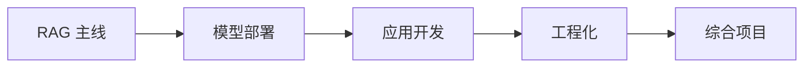

# 第八B阶段：大模型应用与工程化

| 信息 | 说明 |
|---|---|
| **预估学时** | 90～120 小时 |
| **前置要求** | 完成第八A阶段 |

## 阶段概述

掌握 RAG、LLM 部署、应用开发与 AI 工程化。

:::warning asyncio 前置
第 4 章需要 `asyncio` 基础，建议提前学习选修模块 B 的并发编程部分。
:::

## 阶段导读

这一阶段的重点不再是“模型怎么训练出来”，而是“模型怎样进入真实系统并稳定工作”。

你会在这里真正面对：

1. 知识从哪里来
2. 模型怎么被调用和部署
3. 应用层如何组织会话、结构化输出和工具
4. 工程层怎样处理并发、日志、监控和上线

如果你想先看一版更具体的阅读顺序、建议时长和第一次做 LLM 应用时最稳的推进方式，可以直接看：

- [学习指南：大模型应用与工程怎么学最不容易学乱](./study-guide.md)

## 第八 A 阶段是怎么自然流到这里的

如果你刚学完第八 A 阶段，最值得先看清的一件事是：

- 第八 A 更强调能力从哪里来、怎样被适配和约束
- 第八 B 开始回答：这些能力怎样真正进入一个可用、可维护、可上线的系统

更直白地说：

- 第八 A 更像“模型内部主线”
- 第八 B 开始进入“系统外部主线”

所以这一阶段不是换话题，而是在继续回答：

> **大模型能力怎样真正接到知识、接口、产品和工程上。**

## 这一阶段的教学安排是否由浅入深？

整体上是顺的，而且这条路比“先学一堆框架”更适合新人。

更适合新人的理解主线是：

也就是说：

- **前两章在回答知识和模型从哪里来**
- **第三章在回答怎么把能力组织成产品功能**
- **第四章在回答怎么让系统真的能上线**
- **第五章负责把整条链真正做成项目**

## 这一阶段真正新增了什么能力

从第八 A 走到这里，真正新增的不是“更多方法名”，而是：

1. 开始把“模型能力”接到“外部知识和外部系统”上
2. 开始分清检索层、模型层、应用层、工程层各自负责什么
3. 开始从 Demo 思维走向产品与系统思维

## 建议学习顺序

1. 第一章：RAG 主线
2. 第二章：模型部署
3. 第三章：应用开发
4. 第四章：工程化
5. 第五章：项目实践

这个顺序的意义是：先理解知识增强，再理解推理与调用，再把应用和工程真正接起来。

## 更适合新人的学习节奏

如果你是第一次系统做 LLM 应用，更稳的节奏通常是：

1. 先学第一章  
   先把文档、切分、检索、重排和评估串起来。

2. 再学第二章  
   先知道模型到底怎样被调用、怎样做服务和统一入口。

3. 再学第三章  
   这时再去看对话系统、函数调用和结构化输出，会更容易理解它们为什么需要前两章。

4. 再学第四章  
   先把异步、API、日志、监控和部署打顺。

5. 最后做第五章项目  
   把知识、调用、应用和工程真正做成一条产品链。

## 如果你是第一次系统做 LLM 应用，最稳的起步方式

建议先不要急着追：

- 哪个框架最火
- 哪个 Agent 最酷
- 哪个部署方案最复杂

更稳的顺序通常是：

1. 先把 `RAG + 部署` 这两条线看顺  
   先知道知识怎么进来、模型怎么出去。

2. 再看应用开发  
   这时你更容易理解为什么会有结构化输出、函数调用和多轮状态。

3. 最后看工程化  
   这时异步、日志、监控和容器部署会更像是顺着主线自然长出来的。

## 本阶段章节地图

| 章节 | 主题 | 主要解决什么问题 |
|---|---|---|
| 第一章 | RAG 主线 | 学文档处理、检索、重排、评估与优化 |
| 第二章 | 模型部署 | 学本地模型、推理服务和统一 API 入口 |
| 第三章 | 应用开发 | 学对话系统、函数调用、结构化输出和产品闭环 |
| 第四章 | 工程化 | 学异步、日志、监控、API 和容器部署 |
| 第五章 | 项目实践 | 把知识库、助手和综合系统做成真实应用 |

## 学这一阶段最容易卡住的地方

- 以为接上模型 API 就算做完应用
- 只关心生成，不检查检索和数据链路
- 没有日志和评估，结果不知道系统到底哪里出错
- 只会做 Demo，不会做稳定可复用的工程结构

## 学这一阶段最该养成的 3 个习惯

1. 每做一个能力，先问问题到底出在知识、模型、应用还是工程层
2. 每做一个系统，先问输入、输出、日志和错误处理有没有闭环
3. 每看到一个“生成效果不好”的问题，都先检查检索和上下文链路，而不是先怪模型

## 这一阶段最值得优先补强的能力

- 能把“知识、模型、工具、接口、日志”讲成一条完整链路
- 能分清问题到底出在检索、生成、应用层还是工程层
- 能把一个 LLM Demo 提升成真正可解释、可维护的系统

## 学完后的出口能力

- 能完成一个最小可用的 RAG 或 LLM 应用系统
- 能设计基础的日志、监控、错误处理和部署方案
- 能判断一个大模型应用是卡在模型、检索还是工程层

## 学完第八 B 阶段后，你应该能自己回答什么

- 一个大模型系统到底是知识问题、调用问题，还是工程问题
- 什么时候该先补检索，什么时候该补模型调用层
- 一个 LLM Demo 距离“可上线系统”还缺哪几层
