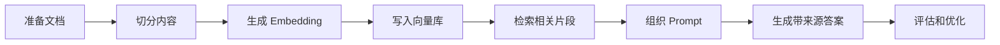
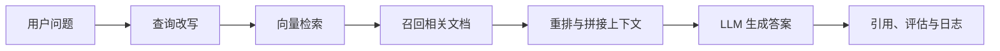

# 8 LLM 应用开发与 RAG

这一阶段解决的是“怎样把大模型接入真实系统”。你会从模型调用走向文档处理、知识库、RAG、工具调用、对话系统、部署、日志和工程化。

## 故事化导入：给大模型接上你的资料库

如果只和通用大模型聊天，它知道的是训练时学到的公开知识；如果你希望它回答公司文档、课程资料、产品手册或个人笔记，就需要把外部资料接进来。RAG 像是给模型配了一名资料员：先帮它找资料，再让它基于资料作答，最后留下引用和日志，方便检查答案从哪里来。

## 学习闯关地图

## 互动练习：从一个“回答不好”的问题开始优化

做 RAG 时，故意找一个系统回答不好的问题，然后追踪原因：是原文档没有答案，切分把关键信息切散了，检索没召回，Prompt 没要求引用，还是模型没有遵守上下文。每定位一次问题，你都在学习真实 LLM 应用工程的调试方法。

## 项目彩蛋

本阶段的彩蛋作品可以是“课程资料问答助手”或“个人知识库助手”。如果你把前面阶段的笔记、项目 README 和报错记录都放进去，它就会变成一个陪你继续学习的私人助教，也能自然过渡到下一阶段的 Agent。

## 阶段定位

| 信息 | 说明 |
|---|---|
| 适合对象 | 已理解大模型基础，希望开发 LLM 应用、知识库或企业 AI 工具的学习者 |
| 预估学时 | 90～120 小时 |
| 前置要求 | 完成大模型原理、Prompt 与微调阶段 |
| 阶段产出 | RAG 知识库、智能问答助手、课程资料助手或企业知识库 Demo |

## 新手最小通关路线

新手先手写一个最小 RAG：准备文档、切分文本、生成向量、检索片段、组织 Prompt、生成带来源的答案。只要能定位 RAG 效果差是文档、切分、检索、提示还是模型问题，就算完成最小通关。

## 进阶深入路线

有经验的学习者可以深入重排、多路召回、查询改写、评估集构造、日志监控、权限控制和部署。进一步尝试把 RAG 封装成 API 或小型应用，并加入反馈收集和成本统计。

## 为什么需要 RAG 和应用工程

大模型本身不能天然访问你的私有文档，也不能保证知识总是最新。RAG 把外部知识检索结果放进模型上下文，让模型基于资料回答问题。应用工程则负责把模型能力接入产品：处理用户输入、调用模型、组织状态、记录日志、控制成本和评估效果。

## 本阶段学习路径

第一章学习 RAG。你会理解文档解析、切分、Embedding、向量数据库、检索策略、RAG 优化和评估。

第二章学习 LLM 本地部署与统一接口。你会理解本地模型、推理服务和统一 API 的意义。

第三章学习大模型应用开发，包括 LLM API、LangChain 基础、Function Calling、对话系统、文档解析、AI 辅助编码和模板文档生成。

第四章学习工程化实践，包括异步编程、API 设计、日志监控和 Docker 部署。

第五章进入综合项目，把知识库、模型调用、应用接口和工程化组合起来。

## 学完后你应该能做到

- 能设计一个基础 RAG 流程
- 能完成文档解析、切分、Embedding 和向量检索
- 能判断 RAG 效果差时，是文档、切分、检索、提示还是模型问题
- 能调用 LLM API 并封装成应用接口
- 能使用 Function Calling 或工具调用组织简单任务
- 能为 LLM 应用加入日志、错误处理和基础部署说明

## 常见误区

不要以为“接入向量数据库”就等于完成 RAG。真正影响效果的是文档质量、切分策略、检索召回、重排、提示组织、引用可信度和评估方式。

也不要一开始就依赖复杂框架。框架能提升效率，但前提是你理解底层流程。建议先手写最小 RAG，再学习 LangChain、LlamaIndex 等框架。

## 阶段项目

基础版是做一个个人知识库问答助手，支持基于本地文档回答问题并给出来源。标准版需要加入文档预处理、向量索引、检索评估、日志记录和简单 Web API。挑战版可以做企业知识库 Demo，加入权限、反馈、重排、多轮对话和线上部署说明。

如果你想看更细的学习节奏，可以阅读 [学习指南：大模型应用与工程怎么学最不容易学乱](./study-guide.md)。