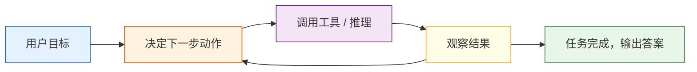

# 什么是 AI Agent

## 学习目标

完成本节后，你将能够：

- 说清楚工作流、聊天机器人和 Agent 的区别
- 理解 Agent 的最小组成部分
- 跑通一个带工具调用的迷你 Agent 示例
- 明白 Agent 为什么不只是“套个 prompt”

---

## 一、先别急着神化 Agent

很多人第一次听到 Agent，会觉得它像“能自主思考并执行任务的 AI 员工”。

这个说法不算错，但容易太飘。

更稳妥的理解是：

> **Agent = 能根据目标、状态和工具，分步完成任务的系统。**

它通常具备这几种能力：

- 接收目标
- 拆解步骤
- 调用工具
- 根据结果继续行动
- 在必要时结束任务

---

## 二、工作流、聊天机器人、Agent 有什么区别？

### 工作流（Workflow）

每一步都是提前写好的：

1. 用户提问
2. 查数据库
3. 拼提示词
4. 返回答案

这更像固定流水线。

### 聊天机器人（Chatbot）

重点是“对话”。  
它未必会主动拆任务或使用外部工具。

### Agent

重点是“为了完成目标，动态选择动作”。

比如一个 Agent 可能会：

1. 先判断用户要什么
2. 再决定是去查天气、查文档，还是计算
3. 拿到结果后再组织输出

---

## 三、Agent 的最小组成部分

你可以先把 Agent 拆成 4 块：

| 组件 | 作用 |
|---|---|
| 目标 | 这次要完成什么 |
| 模型 / 决策器 | 下一步该做什么 |
| 工具 | 能调用哪些外部能力 |
| 状态 / 记忆 | 当前任务进行到哪了 |

类比一下：

> Agent 很像一个会做事的实习生：有任务目标，有工具箱，有工作记录，还要自己决定下一步。

---

## 四、一个不依赖大模型的迷你 Agent

为了让原理更清楚，我们先不用真正的大模型，先写一个“规则版 Agent”。

```python
def tool_weather(city):
    fake_weather = {
        "北京": "晴，22 度",
        "上海": "多云，25 度",
        "深圳": "小雨，28 度"
    }
    return fake_weather.get(city, "暂无该城市天气数据")

def tool_calculate(expression):
    return str(eval(expression, {"__builtins__": {}}))

def tool_search_docs(keyword):
    docs = {
        "退款": "课程购买后 7 天内且学习进度低于 20% 可申请退款。",
        "证书": "完成所有必修项目并通过结课测试后可获得证书。"
    }
    for k, v in docs.items():
        if k in keyword:
            return v
    return "未找到相关文档。"

def simple_agent(user_query):
    steps = []

    if "天气" in user_query:
        city = "北京" if "北京" in user_query else "上海" if "上海" in user_query else "深圳"
        steps.append(f"识别到天气查询，准备调用 weather 工具，城市={city}")
        result = tool_weather(city)
        steps.append(f"工具返回：{result}")
        final_answer = f"{city}当前天气：{result}"

    elif "退款" in user_query or "证书" in user_query:
        steps.append("识别到知识查询，准备调用 docs 工具")
        result = tool_search_docs(user_query)
        steps.append(f"工具返回：{result}")
        final_answer = result

    elif "计算" in user_query:
        expression = user_query.replace("计算", "").strip()
        steps.append(f"识别到计算任务，准备调用 calculator 工具，表达式={expression}")
        result = tool_calculate(expression)
        steps.append(f"工具返回：{result}")
        final_answer = f"计算结果是：{result}"

    else:
        steps.append("无法匹配工具，直接回复默认答案")
        final_answer = "我暂时还不知道该调用哪个工具。"

    return steps, final_answer

query = "计算 23 * 7"
steps, answer = simple_agent(query)

print("用户问题:", query)
print("执行步骤:")
for step in steps:
    print("-", step)
print("最终回答:", answer)
```

这个例子虽然简单，但已经包含了 Agent 的核心味道：

- 识别任务
- 选择工具
- 拿到结果
- 组织输出

---

## 五、Agent 和“函数调用”是什么关系？

Agent 经常会用到函数调用（Function Calling / Tool Calling），但两者不完全等价。

### 函数调用

重点是：模型能不能产出结构化参数，正确调用工具。

### Agent

重点是：模型或系统能不能围绕目标，动态决定：

- 何时调用工具
- 调哪个工具
- 调几次
- 调完之后下一步做什么

所以可以记成：

> 工具调用是 Agent 的常见能力，但 Agent 不只等于工具调用。

---

## 六、为什么 Agent 比普通问答系统更难？

因为它多了“行动”这一层。

普通问答系统更像：

- 看输入
- 生成答案

Agent 更像：

- 看输入
- 规划
- 试着做事
- 观察结果
- 再决定下一步

这就带来更多挑战：

- 错误会在多步过程中累积
- 工具调用可能失败
- 成本和时延更高
- 安全风险也更大

---

## 七、一个更像 Agent 的循环思路

真实 Agent 系统经常长这样：



这就是为什么 Agent 特别强调：

- 规划
- 观察
- 反馈
- 迭代

---

## 八、什么任务适合做 Agent？

### 比较适合

- 多步任务
- 需要外部工具
- 需要根据中间结果调整策略

例如：

- 研究助理
- 自动报表
- 数据分析助手
- 代码修复助手

### 不太适合

- 一步就能答完的简单 FAQ
- 完全固定流程的任务
- 对稳定性要求极高、不能容忍自由发挥的场景

很多场景里，**工作流反而比 Agent 更合适**。

---

## 九、初学者常见误区

### 1. 以为“能聊天”就叫 Agent

不对。  
聊天机器人不一定会自主分步行动。

### 2. 以为 Agent 一定比工作流高级

不一定。  
简单稳定的任务，工作流可能更便宜、更可靠。

### 3. 以为加上工具调用就万事大吉

工具越多、步骤越多，调试和安全难度也会更高。

---

## 小结

这一节最重要的一句话是：

> **Agent 不是“会说话的模型”，而是“能围绕目标采取行动的系统”。**

它的价值不只是回答，而是完成任务。  
后面几章我们会继续展开：推理、工具、记忆、多 Agent、部署与安全。

---

## 练习

1. 给 `simple_agent()` 再加一个工具，比如“查课程安排”。
2. 让 Agent 支持“先查文档，再计算”的两步任务。
3. 思考：如果工具返回错误信息，Agent 应该怎么处理才更稳妥？
